# CyberSocium: Theoretical Foundations of CyberSocial Economics and Architecture of Decentralized Socio-Economic Formation

## Fundamental Article and Technical Specification of GyberExperiment

---

## Table of Contents

1. Introduction
   - 1.1. Problem: crisis of institutions, technological optimism and threats of the 21st century
   - 1.2. Crisis of existing socio-economic institutions
   - 1.3. Information security, ethics and data ownership
   - 1.4. Decentralization and Open Source as a historical trend
   - 1.5. Evolution of economic process management systems
2. Literature review and interdisciplinary context
   - 2.1. Political economy of the digital age
   - 2.2. Theory of common resources and collective action
   - 2.3. Cryptoeconomics and mechanism design
   - 2.4. Complex adaptive systems theory
   - 2.5. Limitations of existing models and unfilled niche
3. Theory of CyberSocium
   - 3.1. Axiomatic foundation
   - 3.2. CyberSocial Corporation: definition and properties
   - 3.3. Evolution of economic process management forms: formalization
   - 3.4. PMIP concept and socio-economic selection mechanism
     - 3.4.5. Mechanism for resolving internal contradictions: Conflict Fork Protocol
   - 3.5. Socio-economic selection and project evolution
     - 3.5.3. Historical analogy
     - 3.5.4. AI-directed evolution: from blind selection to designed selection
   - 3.6. Formal model of CyberSocium as a complex adaptive system
     - 3.6.1. System components
     - 3.6.2. Emergent properties
     - 3.6.3. System dynamics — formalization of feedback loops
     - 3.6.4. System attractor
4. Architecture of GyberExperiment: technical specification
   - 4.1. From theory to implementation: correspondence mapping
   - 4.2. GyberCommunityToken (Gbr): tokenomics
     - 4.2.1. Token specification
     - 4.2.2. Emission distribution and governance
     - 4.2.3. Reward mechanism: UnitManager
     - 4.2.4. Liquidity pools and project integration
   - 4.3. Gyber Social Platform (GSP): architecture
     - 4.3.1. Overview and principles
   - 4.4. GyberNet: community blockchain
   - 4.5. GyberComputer: distributed computing
   - 4.6. MacroeconomicDAO: governance system
     - 4.6.1. Governance architecture
     - 4.6.2. Decision-making process
     - 4.6.3. Four classes of DAO
     - 4.6.4. Wallet activity verification
   - 4.7. Legal framework: Gybernaty DUNA
     - 4.7.1. Justification for legal form necessity
     - 4.7.2. Control architecture: community — DUNA — real world
     - 4.7.3. Mechanisms for legal value extraction by participants
     - 4.7.4. Compliance with axioms / Legal constraints and priorities
   - 4.8. AiC — Gybernaty Artificial Intelligence Department
     - 4.8.1. Status and role in the ecosystem
     - 4.8.2. Problem solved by AiC
     - 4.8.3. AiC architecture
     - 4.8.4. AiC technical stack
     - 4.8.5. DAO governance of AI resources
     - 4.8.6. AiC economic model
     - 4.8.7. CyberSocial significance of AiC
     - 4.8.8. AiC as ecosystem infrastructure AI layer
5. DAO taxonomy: four-class model of decentralized decision-making
   - 5.1. Social DAO
   - 5.2. Code DAO
   - 5.3. Commerce DAO
   - 5.4. Economic DAO
   - 5.5. DAO interaction and conflict resolution
6. Applied ecosystem: from theory to implementation
   - 6.1. GSP — GyberSocial Platform (Decentralized social platform)
   - 6.2. GyberNet — Decentralized network
   - 6.3. GyberComputer — Distributed computing network
   - 6.4. G-Plan — Task management and activity verification system
   - 6.5. LQD, SAPP, PowerSwapMeta, Contact — Supporting ecosystem projects
   - 6.6. Portfolio validation and ecosystem integration
7. Comparative analysis and related works
   - 7.1. Theoretical frameworks
   - 7.2. Practical projects
   - 7.3. Unique contribution of GyberExperiment
8. Discussion: implications, limitations and open questions
   - 8.1. Theoretical implications
   - 8.2. Practical implications
   - 8.3. Limitations and challenges
   - 8.4. Open research questions
9. Roadmap: from experiment to ecosystem
   - 9.1. Phase I: Foundation (2024–2025)
   - 9.2. Phase II: Growth (2025–2026)
   - 9.3. Phase III: Scaling (2026–2028)
   - 9.4. Phase IV: Maturity (2028+)
10. Conclusion
11. Bibliography
12. Appendices
    - Appendix A. Glossary
    - Appendix B. Smart contract addresses
    - Appendix C. Eight axioms of CyberSocium — summary

---

**Version:** 1.0
**License:** Creative Commons Attribution-NonCommercial 4.0 International / GPL-v3 (code portion)
**Authorship:** Gybernaty Research Collective
**Date:** 2025
**Classification:** Interdisciplinary Research — Political Economy, Distributed Systems, Institutional Design, Cryptoeconomics, Social Theory

---

## Abstract

This document establishes the theoretical foundation of a new interdisciplinary field — **CyberSocial Economics** — and presents the technical specification of **GyberExperiment** as its first empirical implementation.

We live in an era when more than five billion people carry computing devices in their pockets, whose collective power exceeds by orders of magnitude all computing technology of the 20th century. Information technologies have integrated into the fabric of social relations, blurring geographical, cultural, and now financial-economic boundaries. However, the institutional infrastructure for managing global resources remains a product of the industrial era — centralized, opaque, oriented toward concentration of capital and power in the hands of a narrowing circle of beneficiaries. Recurring global crises, rising inequality, and systemic fragility of existing economic mechanisms signal that none of the current socio-economic formations is capable of ensuring sustainable and rational management of civilization's resources, whose technological might has long demanded precisely such management.

In this work we: (a) formalize the concept of **CyberSocial Corporation** (CSC) as a fundamental economic unit of a new type — a decentralized, autonomous, self-governing structure owned by all participants; (b) introduce the **Principle of Minimum Individual Participation** (PMIP) and prove that with a sufficient number of participants it enables implementation of projects of arbitrary scale; (c) describe the **Socio-Economic Selection** (SES) mechanism — an evolutionary process in which projects compete not for investor capital but for society's interest; (d) design the **MacroeconomicDAO** system as an instrument of direct public governance of economic processes; (e) present the complete architecture of GyberExperiment — infrastructure implementing the described theoretical constructs through blockchain technologies, distributed computing, cryptographic protocols, and open-source software.

The theory of CyberSocium describes the patterns of **cybersocialization of the economy** — a historical process of transition of the global socio-economic mechanism to distributed peer-to-peer forms controlled directly by society. This process is as objective and irreversible as industrialization, and equally requires new theory, new infrastructure, and new institutional design.

**Keywords:** CyberSocium, CyberSocial Corporation, decentralized autonomous organization, cryptoeconomics, socio-economic selection, distributed governance, open-source economics, MacroeconomicDAO, peer-to-peer economy, principle of minimum individual participation

---
# Section 1: Introduction — Problem Statement

**Note:** Sections 1.1 (Era of Supercommunications) and 1.2 (Crisis of Existing Socio-Economic Institutions) are listed in the table of contents but do not appear to have written content in the source document. The actual Section 1 content begins with section 1.3.

---

### 1.3. Information Security, Ethics, and Data Ownership

Even those of us not directly involved with computer science and electronics are personally engaged in the process of generating enormous amounts of data — all kinds of valuable information that is easily used for all sorts of manipulations and just as easily monetized.

The scale of this process is staggering. Each smartphone user generates an average of 1.5 GB of data daily [16]. Collectively, this forms a data flow that traditional economic theory is unable to adequately describe: data is neither a classical commodity (it is non-rivalrous and reproducible at zero marginal cost) nor a public good (it is excludable — controlled by those who own the servers).

Most major IT companies regard user accounts as corporate property, and the massive data constantly generated by users as a full-fledged company product. And from a technical standpoint, this is correct: the accounts created by users are formed and stored on the companies' own servers. Probably 99% of internet content known to the masses is stored on closed proprietary servers that are physically protected no worse (and rather — even better) than the most heavily guarded military facilities, and, of course, all of this is maintained at the expense of the network users themselves.

The fundamental technical concept of the internet is simple: it is a collection of computers connected by a network. In reality, the internet is people who send physical signals to each other through a computer network, and the computer transforms these signals for us into information of the required type. Without people, the internet would not be alive; obviously, it is inconceivable without society, because it is the living result of society's activity in real time, which cannot exist without it.

From an ethical standpoint, data created by users is, at minimum, their personal intellectual property and personal data, and the appropriation of this data by obsolete economic institutions due to temporary technical circumstances is an egregious fact, signaling the lag of modern society's humanitarian development behind its technical development. If we add to this the fact that 99% of the internet runs on open (free) software products and fundamentally — on open Linux servers, the absurdity of the internet space being captured by obsolete economic institutions becomes obvious.

Trading in user data is nowadays an established, commonplace, and completely legal phenomenon. Companies develop lengthy user agreements that almost no one still reads, in which they obtain various consents from users, such as for the processing of personal data, which gives them the legal right to appropriate the data of millions of users around the world, analyze it, and trade in it. And the multimillion-strong community of actual users remains excluded from managing and controlling their own data, which in the long term leads to the degradation of fundamental principles of personal information freedom, security and control of personal data, freedom of society, and in every way slows and oppresses the process of historical socio-economic development of society.

GDPR (General Data Protection Regulation), adopted by the European Union in 2018, became the first serious attempt at a legal solution to this problem [17]. However, GDPR remains a palliative solution: it regulates the use of data but does not eliminate the structural cause of the problem — centralized data storage and processing. As Aaron Swartz noted in the "Guerilla Open Access Manifesto": the problem is not in the policies of specific companies, but in the architecture of systems that makes data concentration technically inevitable and economically profitable [18].

Obviously, from an ethical standpoint, the user is the sole owner of all rights to the content they generate, including metadata and any other types of data, not to mention the inviolability of personal correspondence, interests manifested on the network, and so forth. Of course, many technical products using user data provide users with convenient, useful, and interesting functions, but obviously, all of them should be turned on and off at will, and the mechanism of their action should be transparent, ensure security and control of user data, and this should be confirmed by the product's open source code.

Also extremely important is the individual flexibility and modifiability of services. The user should have complete control over that part of the overall system which they personally use, and the possibilities for changes made by the user should be unlimited within the framework of their personal part of the system. Individual possibilities for system expansion should also be unlimited — the system should be extensible in all directions.

### 1.4. Decentralization and Open Source as a Historical Trend

Computer science began its development as a closed field of technology, accessible only to corporations and governments. Computers were expensive, bulky machines, accessible mainly to large technical institutions and corporations. We can roughly define this stage as initial. This is followed by a stage of acceleration in the development of information technologies — it can be defined as the time when the computer becomes accessible to a greater number of developers. During this time, competition in the field of software development expanded and two main competing currents in the world of software development emerged: proprietary and open.

Richard Stallman founded the free software movement in 1983, formulating four fundamental freedoms: the freedom to use the program, to study and modify it, to distribute copies, and to distribute modified versions [19]. Linus Torvalds in 1991 created the Linux kernel, demonstrating that a distributed community of volunteers is capable of creating a software product that surpasses the products of the largest corporations in reliability and scalability. Eric Raymond in the essay "The Cathedral and the Bazaar" (1999) theorized this phenomenon, contrasting two development models: "cathedral" (centralized) and "bazaar" (distributed) [20].

As a result of overcoming these abstract stages of development, we observe an unprecedented surge of activity in the field of OPEN SOURCE development, improvement in the quality and usability of open source software products, expansion of their scope of application, and significant growth in the number of users. OPEN SOURCE increasingly facilitates the emergence of revolutionary technologies. We can observe an entire cycle of evolution of global socio-economic relations, directly connected to and nourished by the global OPEN SOURCE community and its ideas, the general vector of which is the open comprehensive development of software and society as a whole.

Parallel to the evolution of open source software, the decentralization of information technologies developed — a process that evolved harmoniously in the depths of the internet community, periodically announcing itself through the emergence of powerful decentralized technological mechanisms solving specific problems of society:

- **BitTorrent** (2001) — decentralized data distribution, demonstrating that a peer-to-peer protocol can be more efficient than centralized infrastructure [21]
- **Bitcoin** (2009) — decentralized electronic money system, solving the double-spending problem without a trusted intermediary [22]
- **Ethereum** (2015) — programmable blockchain, transforming decentralization from a protocol for transactions into a platform for arbitrary applications [23]
- **IPFS** (2015) — InterPlanetary File System, proposing content addressing instead of location addressing [24]
- **FileCoin** (2020) — economic layer on top of IPFS, incentivizing data storage [25]

Fighting such decentralized technologies is practically useless and at best leads to temporary difficulties in service operation, which subsequently leads to their modernization and stabilization of work — that is, contributes to their development. This empirical fact has deep theoretical significance: it demonstrates that decentralization is not a design decision, but a **historical attractor** — a direction toward which the system strives regardless of attempts at external opposition.

Another of the major contemporary problems hanging over society is the growth of centralized control over the dissemination of ideas relevant to society. Obsolete economic institutions, by virtue of their hopeless but still sufficiently powerful position, strive to rapidly improve their own mechanisms of control and monitoring of society, in order to identify relevant, advanced, socially significant ideas and projects and counteract their activity before they spread in society. Together with the fact that the overwhelming majority of large resource-intensive projects are initiated and financed by the same obsolete socio-economic institutions, we mainly have a world reflecting exclusively the interests of these obsolete institutions and extremely reactionary to any kind of revolutionary, fundamental changes, and consequently — to the development of society as a whole.

At the same time, and partly as a result of this, we see active development of decentralized technologies, which has already formed into a powerful, global distributed socio-economic movement, already uniting fairly broad and educated masses of people. In essence, we are observing the process of formation of a new type of global creative intelligentsia, capable of uniting their ideas and interests with other social forces into a single ideology, entirely directed toward universal welfare and development — to become the foundation for the final formation of a new, advanced creative class, capable of finally stepping forward to long-overdue global socio-economic changes, adequately meeting the contemporary requirements of global Civilization.

This emerging class is fundamentally different from traditional intelligentsia in the historical sense — confined within academic or cultural institutions and dependent on the patronage of the state or capital. We are talking about a distributed global network of researchers, developers, engineers, economists, and thinkers, united not by geography, not by corporate affiliation, and not by national identity, but by three structural characteristics: first, common technological literacy, allowing not only to understand but also to create complex information systems; second, commitment to the principles of openness, decentralization, and transparency as fundamental ethical and practical guidelines; third — and this is critically important — possession of practical tools for the direct realization of their ideas without the mediation of obsolete institutions, from cryptographic protocols and smart contracts to distributed computing networks, open-source management systems, and mechanisms of decentralized financing.

Richard Florida described the emergence of the "creative class" as an economic force determining the development of post-industrial societies [47], but his analysis remained within the framework of existing institutions — corporations, cities, universities. Florida's creative class creates value within the system and depends on it. What we observe now is qualitatively different: a class is forming that does not integrate into existing institutions but generates its own — decentralized autonomous organizations, open protocols, distributed storage and computing networks, cyber-social corporations. For the first time in history, a significant mass of people possesses simultaneously the intellectual potential for designing alternative forms of socio-economic organization and the technical capability for their realization — without permission, without mediation, and without control from obsolete structures.

Today, a new, global public consciousness is forming — the main organ of social self-governance of Humanity. Although the era of "kings" with all its characteristic rigidly centralized control mechanisms restraining education and development of society, science, and technology has long passed, and today we see a flourishing of culture, education, science, and technology in the historical sense, and their penetration — as a consequence of historically sequential social transformations that have already occurred — into practically all layers of society, the process of decentralization of global economic interaction mechanisms is still far from its final stage. However, the direction of this process has already been determined — not by the will of individual leaders or organizations, but by the very logic of technological and social development, which cannot be stopped, but can only be temporarily hindered, which, as the history of decentralized technologies shows, invariably leads to their strengthening and improvement.

The striving of the global socio-economic mechanism in its historical development to arrive at the most distributed peer-to-peer form, managed through cyber-social financial mechanisms affecting the global socio-economic resource — that is, a mechanism in the hands of the public and controlled directly by the public — is obvious.

With the development of information technologies and as they penetrate into the real sector of the financial and economic space, society acquires an increasing number of levers of significant influence on the direction of global economic development. Technologically, the global economy is on the threshold of large-scale transformations associated with society's transition to a new level of socio-economic interaction with the direct use of innovative decentralized cyber-social economic mechanisms.

With the emergence of Blockchain technology, the possibility of building decentralized financial systems opened up, and their development really contributes to the emergence of possibilities for building global self-governing cyber-social economic structures, expanding the possibilities of society's intellectual influence on the global economic process.

Whatever happens in the world and whatever powerful forces influence the course of history, the organism of society invariably produces a cycle of evolutionary transformation — adaptive change. It becomes more perfect, and this process occurs, first of all, not on the platforms of debates, financial and economic congresses, and other hypocritical places, but in the minds of people — initially in isolated cases, then, gathering momentum, it strengthens in society and develops in a spiral. And, of course, all this development is accompanied and approved by the appearance of revolutionary, fundamental, philosophical, legal, and technical documents and products, which are various moments of a unified dialectic of the development of global socio-economic relations, systematizing and developing it to the limit necessary for transition to a new stage of development.

This document is an attempt at such systematization.

---

### 1.5. Evolution of Economic Process Management Systems

[Note: Section 1.5 is listed in the table of contents but does not appear to have content in this portion of the document. The Section 1 content concludes with the paragraph above, which serves as a transition to Section 2.]
# Section 2: Literature Review and Interdisciplinary Context

**Translation from:** CyberSocium_Foundation_RU.md

**Note:** The source Russian document contains only subsection 2.1. Subsections 2.2-2.5, though listed in the table of contents, have not been written in the source document.

---

## 2. Literature Review and Interdisciplinary Context

CyberSocium theory does not arise in an intellectual vacuum. It stands at the intersection of several powerful intellectual traditions, each of which provides a necessary but insufficient apparatus for describing the phenomena we observe. The purpose of this section is to map these traditions, demonstrate their contribution, identify their limits, and justify the necessity of a new synthesis.

### 2.1. Political Economy of the Digital Era

Classical political economy from Adam Smith to Karl Marx analyzed the transformation of economic systems through the lens of production relations, forms of property, and the distribution of surplus product. Marx, in particular, demonstrated that each mode of production creates a corresponding superstructure of institutions, and that the contradiction between the development of productive forces and outdated production relations is the driving force of historical transformations [26].

Modern authors develop this line of analysis as applied to the digital economy. Paul Mason in "PostCapitalism: A Guide to Our Future" (2015) argues that information technologies undermine the basic mechanisms of market economy: when marginal costs of reproduction approach zero, the price mechanism ceases to be an effective means of coordination [27]. Jeremy Rifkin in "The Zero Marginal Cost Society" (2014) develops the same thesis, predicting the emergence of "collaborative commons" — an economy of shared use in which the logic of free software (freedom to study and modify the program) dominates, extended to the entire stack of socio-economic interaction. Modular architecture, open code, and standardized interfaces make this technically achievable.

Yochai Benkler in "The Wealth of Networks" (2006) demonstrates that peer production is not a utopian alternative to markets, but an empirically observed phenomenon that already plays a significant role in key sectors of the digital economy [28]. Wikipedia, Linux, the Apache web server — these are not marginal experiments, but infrastructure on which a significant part of the global digital economy operates. Benkler formulates the concept of "commons-based peer production" — a mode of production in which neither markets nor hierarchies are the primary coordination mechanism, but rather voluntary cooperation based on shared resources.

Nick Srnicek in "Platform Capitalism" (2017) analyzes how digital platforms — Google, Facebook, Amazon, Uber — become the dominant organizational form of the 21st century [7]. However, Srnicek demonstrates that platforms, despite their technological progressiveness, reproduce the fundamental contradiction of capitalism — the concentration of control and extraction of value in the hands of owners, while production is carried out by a dispersed mass of users who do not control the results of their labor. Shoshana Zuboff in "The Age of Surveillance Capitalism" (2019) goes further, arguing that platforms create a new form of capitalism — surveillance capitalism — in which the primary commodity is not goods or services, but behavioral data extracted from users without their informed consent [6].

These authors identify the **central contradiction of Phase 4** (platform capitalism, see Section 3.3): maximal accessibility of participation (anyone with a smartphone is a user and value generator) combined with minimal sovereignty (the user owns neither the account, nor the data, nor the algorithm). This contradiction is not accidental — it is structural. Platforms maximize network effects (value grows with the number of users) while simultaneously maximizing extraction (value is appropriated by shareholders, not users). This creates conditions for a phase transition: the larger the mass of users aware of this contradiction, the greater the potential for alternative organizational forms.

CyberSocium theory positions itself as a response to this contradiction. If Mason and Rifkin describe **what** is collapsing (market mechanisms under conditions of zero marginal costs), and Srnicek and Zuboff describe **what** is problematic (concentration of control in platforms), then CyberSocium describes **what should emerge** — a new organizational form that combines the scale and efficiency of platforms with decentralization, transparency, and user sovereignty.

The connection with classical political economy is not metaphorical. Marx showed that each mode of production is characterized by: (a) a specific form of property, (b) a specific mechanism of appropriation of surplus product, (c) a specific form of coordination [26]. In CyberSocium: (a) distributed property (CSC belongs to all participants), (b) meritocratic appropriation (reward is determined by verified contribution, not capital), (c) algorithmic coordination through DAO and smart contracts. This is not capitalism (private property + market coordination) and not the planned economy of the 20th century (state property + directive coordination), but a third form, made possible by technologies that did not exist in the era of Marx or Keynes.

Joseph Stiglitz in works on information asymmetry and market failures [9] demonstrates that many problems of modern economies stem from the fact that information is unevenly distributed: some participants know more than others, and this creates opportunities for manipulation. In traditional corporations, management knows more than shareholders; in platforms, the algorithm knows more than users. CyberSocium through Axiom A2 (transparency) eliminates this asymmetry: all operations are recorded on the blockchain, all code is open, all decisions of DAO are auditable. This is not just an ethical choice, but a **structural solution** to the problem of information asymmetry.

Thomas Piketty in "Capital in the Twenty-First Century" (2014) demonstrates that in the absence of counteracting mechanisms, inequality grows: return on capital (r) exceeds economic growth (g), which leads to the concentration of wealth [8]. Traditional solutions — progressive taxation, redistribution through the state — work within the existing system. CyberSocium offers a structural alternative: in CSC, return is distributed among all participants proportionally to verified contribution (Axiom A5), and the barrier to entry is minimal (Axiom A6). This does not eliminate inequality (differences in contribution will always exist), but eliminates the **mechanism of accumulation** — the ability of capital to generate more capital independent of contribution.

**Axioms emerging from political economy analysis:**

The analysis of digital political economy leads to the formulation of axioms that must be satisfied by any organizational form claiming to overcome the contradictions of Phase 4:

**Axiom 5 (Meritocratic Justice).** The participant's reward is determined by their contribution to the system, verifiable by objective mechanisms, not by hierarchical position or volume of capital.

*Justification:* Ostrom's principle of monitoring by users themselves [30]. Smart contracts and activity tracking systems (G-Plan) make contribution verification automatable and non-manipulable.

**Axiom 6 (Inclusiveness).** The barrier to entry into the system must be minimal, and each participant must have access to the system's resources regardless of their personal involvement in specific projects.

*Justification:* PMIP (Section 3.4) mathematically shows that inclusiveness does not contradict scalability, but is its condition. Technically — Gbr liquidity pools with all projects ensure each community member's participation in the economic success of any project.

**Axiom 7 (Self-governance).** The system is governed exclusively by its participants through formalized mechanisms of collective decision-making, without external management.

*Justification:* Ostrom's principle of the community's right to self-organization [30]. DAO contracts provide technical implementation of self-governance.

**Axiom 8 (Cognitive Augmentation).** The system uses artificial intelligence as a tool for enhancing participants' collective cognitive abilities, but not as a replacement for human judgment in matters affecting values, ethics, and strategic direction.

*Justification:* Direct democracy has historically been considered impractical at scale due to two limitations: cognitive (a person cannot deeply evaluate every proposal) and coordinational (millions of people cannot discuss simultaneously). AI eliminates both limitations, making large-scale direct democracy practically feasible for the first time. However, without explicit limitation, AI can become a new form of centralization — "AI-oligarchy," where the algorithm, not the community, determines direction. Axiom A8 explicitly limits AI to the role of cognitive amplifier.

*Principle of Delineation:*
- **AI decides autonomously:** technical optimizations (computing distribution, routing, monitoring), information aggregation and structuring, anomaly and pattern detection, recommendation and forecast generation
- **AI informs, human decides:** strategic decisions on development direction, ethical questions, distribution of large resources (Economic DAO), value conflicts (FRP at the principle level)
- **AI has no right to:** independently move treasury funds, change smart contract parameters without DAO voting, block or censor participant proposals, make irreversible decisions without human-in-the-loop

*Implementation:* all AI agents are registered in GyberNet (soulbound tokens), their decisions are recorded on-chain and auditable, AI agent parameters are set by voting of the corresponding DAO, any participant can challenge an AI agent's action through the standard proposal mechanism.

**Hypothesis of Non-Contradiction:** Axioms A1–A8 are non-contradictory and mutually reinforcing. Decentralization (A1) ensures sustainability of transparency (A2); transparency (A2) ensures verifiability of meritocracy (A5); data sovereignty (A3) and extensibility (A4) create conditions for inclusiveness (A6); inclusiveness (A6) provides the scale necessary for self-governance (A7); self-governance (A7) protects all other axioms from violation by external forces; cognitive augmentation (A8) ensures the quality of self-governance (A7) at any scale, enhances meritocracy (A5) through objective contribution analysis, and respects data sovereignty (A3) through federated learning without raw data transfer.

It should be noted there is tension between A5 (meritocracy: vote weight by contribution) and A6 (inclusiveness: minimal barrier for all) — new participants have access but low governance weight, requiring balancing mechanisms (such as quadratic voting or reputation-weighted voting).

---

## Missing Subsections

The following subsections are listed in the table of contents but have not been written in the source document:

### 2.2. Theory of Common Resources and Collective Action
*[Content not available in source document]*

### 2.3. Cryptoeconomics and Mechanism Design
*[Content not available in source document]*

### 2.4. Theory of Complex Adaptive Systems
*[Content not available in source document]*

### 2.5. Limits of Existing Models and the Unfilled Niche
*[Content not available in source document]*

---

## Bibliography References Cited in This Section

[6] Zuboff, S. (2019). *The Age of Surveillance Capitalism: The Fight for a Human Future at the New Frontier of Power*. PublicAffairs.

[7] Srnicek, N. (2017). *Platform Capitalism*. Polity Press.

[8] Piketty, T. (2014). *Capital in the Twenty-First Century*. Harvard University Press.

[9] Stiglitz, J. E. (2002). *Information and the Change in the Paradigm in Economics*. American Economic Review, 92(3), 460-501.

[26] Marx, K. (1867). *Das Kapital*. Verlag von Otto Meisner.

[27] Mason, P. (2015). *PostCapitalism: A Guide to Our Future*. Allen Lane.

[28] Benkler, Y. (2006). *The Wealth of Networks: How Social Production Transforms Markets and Freedom*. Yale University Press.

[30] Ostrom, E. (1990). *Governing the Commons: The Evolution of Institutions for Collective Action*. Cambridge University Press.

---

**Translation Notes:**

1. This translation preserves all academic references and citations as they appear in the original Russian text.

2. The scholarly tone and terminology have been maintained throughout.

3. Axioms 5-8 are included as they appear immediately after subsection 2.1 in the source document, before the content transitions to Section 3.

4. The source document's structure places these axioms in what appears to be a transitional section between Section 2 and Section 3, integrated into the political economy discussion.

5. Technical terms such as "CSC" (CyberSocial Corporation), "PMIP" (Principle of Minimum Individual Participation), "DAO" (Decentralized Autonomous Organization), and "FRP" (Fork Resolution Protocol) have been preserved as they are defined elsewhere in the complete document.
# Section 3: Theory of CyberSocium

## 3.1. Axiomatic Foundation

Before formulating a model of CyberSocium, it is necessary to establish the axiomatic foundation — the set of fundamental principles that determine the nature of CyberSocial Corporations (CSC) and distinguish them from all existing organizational forms: traditional corporations, cooperatives, and even existing DAOs.

These axioms are not arbitrary postulates. Each is justified by: (a) empirical experience of previous failures and limitations; (b) theoretical analysis of structural contradictions; (c) technological possibilities that have become available only in recent years.

**Axiom 1 (Decentralization).** The system must not have a single point of control — neither technical (server, database, key) nor managerial (administrator, CEO, board of directors).

*Justification:* Centralization is the root cause of capture. Any centralized system inevitably becomes the target of capture attempts — by the state, capital, or internal power groups. Zuboff [6] demonstrated how centralized platforms transform users into resources for extraction. Decentralization is not an ideological preference, but a structural requirement for resilience.

**Axiom 2 (Transparency).** All significant operations of the system must be publicly verifiable. The code is open. Decisions are recorded on the blockchain. Financial flows are transparent.

*Justification:* Transparency is a necessary condition for accountability. Ostrom [30] showed that sustainable commons management requires monitoring by users themselves. Blockchain provides technological infrastructure for transparency at scale that was unattainable in pre-digital commons.

**Axiom 3 (Data Sovereignty).** Each participant has full control over their data. The system stores data encrypted; the keys belong exclusively to the user.

*Justification:* The Cambridge Analytica case [15] and subsequent leaks demonstrated the systemic danger of centralized data storage. GDPR [17] is a regulatory response, but it regulates use, not architecture. Only cryptographic sovereignty — where the platform technically cannot access user data even if it wanted to — provides genuine protection.

**Axiom 4 (Extensibility).** Any participant can extend the system's functionality by writing their own code module and integrating it into their instance. The best modules spread through the community organically, without centralized approval.

*Justification:* Raymond's "The Cathedral and the Bazaar" [20] demonstrated that distributed innovation is more efficient than centralized. Modularity + open source creates evolutionary selection of the best solutions. Firefox extensions, WordPress plugins, Ethereum smart contracts — all successful examples of this principle.

**Axiom 5 (Meritocratic Justice).** A participant's reward is determined by their contribution to the system, verifiable by objective mechanisms, not by hierarchical position or capital volume.

*Justification:* Ostrom's principle of monitoring by users themselves [30]. Smart contracts and activity tracking systems (G-Plan) make contribution verification automatable and non-manipulable.

**Axiom 6 (Inclusiveness).** The barrier to entry into the system must be minimal, and each participant should have access to the system's resources regardless of their personal involvement in specific projects.

*Justification:* PMIP (Section 3.4) mathematically shows that inclusiveness does not contradict scale, but is its condition. Technically — Gbr liquidity pools with all projects ensure every community member's participation in the economic success of any project.

**Axiom 7 (Self-Governance).** The system is governed exclusively by its participants through formalized collective decision-making mechanisms, without external management.

*Justification:* Ostrom's principle of the community's right to self-organization [30]. DAO contracts provide technical implementation of self-governance.

**Axiom 8 (Cognitive Augmentation).** The system uses artificial intelligence as a tool to enhance participants' collective cognitive abilities, but not as a replacement for human judgment in matters involving values, ethics, and strategic direction.

*Justification:* Direct democracy has historically been considered impractical at scale due to two limitations: cognitive (a person cannot deeply evaluate every proposal) and coordinative (millions of people cannot discuss simultaneously). AI eliminates both limitations, making large-scale direct democracy practically feasible for the first time. However, without explicit constraint, AI can become a new form of centralization — "AI oligarchy," where the algorithm, not the community, determines direction. Axiom A8 explicitly limits AI to the role of cognitive enhancer.

*Principle of Demarcation:*
- **AI decides autonomously:** technical optimizations (compute distribution, routing, monitoring), information aggregation and structuring, anomaly and pattern detection, generation of recommendations and forecasts
- **AI informs, human decides:** strategic decisions about development direction, ethical questions, allocation of large resources (Economic DAO), value conflicts (FRP at the principle level)
- **AI has no right to:** independently move treasury funds, change smart contract parameters without DAO voting, block or censure participant proposals, make irreversible decisions without human-in-the-loop

*Implementation:* all AI agents are registered in GyberNet (soulbound tokens), their decisions are recorded on-chain and auditable, AI agent parameters are set by vote of the corresponding DAO, any participant can challenge an AI agent's action through the standard proposal mechanism.

**Hypothesis of Consistency:** Axioms A1–A8 are consistent and mutually reinforcing. Decentralization (A1) ensures sustainability of transparency (A2); transparency (A2) ensures verifiability of meritocracy (A5); data sovereignty (A3) and extensibility (A4) create conditions for inclusiveness (A6); inclusiveness (A6) ensures the scale necessary for self-governance (A7); self-governance (A7) protects all other axioms from violation by external forces; cognitive augmentation (A8) ensures quality of self-governance (A7) at any scale, strengthens meritocracy (A5) through objective contribution analysis, and respects data sovereignty (A3) through federated learning without transferring raw data.

Note the tension between A5 (meritocracy: vote weight by contribution) and A6 (inclusiveness: minimal barrier for all) — new participants have access, but small management weight, which requires balancing mechanisms (such as quadratic voting or reputation-weighted voting).

## 3.2. CyberSocial Corporation: Definition and Properties

**Definition 3.2.1.** A CyberSocial Corporation (CSC) is an organizational form satisfying the following conditions:

1. **Distributed ownership:** CSC belongs to all its participants; no participant or group of participants possesses a controlling share
2. **Algorithmic governance:** key decisions are made through formalized protocols (DAO), executed by smart contracts
3. **Open codebase:** all CSC software code is available for audit and modification by any participant
4. **Peer-to-peer structure:** participants interact without hierarchical intermediaries; statuses determine level of responsibility and reward, but not power
5. **Economic autonomy:** CSC can generate resources for its functioning and development without dependence on external investors or sponsors
6. **Social orientation:** the criterion for selecting projects for implementation is social relevance, not profit maximization

**Comparative Analysis of Organizational Forms:**

| Characteristic | Traditional Corporation | DAO (existing) | CSC (CyberSocium) |
|---|---|---|---|
| **Ownership** | Shareholders | Token holders | All participants (equal shares) |
| **Governance** | Board of Directors | Token-weighted voting | Verified activity + DAO |
| **Success Criterion** | Shareholder Profit | TVL / token price | Social relevance |
| **Code** | Proprietary | Partially open | Fully open |
| **Entry Barrier** | Hiring / Stock Purchase | Token Purchase | Participation (minimal) |
| **Scalability** | Hierarchical | Limited (tokenholder plutocracy) | PMIP scaling |
| **Crisis Resilience** | Depends on management | Depends on token market | Antifragility (Claim 3) |

*Table 3.1: Comparison of organizational forms across seven key dimensions, highlighting CSC's unique properties.*

The substantial difference between CSC and existing DAOs requires separate explanation. Most contemporary DAOs — MakerDAO, Compound, Uniswap — use token-weighted voting, where vote weight is proportional to token quantity. This creates plutocracy: large holders determine decisions, while small holders are effectively disenfranchised. Vitalik Buterin has repeatedly pointed out this problem [46]. In CSC, vote weight is determined not by token quantity, but by **verified activity** — participation in projects, confirmed by the G-Plan system and higher-status participants. This implements the principle of meritocratic justice (A5) and prevents plutocratic degeneration.

## 3.3. Evolution of Forms of Economic Process Management: Formalization

The historical trajectory described in Section 1.5 can be formalized as a sequence of phase transitions in the space of organizational forms.

**Definition 3.3.1.** Let the space of organizational forms be described by a vector of characteristics:

```
Ω = ⟨D, T, A, S, C⟩

where:
  D ∈ [0, 1] — degree of decision-making decentralization
  T ∈ [0, 1] — degree of operational transparency
  A ∈ [0, 1] — degree of participation accessibility (inclusiveness)
  S ∈ [0, 1] — degree of participant sovereignty over their data and assets
  C ∈ [0, 1] — degree of algorithmic coordination
               (replacement of human hierarchy with formalized protocols)
```

**Definition 3.3.2.** A phase transition in space Ω is a historically observable qualitative change in the dominant organizational form, where at least one component of vector Ω makes a jump exceeding threshold δ > 0.

**Historical Sequence of Phase Transitions:**

```
Phase 0 — Monarchical Centralization (before 18th century):
  Ω₀ ≈ ⟨0.05, 0.05, 0.02, 0.10, 0.01⟩

  Characteristic: Economic process management
  concentrated in sovereign's hands. Trade guilds and
  craft associations operate by crown privilege.
  Transparency absent. Participation determined by estate.
  Coordination — through direct orders and tradition.

  Dominant form of economic unit:
  manufactory, trading house, colonial company.

Phase 1 — Parliamentary Capitalism (18th–19th centuries):
  Ω₁ ≈ ⟨0.15, 0.15, 0.10, 0.20, 0.05⟩

  Transition: δ(D) ≈ 0.10 — management functions passed
  from monarch to parliament, representing interests
  of broader economic forces.

  Characteristic: Emergence of joint-stock company as
  method of distributing risks and ownership. Birth
  of corporate law. Stock exchange as mechanism of
  capital coordination. However, participation limited
  by property qualification; working class excluded
  from management.

  Dominant form: joint-stock company, bank.

  Key theorists: Adam Smith [26], David Ricardo.

Phase 2 — Corporate Capitalism (late 19th — mid-20th century):
  Ω₂ ≈ ⟨0.15, 0.20, 0.15, 0.15, 0.10⟩

  Transition: δ(C) ≈ 0.05 — emergence of management as
  formalized discipline of coordination (Taylor, Ford).
  δ(A) ≈ 0.05 — expansion of participation through mass
  public securities markets.

  Characteristic: Transnational corporations.
  Separation of ownership from control (Berle and Means, 1932).
  Managerial revolution. Keynesian
  state regulation as compensation for
  market failures.

  Paradox: D doesn't grow, and in some aspects declines —
  concentration of control in management hands with
  dispersed shareholders.

  Dominant form: public corporation, state
  enterprise.

Phase 3 — Financial Capitalism / Neoliberalism (1970s — 2008):
  Ω₃ ≈ ⟨0.12, 0.18, 0.20, 0.12, 0.15⟩

  Transition: δ(C) ≈ 0.05 — algorithmic trading,
  derivatives, securitization.
  δ(A) ≈ 0.05 — expansion of retail investing.
  However: δ(D) < 0 — actual decline in
  decentralization: financial conglomerates,
  banking capital concentration, too big to fail.
  δ(S) < 0 — decline in participant sovereignty:
  growing dependence on financial intermediaries.

  Characteristic: Economic hegemony of financial
  sector. Globalization as strengthening of financial flows
  without corresponding globalization of governance.
  Result — 2008 crisis as systemic failure
  of opaque, over-concentrated system.

  Dominant form: investment bank, hedge fund,
  financial conglomerate.

  Critics: Stiglitz [9], Piketty [8], Minsky.

Phase 4 — Platform Capitalism (2000s — present):
  Ω₄ ≈ ⟨0.10, 0.15, 0.35, 0.08, 0.30⟩

  Transition: δ(A) ≈ 0.15 — radical lowering of
  participation barriers (anyone with a phone — user
  and value generator).
  δ(C) ≈ 0.15 — algorithmic coordination through
  platforms (Uber, Airbnb, Amazon Marketplace).
  However: δ(D) < 0 — catastrophic decline in
  decentralization: GAFAM controls ~$10T+ market
  capitalization, data of billions of people.
  δ(S) < 0 — minimum sovereignty: user doesn't
  own account, data, or algorithm.
  δ(T) < 0 — decline in transparency: closed algorithms
  for ranking, recommendations, pricing.

  Paradox of Phase 4: maximum participation accessibility
  with minimum sovereignty and minimum
  decentralization. Billions of people involved in creating
  value, but deprived of control over results
  of their labor. This structural contradiction
  is the driving force of transition to Phase 5.

  Critics: Zuboff [6], Srnicek [7].

  Dominant form: platform (Google, Meta, Amazon).

Phase 5 — Declaration: CyberSocial Economics (forming):
  Ω₅* ≈ ⟨0.85, 0.90, 0.90, 0.95, 0.85⟩  (target state)

  Transition: Simultaneous jump of all components.
  This is not incremental improvement of one parameter
  (as in previous phases), but phase transition in
  full sense — qualitative change in nature
  of organizational form. AI (A8) is necessary
  condition for this transition: D=0.85 requires
  decentralized monitoring, T=0.90 — processing of
  petabytes of data, C=0.85 — algorithmic coordination
  of millions of participants. Without AI these target values
  are unattainable.

  Characteristic: CSC as dominant form
  of economic unit. PMIP as mechanism
  of financing. SES as mechanism of project selection.
  MacroeconomicDAO as coordination instrument.

  Marker: GyberExperiment as first empirical
  realization.
```

> 📊 **Professional diagram version:** [View SVG](diagrams/conceptual/evolution_timeline.svg)

*Figure 3.1: Evolution of economic organizational forms from Phase 0 (Monarchical Centralization) through Phase 5 (CyberSocial Economics). Each phase is characterized by a 5-dimensional vector Ω = ⟨D, T, A, S, C⟩ representing Decentralization, Transparency, Accessibility, Sovereignty, and Coordination. The timeline shows how these dimensions evolved from pre-18th century monarchical control (Ω₀ ≈ ⟨0.05, 0.05, 0.02, 0.10, 0.01⟩) through parliamentary capitalism, corporate capitalism, financial capitalism, and platform capitalism, culminating in the emerging CyberSocial Economics phase (Ω₅* ≈ ⟨0.85, 0.90, 0.90, 0.95, 0.85⟩). Note the paradox of Phase 4 (Platform Capitalism): maximum accessibility (A=0.35) coincides with minimum sovereignty (S=0.08) and declining decentralization (D=0.10), creating the structural contradiction driving transition to Phase 5.*

**Key characteristics by phase:**

- **Phase 0 (Monarchical, pre-18th c.):** Ω₀ ≈ ⟨0.05, 0.05, 0.02, 0.10, 0.01⟩ — Economic control concentrated in sovereign; guilds operate by crown privilege
- **Phase 1 (Parliamentary, 18th-19th c.):** Ω₁ ≈ ⟨0.15, 0.15, 0.10, 0.20, 0.05⟩ — Joint-stock companies emerge; stock exchanges coordinate capital
- **Phase 2 (Corporate, late 19th-mid 20th c.):** Ω₂ ≈ ⟨0.15, 0.20, 0.15, 0.15, 0.10⟩ — Transnational corporations; managerial revolution
- **Phase 3 (Financial, 1970s-2008):** Ω₃ ≈ ⟨0.12, 0.18, 0.20, 0.12, 0.15⟩ — Financial hegemony; algorithmic trading; 2008 crisis
- **Phase 4 (Platform, 2000s-present):** Ω₄ ≈ ⟨0.10, 0.15, 0.35, 0.08, 0.30⟩ — GAFAM dominance; mass participation with minimal sovereignty
- **Phase 5 (CyberSocial, forming):** Ω₅* ≈ ⟨0.85, 0.90, 0.90, 0.95, 0.85⟩ — CSC as dominant form; PMIP financing; MacroeconomicDAO coordination; GyberExperiment as first empirical marker

**Claim 3.3.1 (On Directionality of Evolution).** Historical sequence Ω₀ → Ω₁ → Ω₂ → Ω₃ → Ω₄ demonstrates general tendency toward growth of algorithmic coordination (C) and participation accessibility (A), but non-monotonic dynamics of decentralization (D), transparency (T) and sovereignty (S). Phases 3 and 4 are characterized by *regression* of D, T and S with growth of A and C, creating structural contradiction — mass participation with absence of control. This contradiction is the driving force of transition to Phase 5, where all five components simultaneously reach high values.

*Justification:* The contradiction of Phase 4 is not a stable equilibrium. Mass involvement (high A) with low sovereignty (low S) and low decentralization (low D) means that enormous human potential is directed by managing algorithms (high C) in interests of narrow group of beneficiaries. With growth of participant awareness (Zuboff effect, data leak effect, decentralized alternatives effect), costs of maintaining this disequilibrium grow, while attractiveness of alternatives increases. This creates conditions for phase transition, analogous to how contradiction between social character of production and private form of appropriation created conditions for social transformations in industrial era [26]. Formal proof of this claim is an open problem and subject of further research.

**Hypothesis 3.3.2 (On Irreversibility of Transition).** Transition from Phase 4 to Phase 5 has property of irreversibility, due to following factors:

1. **Technological ratchet:** Cryptographic protocols, once distributed, cannot be "recalled". A user generating a key pair and encrypting their data gains sovereignty that cannot be taken away without physical coercion — and physical coercion doesn't scale to billions of people.

2. **Knowledge effect:** Understanding principles of decentralization, open code and self-governance, once distributed in society, cannot be "forgotten". This is analog of literacy ratchet: a society that learned to read doesn't return to illiteracy.

3. **Economic ratchet:** Each successful decentralized project creates infrastructure (code, protocols, standards) on which next projects build. Cumulative effect makes return economically irrational.

4. **Network effect:** Value of decentralized network grows proportionally to square of number of participants (Metcalfe's law). After reaching critical mass, network becomes self-sustaining.

*Counterargument:* historical examples (Great Firewall, crypto winter 2022, regulatory bans) demonstrate that reversibility is possible under certain conditions — large-scale state coercion, loss of trust in technology, or catastrophic economic shock. Hypothesis of irreversibility requires clarification: transition is irreversible provided network effect preservation and absence of systemic trust crisis.

**Remark 3.3.3 (On Heterogeneity and Coexistence of Forms).** Claim about transition to Phase 5 doesn't mean instantaneous disappearance of organizational forms of previous phases. Just as industrialization didn't destroy craft production, but created new dominant form coexisting with preceding ones, so cybersocialization creates new dominant form — CSC — which will coexist with traditional forms, gradually transforming economic landscape without radical instantaneous paradigm shift.

## 3.4. Concept of PMIP and Mechanism of Socio-Economic Selection

The Principle of Minimum Individual Participation (PMIP) is the economic foundation of CyberSocium. It solves the fundamental problem: how to implement projects of arbitrary scale without dependence on concentrated capital — neither investor capital nor state budget.

Traditional logic: large project → large budget → concentration of capital in hands of few → hierarchical control. PMIP inverts this logic: large project → distribution among many → minimal individual contribution from each → control remains distributed.

### 3.4.1. Formal Model PMIP

**Definition 3.4.1.** Let:

```
NFC (Network Financial Community) — set of all participants
  of ecosystem, A = {a₁, ..., aₙ}

For each project p ∈ P:
  SIC(p) ⊆ A — Socio-Investment Circle,
    subset of participants interested in realization of p

  C(p) ∈ ℝ₊ — estimated cost of project realization p

  For each agent aᵢ ∈ A:
    capacityᵢ ∈ ℝ₊ — investment capacity of agent
      (resource they're ready to direct to projects)
```

**Definition 3.4.2.** Social Relevance (SR) of project p is defined as:

```
SR(p) = 1  if  |SIC(p)| × min{capacityᵢ | aᵢ ∈ SIC(p)} ≥ C(p)
SR(p) = 0  otherwise
```

In words: project is socially relevant if collective capacity of its Socio-Investment Circle is sufficient to finance it, even when each participant contributes only minimal amount they're willing to invest.

**Claim 1 (Sufficiency of Distributed Participation).** For any project p with cost C(p), there exists threshold number of participants TSR(p):

```
TSR(p) = ⌈C(p) / min_capacity⌉

where min_capacity = min{capacityᵢ | aᵢ ∈ A}
```

such that if |SIC(p)| ≥ TSR(p), then SR(p) = 1.

*Proof:* If each of |SIC(p)| participants contributes at least min_capacity, then total contribution:

```
CC(p) = |SIC(p)| × min_capacity ≥ TSR(p) × min_capacity
      = ⌈C(p) / min_capacity⌉ × min_capacity ≥ C(p)
```

Therefore SR(p) = 1 by definition. ∎

**Claim 2 (Scale Inversion).** In PMIP model, with fixed global NFC size (|A| = const), probability of project realization positively correlates with its social significance.

*Justification:* Let social significance of project p be defined as fraction of NFC agents interested in its realization: significance(p) = |SIC(p)| / |A|. Then:

```
individual_cost(p) = C(p) / |SIC(p)| = C(p) / (significance(p) × |A|)
```

With fixed C(p) and |A|: the higher significance(p), the lower individual_cost(p), the higher probability that individual_cost(p) ≤ min_capacity, the higher probability SR(p) = 1.

This inverts traditional logic, where large-scale projects are accessible only to concentrated capital. In PMIP, large-scale projects become possible precisely thanks to distribution among many — provided project is significant enough to attract this multitude. ∎

Formal proof of this claim is an open problem and subject of further research.

**Claim 3 (Antifragility).** System based on PMIP has property of antifragility per Taleb [35]: increase in number of participants not only makes system resilient to shocks, but strengthens its ability to implement projects of any complexity.

*Proof:* Let δ be economic shock reducing min_capacity by ε > 0. Then new threshold:

```
TSR'(p) = C(p) / (min_capacity - ε)  >  TSR(p)
```

However if simultaneously number of participants grows: N' = N + Δ, then for sufficient Δ:

```
N' ≥ TSR'(p) ⟺ N + Δ ≥ C(p) / (min_capacity - ε)
⟺ Δ ≥ C(p) / (min_capacity - ε) - N
```

With large N even significant ε are compensated by small relative increase Δ/N. Moreover, economic shocks tend to stimulate search for alternative economic models, which increases influx of participants to NFC. Thus system not only withstands shocks, but uses them as source of growth — which is defining property of antifragility. ∎

*Limitation:* system antifragility depends on type of shock. Crypto winter 2022 demonstrated that economic shocks within crypto industry can cause participant outflow, not inflow. Claim is valid for shocks in traditional economy, stimulating search for alternatives, but requires empirical verification for endogenous cryptoeconomic crises. Formal proof of this claim is an open problem and subject of further research.

**Claim 4 ("Millions are Billions").** With sufficient number of NFC participants, collective capital reaches scales comparable to budgets of largest institutions and state programs, with individual costs negligibly small for each participant.

*Demonstration:*

```
Scenario A:
  N = 10⁶ (one million participants)
  min_capacity = $10/month
  CC = $10⁷/month = $120M/year

Scenario B:
  N = 10⁷ (ten million participants)
  min_capacity = $5/month
  CC = $5 × 10⁷/month = $600M/year

Scenario C:
  N = 10⁸ (hundred million participants)
  min_capacity = $3/month
  CC = $3 × 10⁸/month = $3.6B/year

Scenario D:
  N = 10⁹ (one billion participants)
  min_capacity = $1/month
  CC = $10⁹/month = $12B/year

For comparison:
  — Annual CERN budget: ~$1.2B
  — Annual NASA budget: ~$25B
  — Annual NIH (USA) budget: ~$47B
  — Total global venture market volume (2023): ~$345B
  — Scenario D at $1/month covers CERN budget in 1 month
  — Scenario C at $3/month exceeds ESA budget
    (~$7.7B) in 2.1 years
```

Consequence: claim "Millions are Billionaires" is not slogan, but mathematical consequence of PMIP. This is arithmetic, not utopia. Question is not in mathematics — question is in creating coordination infrastructure ensuring: (a) formation of SIC of sufficient scale; (b) transparent and verifiable fund collection; (c) accountable project implementation; (d) fair distribution of results. This is precisely the subject of GyberExperiment. ∎

Formal proof of this claim is an open problem and subject of further research.

**Corollary 4.1 (AI-Enhancement of PMIP).** Artificial intelligence accelerates PMIP convergence to zero individual participation threshold from two sides simultaneously, introducing qualitatively new dynamics:

*First side — reducing C(p):*

AI-assisted development (code generation, automatic testing, AI-audit of smart contract security) reduces project implementation cost. AI-coordination within AG(p) reduces management overhead. AI-analytics prevents costly design errors at early stages. Consequently:

```
C(p | AI) < C(p)

individual_cost(p | AI) = C(p | AI) / |SIC(p)| < C(p) / |SIC(p)|
```

*Second side — increasing effective |SIC|:*

Coordination costs with large |SIC| are fundamental limitation of PMIP (see Loop 5, Section 3.6). Brooks showed that in traditional organizations coordination costs grow as O(n²). In CSC formalized protocols reduce growth to O(n log n). AI-agent as mediator — aggregating positions of thousands of participants, clustering opinions, formulating decision variants for voting — reduces coordination cost growth to O(n):

```
Without AI:  effective_capacity(SIC) = |SIC| / coordination_overhead(|SIC|)
             coordination_overhead ∝ log(|SIC|)

With AI:     effective_capacity(SIC | AI) ≈ |SIC|
             coordination_overhead ≈ const (AI scales trivially)
```

*Combined effect:*

```
individual_cost(p | AI) = C(p | AI) / effective_SIC(p | AI)

With C(p | AI) < C(p) and effective_SIC(p | AI) > effective_SIC(p):
  individual_cost(p | AI) << individual_cost(p)

AI accelerates PMIP convergence to zero EXPONENTIALLY,
not linearly — which practically means that social
relevance threshold TSR(p) is overcome
for projects of any cost with significantly fewer
participants than predicted by model without AI.
```

This corollary has fundamental significance: AI is not external addition to PMIP, but structural factor eliminating practical limitations of theoretically perfect mechanism. AI-coordination substantially reduces communicative component of Brooks' law (O(n²) → O(n) for routine coordination tasks), though core of law — complexity of judgment coordination — persists for strategic decisions (Axiom A8). ∎

### 3.4.5. Mechanism for Resolving Internal Contradictions: Fork Resolution Protocol

Any collective decision-making system faces problem of internal disagreements. Traditional hierarchical structures solve it through mechanism of managerial power — decision is made by whoever is higher in hierarchy. In CSC there is no such mechanism by definition (Axiom A1). A formalized protocol preserving decentralization is needed.

**Problem of cost estimation.**

Precise definition of C(p) is difficult at early project stages. Underestimation leads to underfunding, overestimation — to inefficient resource allocation and artificial inflation of TSR.

Solution: iterative estimation model — initial estimate formulated by idea author at Discussion stage; at Formation stage estimate corrected with participation of AG and CG (if attracted); final fixation of C(p) happens at transition to Accumulation, when internal project tokens are issued. Additionally, modular project structure allows breaking large projects into independent subprojects, each with its own C and SIC.

## 3.5. Socio-Economic Selection and Project Evolution

### 3.5.3. Historical Analogy

For deeper understanding of scale and character of occurring transformation, it's useful to draw analogy with industrial revolution — last phase transition of comparable scale.

Carlota Perez in fundamental work "Technological Revolutions and Financial Capital" (2002) showed that each technological revolution passes through cycle: installation of new technological paradigm → financial bubble → crisis → deployment period, where institutional structure finally adapts to new technology [42]. We assume digital revolution is in transition from bubble/crisis phase (dotcom crash 2000, crisis 2008, crypto winter 2022) to deployment phase, where institutional innovation — CSC — becomes dominant form.

```
Industrial Revolution created:
  — Factory as new organizational form
    (replacing manufactory and workshop)
  — Joint-stock company as new economic unit
    (replacing trading house and guild association)
  — Stock exchange as new mechanism of capital coordination
    (replacing direct trade deals)
  — Industrial working class as new social force
    (changing balance of social relations)
  — Demanded new legislation (corporate law,
    labor law), new economic theory (classical
    political economy of Smith, Ricardo, Marx), new philosophy
    (utilitarianism, liberalism, socialism)

Cybersocialization creates:
  — CSC as new organizational form
    (overcoming limitations of both corporation and existing DAOs)
  — CyberSocial Corporation as new economic unit
    (replacing joint-stock company in digital environment)
  — MacroeconomicDAO as new coordination mechanism
    (replacing stock exchange and venture market)
  — Global digital intelligentsia as new social force
    (forming new balance in relations between society
    and outdated institutions)
  — Requires new theory (CyberSocial Economics — this
    document), new infrastructure (GyberExperiment),
    new law (DAO governance frameworks beginning
    to appear: Wyoming DAO LLC, Marshall Islands
    DAO Act)
```

Analogy is not superficial. Each element has deep structural correspondence. Just as joint-stock company allowed distributing risk of large enterprises (transoceanic trade, railroad construction) among many investors, so CSC through PMIP allows distributing costs of large-scale projects among arbitrarily large number of participants. Just as stock exchange created mechanism of price discovery and aggregation of dispersed capital, so MacroeconomicDAO creates mechanism of determining social relevance and aggregating dispersed interest. Just as industrial working class became conscious of itself as social force and formed institutions protecting its interests (unions, workers' parties), so digital intelligentsia becomes conscious of itself through Open Source movement, crypto-communities and DAO-experiments and forms institutions of new type — decentralized, open, global.

Of course, analogy has its limits. Industrial revolution occurred in world of nation-states and was tied to physical infrastructure (factories, railroads). Cybersocialization occurs in global digital space and is largely abstracted from physical geography. This means transformation pace may be substantially higher, and its scope — global from the start, bypassing stage of national scaling.

### 3.5.4. AI-Directed Evolution: From Blind Selection to Designed

SES model described above represents analog of biological evolution (formalized in detail in Section 3.6.2, property E4). However biological evolution has fundamental limitation — it is **blind**: mutations random, selection undirected, trillions of organisms die for sake of fixing one successful adaptation.

In CSC there is already Lamarckian component — acquired traits (experience, code, infrastructure) are inherited by subsequent projects. Artificial intelligence introduces qualitatively new element — **foresight** — transforming SES from undirected evolutionary process to designed:

```
Biological evolution:
  Mutation (random) → Selection (blind) → Inheritance

SES without AI:
  Idea (from human) → SES (SR as criterion) → Code/experience inheritance

SES with AI (directed evolution):
  AI-analysis of environment → Generation of directed ideas →
  AI-forecast of SR → SES (enhanced) →
  Inheritance + AI-optimization of inherited
```

**AI-generation of ideas based on ecosystem gap analysis.** AI-agent, having access to full map of projects, their dependencies and results, can identify: unfilled niches ("ecosystem has X and Y, but not Z which would connect them"), bottlenecks ("80% of projects hit absence of component W"), external trends ("growing demand for category K, ecosystem has competencies for realization"). Ideas suggested or generated by AI have higher probability of being socially relevant than random ideas of individual agents. AI-generated proposals are necessarily marked as such — decision to accept remains with community (Axiom A7).

**AI-predictor of social relevance.** Before author invests significant effort in full project specification, AI can: estimate potential |SIC(p)| based on precedent data, model TSR(p) under various budget parameters, recommend modifications increasing SR. This reduces "evolutionary losses" — efforts spent on projects doomed to SR = 0.

**AI-enhancement of FRP.** Fork Resolution Protocol (Section 3.4.5) describes fork as extreme measure, but fork is costly operation: effort duplication, community split. AI optimizes each FRP stage:
- *Deliberation stage:* AI clusters participant positions, identifies consensus points and real (not apparent) divergence points, visualizes argument space
- *Synthesis stage:* AI proposes compromise solutions v*, maximizing |support(v*)| / |SIC(p)|, based on analysis of each group's preferences
- *Fork stage (if unavoidable):* AI models viability of each branch — forecasts |SIC| for each variant, evaluates resource sufficiency, warns of risks

Formally, AI-enhanced SES increases system success rate through three channels:

```
Success_rate_AI = f(directed_diversity, enhanced_selection, accelerated_inheritance)

directed_diversity > random_diversity
  (AI generates ideas in promising directions)

enhanced_selection > blind_selection
  (AI reduces noise in SR assessment — see property E1 below)

accelerated_inheritance > passive_inheritance
  (AI systematizes and makes instantly accessible
   experience of all past projects — see property E6 below)
```

Analogy with biology: AI transforms SES from natural selection process to process resembling genetic engineering — directed modifications with predictable results, while preserving evolutionary diversity through FRP.

**AI-transformation of IPI lifecycle.** At each phase of Idea-Project-Implementation model AI introduces qualitatively new possibilities:

- **Idea Phase:** three parallel streams — (1) human proposes idea, AI validates; (2) AI identifies ecosystem gaps and generates proposals; (3) AI forms "opportunity map" based on external environment analysis
- **Formation Phase:** AI automatically generates specification draft based on discussions, identifies unaddressed risks, proposes optimal AG(p) composition based on competencies and participant workload
- **Accumulation Phase:** AI forecasts accumulation speed, optimizes internal token parameters, models future LP sustainability
- **Implementation Phase:** AI as co-developer — code generation, automatic testing, continuous security audit, automatic documentation. AI Project Manager — task decomposition, optimal assignment, early warning of delays
- **Functioning Phase:** AI-monitoring of metrics, anomaly detection, parameter optimization, revenue and load forecasting

Combined effect: AI reduces IPI cycle time (from idea to functioning) by 3–5x, meaning proportional acceleration of Loop 1 (Growth Loop, Section 3.6.3) and, consequently, exponential acceleration of entire ecosystem development.

## 3.6. Formal Model of CyberSocium as Complex Adaptive System

Theoretical constructions introduced in previous sections — CSC, PMIP, SES, FRP, IPI — describe individual components and mechanisms. However CyberSocium as integral system has properties not reducible to sum of component properties. To describe these **emergent** properties, apparatus of Complex Adaptive Systems (CAS) theory is needed [36, 37].

### 3.6.1. System Components

```
CyberSocium CS = ⟨A, P, R, T, G, Φ⟩

where:
  A = {a₁, ..., aₙ} — set of agents (NFC participants)
    Each agent aᵢ characterized by vector:
        aᵢ = ⟨walletᵢ, reputationᵢ, statusᵢ, skillsᵢ, capacityᵢ⟩

        where:
          walletᵢ — cryptographic address identifying agent in system
          reputationᵢ ∈ ℝ≥₀ — accumulated reputation, determined by history
                               of verified activity
          statusᵢ ∈ {Unit, Dev, LeadDev, ArchDev, Core} — status in hierarchy
                               of responsibility (not power), determining
                               reward level and confirmation authority
          skillsᵢ ⊆ S — subset from set of competencies S,
                         relevant for ecosystem projects
          capacityᵢ ∈ ℝ>₀ — agent's investment capacity
                             (resource they're ready to direct to projects)

      P = {p₁, ..., pₘ} — set of projects (including potential)
        Each project pⱼ characterized by:
        pⱼ = ⟨descriptionⱼ, C(pⱼ), stateⱼ, SIC(pⱼ), AG(pⱼ), tokensⱼ, revenueⱼ⟩

        where:
          descriptionⱼ — formalized project description
          C(pⱼ) ∈ ℝ>₀ — estimated implementation cost
          stateⱼ ∈ {Idea, Discussion, Formation, Accumulation,
                    Implementation, Operation, Completion} — current
                    state in IPI model
          SIC(pⱼ) ⊆ A — Socio-Investment Circle
          AG(pⱼ) ⊆ SIC(pⱼ) — Active Group
          tokensⱼ — internal project tokens (issued at
                    transition to Accumulation)
          revenueⱼ(t) — project revenue function of time
                         (defined for state = Operation)

      R = ⟨R_fin, R_int, R_rep, R_inf⟩ — system aggregate resource

        where:
          R_fin — financial resource: aggregate Gbr liquidity,
                  pool funds, accumulated project revenue
          R_int — intellectual resource: aggregate participant
                  competencies, Σᵢ |skillsᵢ|, accumulated codebase,
                  documentation, research
          R_rep — reputational resource: aggregate reputation
                  of ecosystem as whole (distinct from sum
                  of participant reputations — emergent property)
          R_inf — infrastructural resource: GyberNet, GyberComputer,
                  GSP, IPFS nodes, deployed smart contracts,
                  liquidity pools

      T = {Gbr} ∪ {token(pⱼ) | pⱼ ∈ P, stateⱼ ∈ {Accumulation,
           Implementation, Operation}} — set of tokens

        Gbr — main utility token of ecosystem
        token(pⱼ) — internal token of project pⱼ

        Relation between tokens: each token(pⱼ) connected with Gbr
        through liquidity pool, created before opening
        trading on DEX. This ensures Axiom 6 (inclusiveness):
        active participants receive tokens of any project
        through Gbr, regardless of personal participation in specific project.

      G = ⟨G_social, G_code, G_commerce, G_economic⟩ — governance structure

        G_social — Social DAO: decision-making within community,
                   organization of social actions
        G_code — Code DAO: managing platform codebase state
                 through voting for changes
                 in main repository branch
        G_commerce — Commerce DAO: crowdinvesting business ideas,
                     proposing and implementing commercial
                     projects at community expense
        G_economic — Economic DAO: accumulating social, financial
                     and economic resources for implementing
                     most large-scale projects

        Each G_x implemented as smart contract based on Solidity
        and OpenZeppelin library, with proposal
        and voting mechanism.

      Φ = {PMIP, FRP, IPI, RepProtocol, StakingProtocol,
           RewardProtocol} — set of interaction protocols

        PMIP — Principle of Minimum Individual Participation
               (Section 3.4.1)
        FRP — Fork Resolution Protocol (Section 3.4.5)
        IPI — "Idea → Project → Implementation" Model (Section 3.4.2)
        RepProtocol — Reputation protocol: set of rules determining
                      how agent activity converts to reputation
        StakingProtocol — Staking protocol:
          Gbr staking: staking percentage determined by
                       Economic DAO vote and adapts to economic
                       ecosystem parameters
          Project token staking: 10 / [total tokens
                       issued] % from specific project revenue
        RewardProtocol — Reward protocol through UnitManager:
          Frequency: 1 time per month
          Conditions: status verification + activity confirmation
                   through G-Plan
          Sizes by status:
            Unit:    10,000,000 Gbr
            Dev:     100,000,000 Gbr
            LeadDev: 1,000,000,000 Gbr
            ArchDev: 10,000,000,000 Gbr
            Core:    determined by community
    ```

### 3.6.2. Emergent Properties

Define properties arising from interaction of CS components, but not inherent to any of them separately. These properties make CyberSocium qualitatively new system, not simple aggregate of existing technologies.

**E1 — Collective Economic Intelligence.**

System's ability to identify and implement socially significant projects through SES mechanism. No single agent possesses sufficient information or resources to determine which projects are most significant for society as whole. However aggregate agent behavior — SIC formation, voting through participation, FRP — generates information signal (social relevance) which is collective assessment of project significance. This is direct analog of "wisdom of crowds" in Surowiecki's formulation [40], but implemented not through polls or prediction markets, but through economic participation mechanism.

Formally: let utility(p) be true social utility of project p (unobservable). Then SR(p), defined through |SIC(p)|, is unbiased estimate of utility(p) provided: (a) agents have independent utility assessments; (b) cost of joining SIC(p) sufficiently small (ensured by PMIP) not to create barrier for expressing preferences; (c) agents act in self-interest, which on average correlates with public utility. Condition (c) is strongest assumption; however Page [41] showed that diversity of assessments in large groups compensates individual errors and biases, ensuring collective decision quality exceeding any individual expert's decision quality.

**E2 — Antifragility.**

System strengthens from stresses. This property formally proven in Theorem 3 for PMIP, but at whole CS system level it manifests more broadly:

- Economic crises → growth of disappointment in traditional institutions → participant influx to NFC → growth of |A| → reduction of TSR → expansion of range of realizable projects.
- Failure of individual project pᵢ → experience accumulation (what doesn't work) → quality improvement of subsequent projects. Code written for pᵢ remains open and can be reused.
- Attack on individual node → load redistribution to remaining nodes + incentive to improve protection → more resilient network.

Individual agent is fragile — they can lose motivation, resources, competencies. Individual project is fragile — it can fail. But aggregate of agents and projects, connected by CS mechanisms, has antifragility: stresses at component level strengthen system at whole level.

**E3 — Self-Scaling.**

Successful projects attract new participants → R increases → TSR reduces for future projects → more large-scale projects realized → even more participants attracted. This is positive feedback without central management — property characteristic of complex adaptive systems [36].

Formally: let N(t) be number of participants at time t, and let successful project pⱼ with revenue rⱼ attract ΔN(rⱼ) new participants (where ΔN is increasing function of r). Then:

```
N(t+1) = N(t) + Σⱼ ΔN(rⱼ(t)) — attrition(t)

where attrition(t) — participant outflow.

When Σⱼ ΔN(rⱼ(t)) > attrition(t), system grows.

With growth of N(t):
  — number of proposed ideas grows (more agents → more ideas)
  — TSR reduces for each project (Theorem 1)
  — CC grows for each project
  — number of realizable projects grows
  — total revenue Σⱼ rⱼ grows
  — ΔN grows

This is self-sustaining growth cycle, limited only by:
  (a) finite number of people on planet;
  (b) limiting capacity of coordination mechanisms
      (limitation substantially softened by AI-coordinator,
       reducing costs from O(n log n) to O(n) — see Loop 5);
  (c) competition with alternative systems.
```

**E4 — Economic Evolution.**

Through SES mechanism system constantly generates, tests and selects projects, adapting to external environment changes without centralized planning. Analog of biological evolution:

```
Biological Evolution          CyberSocium
────────────────────────────────────────────────────────────
Mutations                    →    New ideas proposed by agents
Genetic diversity            →    Diversity of projects and their versions (FRP)
Natural selection            →    Socio-Economic Selection (SES):
                                  SR as survival criterion
Fitness                      →    Social relevance
Heredity                     →    Code, knowledge reuse,
                                  infrastructure, experience
Habitat                      →    Aggregate of interests, needs
                                  and resources of NFC participants
Speciation                   →    Project branching through FRP
Coevolution                  →    Mutual project influence: infrastructure
                                  of one creates opportunities for another
Extinction                   →    Completion of projects with SR = 0
                                  (without loss of accumulated experience and code)
```

Unlike biological evolution, economic evolution in CS has Lamarckian component: acquired "traits" (experience, code, infrastructure) are inherited by subsequent projects. This makes evolution in CS substantially faster than biological, and more directed — knowledge accumulation ensures not random, but cumulative progress.

**E5 — Distributed Resilience.**

Failure of any individual project, node, agent or even group of agents doesn't lead to failure of system as whole. This property follows from Axiom 1 (decentralization) applied to entire system scale.

Formally: for any subset S' ⊂ A, |S'| < |A|/2, removal of S' doesn't stop CS functioning. This is true because: (a) infrastructure (GyberNet, GSP) distributed across nodes controlled by various agents; (b) code is open — any agent can raise new node; (c) data duplicated in blockchain and IPFS; (d) governance distributed through DAO — there's no single decision-making point whose removal would paralyze system.

This qualitatively differs from resilience of traditional corporation (depending on management) or existing DAOs (depending on large tokenholders). In CS resilience doesn't depend on specific agents — it's structural property of architecture.

**E6 — Knowledge Compounding.**

Each implemented project pᵢ generates:

(a) Open source code available to future projects. Code of project pᵢ can be library, framework, module that reduces implementation cost of pᵢ₊₁, ..., pₖ.

(b) Experience and competencies of AG(pᵢ) participants. Developer who participated in pᵢ implementation possesses skills applicable in pᵢ₊₁.

(c) Infrastructure reusable in subsequent projects: deployed nodes, liquidity pools, integrations with external services.

(d) Economic resource through Gbr liquidity: each project entering market creates liquidity pool with Gbr, increasing its aggregate liquidity and utility.

Formally:

```
R(t+1) = R(t) + ΔR(pᵢ)

where ΔR(pᵢ) = ⟨ΔR_fin(pᵢ), ΔR_int(pᵢ), ΔR_rep(pᵢ), ΔR_inf(pᵢ)⟩

With successful implementation: ||ΔR(pᵢ)|| > cost(pᵢ)

That is: system creates more aggregate resource
than it consumes for project implementation — due to
intangible cumulative knowledge effect.

Moreover, cumulative effect is superlinear:
  ΔR(pᵢ | implemented p₁, ..., pᵢ₋₁) > ΔR(pᵢ | only pᵢ implemented)

That is: each project creates more value in context
of previously implemented projects than in isolation. This is direct
consequence of code, infrastructure and experience reuse.
```

This effect is one of most powerful advantages of CSC over traditional organizational forms. In traditional corporation knowledge is proprietary and doesn't spread beyond its boundaries. In CSC all knowledge is open by definition (Axiom 4), allowing entire ecosystem to benefit from each project. Raymond [20] described this effect for individual software projects; in CSC it scales to entire economic system.

### 3.6.3. System Dynamics — Formalization of Feedback Loops

CyberSocium behavior as CAS is determined by interaction of positive (reinforcing) and negative (balancing) feedback loops. Donella Meadows in "Thinking in Systems" [39] showed that it's precisely feedback loop structure that determines long-term system behavior, not its components separately.

**Positive feedback loops (reinforcement):**

```
Loop 1 — Growth Loop:

  More participants (↑A)
    → more ideas proposed to project space
    → more projects pass through IPI
    → more successful implementations
    → more value created in ecosystem
    → higher NFC attractiveness
    → more participants (↑A)

  Loop speed: determined by IPI cycle time
  (from idea to first results). Optimizing this
  time is one of key infrastructure tasks.

Loop 2 — Liquidity Loop:

  More projects enter market
    → more liquidity pools created with Gbr
    → higher aggregate Gbr liquidity
    → higher Gbr value as medium of exchange
    → greater reward for active participants (in real terms)
    → higher motivation for active participation
    → more and higher quality projects
    → more projects enter market

  Key role: mechanism described in original documentation —
  "all projects create liquidity pool with Gbr before opening
  trading on DEX, allowing active community members
  to receive tokens of any project, regardless of personal
  participation in specific project" — is implementation
  of Axiom 6 (inclusiveness) and key mechanism of this loop.

Loop 3 — Competence Loop:

  More implemented projects
    → more experience accumulated in community (↑R_int)
    → higher quality of new projects
    → higher percentage of successful implementations
    → higher ecosystem reputation (↑R_rep)
    → attraction of more qualified participants
    → even more experience

  This loop explains why CSC becomes
  more efficient over time, not less — unlike
  bureaucratic organizations, where size growth usually
  accompanied by efficiency decline (Parkinson's law).
```

**Negative feedback loops (stabilization):**

```
Loop 4 — Quality Filter:

  Growth in number of proposed projects
    → decline in average idea quality
      (more participants → more inexperienced → more weak ideas)
    → SES mechanism filters out irrelevant projects
      (low SIC → SR = 0 → project doesn't transition to Accumulation)
    → only projects with high social relevance implemented
    → increase in average quality of implemented projects

  This is stabilizing loop: it prevents ecosystem degradation
  during rapid participant number growth. SES
  acts as immune system, filtering out non-viable
  projects without centralized "selection committee".

Loop 5 — Coordination Cost Loop:

  Growth in number of participants
    → growth of coordination costs
      (more people → harder to agree →
       longer discussions → more conflicts)
    → incentive to improve coordination tools
      (G-Plan, DAO, automation, AI-assisted governance)
    → reduction of coordination costs per participant
    → possibility of further growth

  This loop describes key scaling challenge.
  Brooks in "The Mythical Man-Month" [50] showed that
  in traditional projects coordination costs grow
  as O(n²), where n is number of participants. In CSC modular
  architecture and formalized protocols (PMIP, FRP)
  allow holding cost growth closer to O(n log n),
  but this estimate requires empirical verification.

Loop 6 — Accountability Loop:

  Growth of ecosystem aggregate resource (↑R)
    → growth of attractiveness to bad actors
      (fraudsters, free-riders, manipulators)
    → activation of reputation mechanism:
      bad behavior identified through G-Plan
      and blockchain transparency
    → reduction of bad actor's reputation
    → exclusion from active roles (AG, implementer)
    → growth of trust in community
    → growth of willingness to participate in projects
    → growth of resource (↑R)

  Critically important: reputation mechanism works
  only with transparency (A2) and verifiability
  of activity (G-Plan). Without these conditions loop
  breaks, and system becomes vulnerable.
```

### 3.6.4. System Attractor

**Hypothesis 3.6.1 (On CyberSocium Attractor).** With sufficient initial conditions (N₀ > N_critical, R₀ > R_critical), CS system evolves toward state characterized by:

```
(a) |A| → A_max — coverage of significant fraction of global population
    with access to digital technologies
    (as of 2025: ~5.4 billion people)

(b) TSR(p) → accessibility for planetary-scale projects
    with individual_cost negligibly small for each participant

(c) Decentralization index → max
    (no agent or coalition < |A|/3 controls system)

(d) Gini(R_fin within CS) → min
    (more even resource distribution than in any
     existing economic system of comparable scale)

(e) Project implementation speed → optimal
    (not maximal, but determined by quality:
     loop 4 ensures speed-quality balance)

(f) Project diversity → maximal
    (FRP ensures coexistence of different approaches,
     not convergence to single)
```

This state is attractor because positive feedback loops (Loops 1–3) dominate over negative ones (Loops 4–6) provided axioms A1–A8 are preserved. Dominance doesn't mean negative loops are suppressed — they're active and perform critically important stabilizing function. But net effect of feedback loops is directed toward described state.

**Claim 3.6.1 (On Axiomatic Stability of Attractor).** Loss of any of axioms A1–A8 puts system on trajectory to different attractor, not possessing properties (a)–(f). In particular, loss of A8 (cognitive augmentation) leads to degradation of E1 (collective intelligence) during scaling and restoration of coordination bottleneck (Loop 5). Degradation analysis given in Section 3.6.2.

**Corollary 3.6.1.** Axioms A1–A8 are not idealistic wishes, but **structural conditions of system sustainability**. Their violation is not ethical, but systemic problem, leading to degradation of emergent properties E1–E6 and transition to degenerate attractors reproducing pathologies of existing organizational forms. Protecting axioms is not question of ideology, but question of engineering: axioms must be built into system architecture such that their violation is technically difficult or economically disadvantageous.

**Estimation of critical initial conditions.** Hypothesis 3.6.1 is conditional on sufficiency of initial conditions. Let's estimate N_critical and R_critical:

```
N_critical — minimum number of participants at which
Loop 1 (growth) begins to dominate over outflow:

  Condition: Σⱼ ΔN(rⱼ(t)) > attrition(t)

  Empirical estimate: based on data from existing
  DAO-ecosystems (MakerDAO: ~70K active addresses;
  Gitcoin: ~300K unique participants; Ethereum governance:
  ~50K active voters), N_critical estimated
  in range 10³–10⁴ active participants.

  When N < N_critical system is in "manual
  launch" mode — growth requires targeted efforts
  for attracting and retaining participants.

  When N > N_critical system transitions to
  self-sustaining growth mode.

R_critical — minimum aggregate resource at which
first projects creating
positive feedback are possible:

  R_critical = R_inf_min + R_fin_min

  R_inf_min — minimum infrastructure:
    deployed smart contracts,
    functioning GSP prototype,
    GyberComputer nodes,
    Gbr liquidity pools

  R_fin_min — minimum financial resource for
    implementing first cascade projects
    (Section 5, Roadmap):
    estimated at $50K–$500K
    (depends on first project complexity)
```

---

**End of Section 3: Theory of CyberSocium**
# Section 4: GyberExperiment Architecture — Technical Specification

## 4.1. From Theory to Implementation: Mapping Correspondences

Sections 1–3 laid the theoretical foundation: identified the problem, formulated axioms, introduced formal models of CSC, PMIP, SES, FRP, and described CyberSocium as a complex adaptive system. This section translates theory into architecture — describing how each theoretical construct is technically realized within GyberExperiment.


*Figure 4.2: Mapping of theoretical CyberSocium constructs to their technical implementations in GyberExperiment. Each axiom (A1-A7), principle (PMIP, SES), and theoretical element corresponds to specific infrastructure components and mechanisms.*

**System Architecture:**

```
                        ┌──────────────────────────────┐
                        │      MacroeconomicDAO         │
                        │  ┌────────┐  ┌────────┐      │
                        │  │Social  │  │ Code   │      │
                        │  │  DAO   │  │  DAO   │      │
                        │  └────────┘  └────────┘      │
                        │  ┌────────┐  ┌────────┐      │
                        │  │Commerce│  │Economic│      │
                        │  │  DAO   │  │  DAO   │      │
                        │  └────────┘  └────────┘      │
                        └──────────────┬───────────────┘
                                      │ governance
                        ┌─────────────▼────────────────┐
                        │     GyberNet Blockchain       │
                        │  (Security & Transparency)    │
                        └─────────────┬────────────────┘
                                      │ trust layer
              ┌───────────────────────┼───────────────────────┐
              │                       │                       │
    ┌─────────▼───────────┐ ┌────────▼─────────┐ ┌───────────▼──────────┐
    │  Gyber Social        │ │  GyberComputer   │ │  Gbr Token Economy   │
    │  Platform (GSP)      │ │  (Distributed    │ │                      │
    │                      │ │   Computing)     │ │ ┌──────────────────┐ │
    │ ┌──────────────────┐ │ │                  │ │ │ UnitManager      │ │
    │ │ Project Spaces   │ │ │ ┌──────────────┐ │ │ │ (BSC, Solidity)  │ │
    │ │ Chat / Voice     │ │ │ │ AI Models    │ │ │ ├──────────────────┤ │
    │ │ Video Hosting    │ │ │ │ (AiC Project)│ │ │ │ Project Liquidity│ │
    │ │ File Sharing     │ │ │ │ Compute      │ │ │ │ Pools            │ │
    │ │ G-Plan (Tasks)   │ │ │ │ Services     │ │ │ │ Staking Contracts│ │
    │ │ Reputation       │ │ │ └──────────────┘ │ │ │ Reputation Oracle│ │
    │ │ Shared Spaces    │ │ │                  │ │ └──────────────────┘ │
    │ └──────────────────┘ │ │                  │ │                      │
    └──────────────────────┘ └──────────────────┘ └──────────────────────┘
              │                       │                       │
              └───────────────────────┼───────────────────────┘
                                      │ data layer
                        ┌─────────────▼────────────────┐
                        │           IPFS               │
                        │  (Distributed File Storage)   │
                        │  + Community Pinning Nodes     │
                        └──────────────────────────────┘
```

> 📊 **Professional version:** [View SVG](diagrams/architecture/system_architecture.svg)

*Figure 4.1: GyberExperiment layered architecture showing the governance layer (MacroeconomicDAO with four DAO classes), trust layer (GyberNet Blockchain), application layer (GSP, GyberComputer, Gbr Token Economy), and data layer (IPFS distributed storage).*

## 4.2. GyberCommunityToken (Gbr): Tokenomics

### 4.2.1. Token Specification

```
Name:               GyberCommunityToken
Ticker:             Gbr
Standard:           BEP-20 (Binance Smart Chain)
Contract address:   0xa970cae9fa1d7cca913b7c19df45bf33d55384a9
Type:               Utility Token
Total supply:       Fixed (defined at contract deployment)
Additional
emission:           Impossible (contract contains no mint function
                    after initialization)
```

**Token functions in the ecosystem:**

```
1. Governance:
   — Voting in DAOs (Social, Code, Commerce, Economic)
   — Signing proposals
   — Condition: wallet must be active
     (verified by special algorithm during voting)

2. Work evaluation:
   — Means of evaluating participant contributions to projects
   — Rewards through UnitManager
     (proportional to status and confirmed activity)

3. Infrastructure interaction:
   — Interaction with GyberNet Blockchain
   — Interaction with GyberComputer
   — Confirming seriousness of intent when initiating projects
     (burning 0.1% of C(p) when transitioning to Accumulation)

4. Staking:
   — Gbr staking: percentage determined by
     Economic DAO voting and adapted to ecosystem
     economic parameters
   — Improving participant reputation
   — Passive income

5. Medium of exchange:
   — Trading on DEX (PancakeSwap)
   — Interaction with project liquidity pools
   — Discounts for special project clients
```

### 4.2.2. Emission Distribution and Management

```
Distribution (fixed supply, deflationary model):

  Governance Pool (~80%+):
    — Controlled by initiators and key
      community members during experiment
      deployment phase
    — Used for on-chain voting, UnitManager funding,
      and reserve operations
    — As system automation progresses, funds are transferred
      to stabilization fund — smart contract
      managed exclusively through DAO voting
    — Managed through BEP-20 delegation mechanism

  Trading Float (~20% or less):
    — Listed on DEX (PancakeSwap)
      to provide liquidity and pricing
    — Creates market mechanism for determining Gbr value
```

### 4.2.3. Reward Mechanism: UnitManager

UnitManager is a smart contract implementing the RewardProtocol and serving as the technical realization of Axiom 5 (meritocratic fairness).

**Implementation status:** the current UnitManager version (GybernatyUnitManager) is a working prototype demonstrating the principle of automatic reward distribution based on participant status. The prototype implements four levels (Unit, Dev, LeadDev, ArchDev), a two-level approval system (confirmation by participants 1 and 2 levels higher), and withdrawal frequency limits (up to 2 times per month). G-Plan integration for activity verification is the next development stage.

**Reward payment algorithm:**



*Figure 4.4: UnitManager reward distribution process showing five steps: (1) Fixed reward by status level (Unit: 10M Gbr, Dev: 100M Gbr, LeadDev: 1B Gbr, ArchDev: 10B Gbr), (2) ×5 multiplier for project completion, (3) Activity confirmation via G-Plan, (4) Payment execution, and (5) On-chain recording for transparency.*

**Key mechanisms:**

1. **Fixed reward by Unit Type** — Each participant receives rewards based on their status level, paid for confirmed activity in the current period
2. **Project completion bonus (×5 multiplier)** — Teams that bring a project to Operation phase receive 5× their base reward, creating tremendous incentive to complete projects
3. **Activity confirmation** — UnitManager queries G-Plan to verify participation in tasks, task completion confirmed by higher-status participants, and overall involvement
4. **Payment** — Automatic transfer upon confirmation, or rejection if activity not verified
5. **Recording** — All operations recorded on BSC blockchain for complete transparency and auditability

**Connection to theory.** UnitManager implements several axioms simultaneously:
- A2 (transparency): all payments on blockchain, verifiable by anyone
- A5 (meritocracy): reward determined by status and activity, not capital
- A6 (inclusiveness): minimum status (Unit) accessible to every active participant

**Anti-free-riding mechanism:** reward is paid not for "presence in the system" but for verified completion of specific tasks in G-Plan. The x5 multiplier for project completion creates additional incentive for real contribution rather than minimal activity simulation. AI verification of task quality (section 6.4) provides primary filtering against formal completion without substantive results.

Critical difference from existing DAOs: in most DAOs, rewards are determined by tokenholder or administrator voting — creating subjectivity and politicization. In UnitManager, rewards are determined by **objectively verifiable activity** through G-Plan, with size tied to status determined by the community. This minimizes room for manipulation.

### 4.2.4. Liquidity Pools and Project Integration

The liquidity pool mechanism is a key element implementing Axiom 6 (inclusiveness) and Loop 2 (liquidity):

```
For each project pⱼ transitioning to Operation state:

1. Internal project tokens token(pⱼ) are issued
   (during Accumulation phase, for sale at 1 BUSD)

2. Before opening trading on DEX, a liquidity pool is created:
   Pool(pⱼ) = {token(pⱼ), Gbr}

3. This means token(pⱼ) trades in pair with Gbr

4. Consequence for participants:
   — Any Gbr holder can acquire token(pⱼ)
     through DEX, regardless of participation in SIC(pⱼ)
   — Active participants receiving Gbr through UnitManager
     automatically have access to tokens of any project
   — This implements the principle: "active community members
     receive tokens of any project, regardless of
     personal participation in specific project"

5. Internal token staking:
   token(pⱼ) staking: 10 / [total_supply(token(pⱼ))] %
   of project pⱼ revenue

   This creates a direct economic link between
   project success and reward for token holders.

6. Project client levels:
   — External clients: use fiat currency,
     pay full price
   — Special clients: use Gbr,
     receive discount
   — Super clients: use token(pⱼ),
     receive maximum discount

   This creates economic incentive for acquiring
   and holding Gbr and token(pⱼ), supporting
   token liquidity and value.
```

To prevent liquidity fragmentation as the ecosystem scales, minimum liquidity thresholds for each pool are established by Commerce DAO voting, along with aggregation mechanisms through PowerSwapMeta (section 6.5).

## 4.3. Gyber Social Platform (GSP): Architecture

### 4.3.1. Overview and Principles

GSP is a social network owned by all users and governed by them through DAO. GSP is not merely a communication tool but the **operating system of CSC** — the environment where the entire project lifecycle (IPI) occurs, SICs form, AGs work, G-Plan functions, and participants' daily interactions take place.

**Architectural principles (following from axioms):**

```
From A1 (decentralization):
  — GSP is a network of nodes, not
    a client-server application
  — Each node contains a set of microservice containers
  — No single point of failure
  — Each participant can deploy their own node

From A3 (data sovereignty):
  — Three levels of data protection:
    Level 1 (basic): server-side encryption
      using client's public key
    Level 2 (enhanced): client-side encryption
      before sending to server
    Level 3 (maximum): full end-to-end
      encryption, server stores only encrypted
      data, keys only with user
  — Even basic level provides optimal protection
  — User has 100% control over their data

From A4 (extensibility):
  — Modular architecture: each user can
    write their own code module
  — Module can be included in node and offered
    to other participants
  — Each node can be augmented with any
    existing modules or new ones
  — Extensibility through GitHub repository
  — System expands in all directions

From A7 (self-governance):
  — Platform code state is determined by
    main branch of GitHub repository
  — Changes to main branch are made
    only through Code DAO voting
  — Each participant can propose changes
    (pull request), but acceptance through DAO

From A8 (cognitive augmentation):
  — AI content moderation: language model
    trained on community rules, classifies
    content in real-time. Model decisions
    are advisory — final decision made
    by Social DAO participants.
    Formally: flag(m) = LLM(m, Rules_DAO) ∈ {ok, review, reject},
    where review → human moderator queue
  — AI recommendations: project, task, and SIC
    recommendation system based on participant
    competency profile. Model runs locally (on-device),
    raw data doesn't leave device (A3)
  — AI participant assistant: contextual helper
    for ecosystem navigation — explaining
    DAO mechanics, helping draft proposals,
    summarizing discussions. Works as interface
    to documentation and on-chain data, without
    access to users' private data
```

## 4.4. GyberNet: Community Blockchain

GyberNet is a secure community blockchain used by the platform to ensure security and transparency of the experiment. GyberNet realizes Axiom A1 (decentralization) and A2 (transparency) at the infrastructure level.

```
Purpose:
  — Ensuring experiment security and transparency
  — Recording critical operations: voting, status
    changes, activity confirmations, document hashes
  — G-Plan data verification
  — Ensuring immutability of DAO decisions
  — Trust layer for entire ecosystem

Current state:
  — In experiment's initial phase, GyberNet functions
    are executed through BNB Smart Chain (BSC),
    providing low fees (~$0.01-0.03 per
    transaction), EVM compatibility, fast block
    time (~3 sec), and developed DeFi infrastructure
  — As experiment develops, GyberNet will be
    deployed as independent community blockchain
  — Migration will be executed through Code DAO voting

Prospective architecture:
  — Consensus: [determined by community through R&D]
  — Compatibility: EVM compatibility for reusing
    existing contracts
  — Validators: ecosystem participants with confirmed
    activity
  — Integration: bridge with BSC, Ethereum and other
    networks for cross-chain interaction
```

## 4.5. GyberComputer: Distributed Computing

GyberComputer is a private distributed computing network of the community, on which necessary functionality for participants' activities is deployed.

```
Purpose:
  — Providing computational resources for ecosystem
    projects without dependence on centralized
    cloud providers
  — Training and using AI models (AiC project)
  — Hosting GSP nodes
  — Ensuring IPFS content pinning
  — Running computationally intensive tasks

Architecture:
  — Network of nodes deployed by community participants
  — Each node provides computational resources
    (CPU, GPU, RAM, storage)
  — Task coordination through smart contracts
    or specialized orchestrator
  — Reward for provided resources
    through Gbr token

Connection to AiC project:
  — AiC (Artificial Intelligence Community) uses
    GyberComputer as computational foundation
  — AI models are trained and deployed in
    decentralized environment
  — DAO contracts regulate access to models,
    their development and reward distribution
  — AGPL licensing ensures openness
    of AI developments
```

## 4.6. MacroeconomicDAO: Governance System

MacroeconomicDAO is the central mechanism implementing Axiom 7 (self-governance). It is a transparent interaction and decision-making system based on blockchain and audited smart contracts in Solidity using the OpenZeppelin library.

### 4.6.1. Governance Architecture

```
Technical implementation:

  Governor Contract (OpenZeppelin Governor):
    — Deployed on BNB Smart Chain (BSC)
    — Accepts proposals from Gbr holders
    — Manages voting: counting votes,
      determining quorum, fixing results
    — Passes approved proposals to Timelock

  Timelock Contract:
    — Delay in executing approved decisions
      (24–48 hours — parameter determined by community)
    — Ensures ability to react urgently
      if malicious proposal detected
    — Automatic execution after delay expires

  Gnosis Safe (emergency multisig):
    — Emergency pause in case of
      critical vulnerability discovery
    — Keys held by trusted community members
      (determined by voting)
    — Cannot initiate spending — only pausing
```

### 4.6.2. Decision-Making Process

```
Standard governance cycle:

  1. Proposal:
     Any participant with active wallet and sufficient
     Gbr (Proposal Threshold) submits
     proposal to corresponding DAO.

     Requirement: wallet must be classified
     as "active" by verification algorithm — this
     prevents governance capture by large but
     inactive holders.

  2. Discussion:
     Proposal published in GSP project space
     linked to corresponding DAO.
     Discussion period: 1–2 days (Voting Delay).

  3. Voting:
     After discussion period expires,
     voting opens. Voting period: 3–7 days.
     Quorum: 10–20% of total supply
     (specific parameters determined by community).

     Voting mechanism may vary
     by DAO class and proposal type:
     simple majority, qualified
     majority, quadratic voting.

  4. Execution:
     Approved proposals automatically queued
     in Timelock. After delay expires —
     automatic execution of on-chain operations.

     For off-chain operations — authorized
     executors (implementers) proceed to work.

  5. Accountability:
     Execution results recorded on-chain.
     Implementers report through GSP.
     Reputation system records execution
     quality.
```

### 4.6.3. Four DAO Classes

MacroeconomicDAO unites four classes of decentralized organizations, each responsible for a specific category of decisions:

```
┌──────────────────────────────────────────────────────────────┐
│                    MacroeconomicDAO                           │
│              (meta-level coordination)                        │
│                                                              │
│  ┌─────────────────┐          ┌─────────────────┐            │
│  │   Social DAO     │          │    Code DAO      │           │
│  │                  │          │                  │           │
│  │ Social life of   │          │ Technical        │           │
│  │ community:       │          │ infrastructure:  │           │
│  │ norms, events,   │          │ codebase,        │           │
│  │ membership,      │          │ architecture,    │           │
│  │ disputes         │          │ standards        │           │
│  └─────────────────┘          └─────────────────┘            │
│                                                              │
│  ┌─────────────────┐          ┌─────────────────┐            │
│  │  Commerce DAO    │          │  Economic DAO    │           │
│  │                  │          │                  │           │
│  │ Commercial       │          │ Systemic         │           │
│  │ projects:        │          │ economic         │           │
│  │ crowdinvesting,  │          │ decisions:       │           │
│  │ business plans,  │          │ treasury,        │           │
│  │ profitability    │          │ strategy,        │           │
│  │                  │          │ large-scale      │           │
│  │                  │          │ projects         │           │
│  └─────────────────┘          └─────────────────┘            │
└──────────────────────────────────────────────────────────────┘
```

Detailed specification of each class presented in Section 5.

### 4.6.4. Wallet Activity Verification

A distinctive feature of MacroeconomicDAO is the requirement for **wallet activity verification**. To participate in governance (voting and signing proposals), a tokenholder's wallet must be classified as "active" by a special verification algorithm.

```
Verification algorithm checks:
  — Participation in ecosystem tasks (G-Plan data)
  — Interaction with projects (commits, discussions,
    financing)
  — Activity regularity (not one-time actions
    but sustained participation pattern)

Mechanism goals:
  — Preventing governance capture by inactive
    large holders
  — Ensuring governance power is exercised
    by participants involved in
    experiment's current activities
  — Aligning governance influence with active
    contribution rather than passive wealth
```

## 4.7. Legal Framework: Gybernaty DUNA

### 4.7.1. Rationale for Legal Form

The CyberSocial Corporation exists in the space of blockchain and smart contracts, but its interaction with the traditional economy — banking operations, contracts with counterparties, tax obligations, intellectual property protection — requires a legal entity. The choice of legal form is a critical decision: the wrong form can undermine axioms A1 (decentralization) and A7 (self-governance).

**Fundamental distinction: Gybernaty DUNA ≠ MacroeconomicDAO.** Gybernaty DUNA is a centralized legal gateway for the experiment's bootstrap phase. It serves as an administrative shell allowing organizers to conduct the experiment within the legal framework of traditional economy: opening bank accounts, signing contracts, paying taxes. DUNA is intentionally centralized at this stage — organizers retain control to ensure operational efficiency and project survival in its early phase. MacroeconomicDAO, described in section 5, is the target state of full decentralization toward which the experiment evolves as the community grows and protocol matures. The transition from DUNA to MacroeconomicDAO is a planned trajectory, not a one-time event.

```
Chosen form: DUNA (Decentralized Unincorporated
Nonprofit Association) — State of Wyoming, USA

Rationale:

  1. Specialized legal form for DAO:
     DUNA created in 2024 specifically for
     recognizing on-chain governance in legal field.
     This means Governor contract decisions
     have legal force — direct link between
     smart contract and legal entity.

  2. Exclusion of fiduciary duties:
     DUNA allows excluding fiduciary duties
     of members, enabling complete reliance
     on code and voting. This is critically important
     for realizing Axiom A7 (self-governance):
     decisions made by algorithm, not trustees.

  3. Limited liability:
     Limits participants' (community members')
     liability for DAO obligations — risk
     limitation for participants.

  4. Nonprofit status:
     Revenue reinvested, not distributed
     as dividends. This corresponds to CSC model
     where success criterion is social
     relevance, not profit maximization
     (Definition 3.2.1, item 6).

  5. Public smart contract identifier:
     Governor contract address specified
     during registration — creates direct legal
     link between legal entity and on-chain
     governance mechanism.
```

### 4.7.2. Control Architecture: Community → DUNA → Real World

```
Absolute control principle:

  Gybernaty Community (Gbr holders)
    │
    │ on-chain voting
    │ through Governor + Timelock
    ▼
  Gybernaty DUNA (legal entity)
    │
    │ legally binding
    │ voting decisions
    ▼
  Administrator (Ministerial Agent)
    │
    │ technical execution:
    │ fiat payments, taxes, compliance
    ▼
  Traditional economy
    (banks, counterparties, regulators)

Key Administrator limitations:
  — No right to initiate spending
    without on-chain voting
  — No access to crypto treasury
    (keys absent)
  — Cannot block approved decisions
  — Can be instantly replaced through
    Social DAO voting
  — Role is exclusively technical
    execution: ministerial agent,
    not manager

Two-tier treasury:

  Crypto treasury (DAO-managed):
    All crypto assets → Timelock contract
    Any movement → Governor vote
    Direct community control

  Fiat treasury:
    Treasury Fiat Account → DAO-managed
      (large payments, core funds)
    Operating Fiat Account → Administrator
      (small operational expenses within
       approved budget, max $2,000
       per transaction)

    Operating Account replenishment → only
    through governance vote (e.g., $10K/month)

    Surplus → automatic return
    to Treasury Account
```

### 4.7.3. Legal Value Extraction Mechanisms for Participants

CSC participants make real contributions — intellectual labor, code, research, coordination — and must receive compensation. DUNA provides legal mechanisms for this:

```
1. Service compensation:
   Participants contract with DUNA
   (strategic leadership, technical
    development, research, coordination).
   Compensation size approved by voting.
   Legal qualification: "reasonable compensation"
   permitted by law.

2. Research grants:
   DUNA issues grants for new product development,
   research, educational programs.
   Grants approved through Economic DAO or Social DAO.

3. Buyback & Burn:
   DUNA directs portion of revenue to buying back GBR
   from DEX and burning.
   Legal qualification: "asset management operation
   to maintain protocol liquidity", NOT profit
   distribution.
   Effect: deflationary pressure on supply → with
   stable demand → Gbr value growth → increased
   real value of UnitManager rewards.

All operations go through voting (crypto part
executed automatically through Timelock, fiat part —
through Administrator).
```

### 4.7.4. Axiom Compliance / Legal Limitations and Priorities

```
A1 (decentralization):
  — DUNA has no single controlling person
  — Governance pool (~80%+) distributed across dozens
    of wallets
  — No single participant < 25% control

A2 (transparency):
  — All voting on-chain on BSC
  — All crypto treasury operations through Timelock
  — Monthly Administrator reports
  — Public dashboard (Dune Analytics)
  — Mandatory smart contract audits

A3 (sovereignty):
  — Each participant controls their keys
  — No one has access to others' wallets

A5 (meritocracy):
  — Reward determined by activity (G-Plan)
    and status, not token quantity

A6 (inclusiveness):
  — Minimum entry barrier
  — Liability limitation through DUNA
  — Liquidity pools ensure participation in success
    of any project

A7 (self-governance):
  — Governor contract = legally recognized
    governance mechanism
  — Administrator subordinate to voting
  — All critical decisions through DAO

A8 (cognitive augmentation):
  — AI Administrator monitor: autonomous agent
    continuously analyzing Administrator actions
    for compliance with DAO decisions:
    ∀ action(Adm) : Verify(action, DAO_decisions) ∈ {compliant, alert}
  — Upon discrepancy detection (alert) —
    automatic notification to Social DAO
    with violation details
  — AI monitor has no executive authority:
    only observation and alerting (watchdog principle)
  — Monitoring logs recorded on-chain,
    ensuring control auditability
```

**Nonprofit constraint upon dissolution:** in accordance with Wyoming law, upon DUNA dissolution, association assets cannot be distributed among participants for their private benefit. Assets must be transferred to another nonprofit organization with similar mission. GBR token holders have no right to receive assets in exchange for tokens upon dissolution. This is a fundamental property of nonprofit form, ensuring ecosystem value cannot be "privatized."

**Agreement priority over code:** in case of discrepancy between Association Agreement text and smart contract behavior, legally the Agreement has priority. Smart contracts are tools implementing the Agreement, not its replacement. Upon discovering discrepancy, community must bring code into compliance with Agreement through voting. This is legal reality that doesn't undermine algorithmic governance principle: code implements law, doesn't create it.

## 4.8. AiC — Gybernaty Artificial Intelligence Department

### 4.8.1. Status and Role in Ecosystem

AiC (*Artificial Intelligence Community*) is not a separate project among others — it is an **internal department** of Gybernaty Community responsible for one of the key areas of computer science. Artificial intelligence permeates every aspect of community activities: from governance automation and participant activity verification to creating fundamentally new products entering the open market. AI integration into the experiment and everything Gybernaty does is one of the key aspects of community development.

This status fundamentally distinguishes AiC from external AI startups or isolated research labs. AiC is embedded in CSC architecture as its intellectual layer — like a nervous system is embedded in an organism rather than being a separate organ. Each GyberExperiment ecosystem component — GSP, G-Plan, MacroeconomicDAO, GyberComputer, GyberNet — is simultaneously a consumer and supplier of AI solutions.

**AiC Position in CyberSocium Architecture:**

The AiC Department serves as the intellectual layer of the ecosystem, providing AI capabilities to all components (GSP, G-Plan, MacroeconomicDAO, GyberComputer) through two divisions: Research Lab and Applied AI Engineering. These capabilities also extend to the open market through commercial AI products and services.

*See the full AiC architecture diagram at the end of this section.*

### 4.8.2. Problem AiC Solves

The current state of the artificial intelligence industry is characterized by a paradox structurally identical to the Phase 4 (platform capitalism) paradox described in Section 3.3. A technology that by nature is the result of decades of open academic research — from Rosenblatt's perceptron (1958) to Vaswani et al.'s transformers (2017) [51] — is monopolized by a narrow circle of corporations turning public knowledge into proprietary product.

```
Problem structure:

  1. Resource concentration:
     Training frontier models (GPT-4, Gemini, Claude)
     requires $50M–$500M+ computational resources.
     This creates oligopoly: only 5–7 organizations
     worldwide capable of training such models.

  2. Closedness:
     Despite fundamental architectures
     (Transformer, LSTM, CNN) published in open
     papers and implemented in open libraries
     (TensorFlow, PyTorch), final models —
     trained weights, training data, fine-tuning
     methods — are proprietary.

     Source paradox: open science → closed product.

  3. Data control:
     AI models trained on data generated by
     billions of users (text, images,
     interactions). Users receive neither
     control nor compensation for contributing data
     to creating billion-dollar models.

     Direct reproduction of problem described
     in Section 1.3: user data appropriation
     by outdated economic institutions.

  4. Opacity:
     Closed models are black boxes.
     Impossible to verify their safety,
     absence of bias, compliance with claimed
     properties. Direct violation of transparency
     principle (Axiom A2).

  5. Economic inaccessibility:
     Frontier model APIs cost $0.01–$0.06 per 1K tokens.
     For large-scale use (millions of requests)
     this amounts to hundreds of thousands of dollars per year —
     unaffordable for most developers,
     researchers, developing country organizations.

  6. Dependency risk:
     Dependence on closed AI providers creates
     strategic risk: provider can change
     terms, close access, impose censorship.
     This violates Axiom A3 (sovereignty) and Axiom A7
     (self-governance).
```

The open AI movement (Meta's LLaMA, Mistral, Stability AI, EleutherAI) partially addresses problems 2 and 4, but doesn't solve problems 1, 3, 5, and 6 — models remain products of individual corporations or collectives not embedded in sustainable economic systems ensuring long-term financing and democratic governance.

AiC proposes a systemic solution based on CyberSocium theory: **development and use of AI models as public good, financed through PMIP, governed through DAO, and deployed on decentralized GyberComputer infrastructure**.

### 4.8.3. AiC Architecture

```
Three functional circuits:

Circuit 1 — Internal (AI for ecosystem):

  AI integration into all GyberExperiment components.
  Goal: efficiency improvement, automation,
  user experience enhancement.

  Applications:

  GSP:
    — Recommendation systems: news feed
      personalization, project suggestions,
      finding like-minded people
    — Content moderation: automatic spam detection,
      violations, bad behavior without
      centralized censorship
      (federated moderation models)
    — NLP functions: automatic translation
      (critically important for global NFC),
      discussion summarization, extracting
      key decisions from discussions
    — Semantic search across projects,
      documentation, codebase
    — AI assistants for new participants:
      onboarding, ecosystem navigation

  G-Plan:
    — Automatic activity verification:
      analyzing repository commits,
      discussion participation, completed task
      quality — for confirming activity
      when requesting UnitManager reward
    — Task complexity assessment: automatic
      preliminary effort estimation
      based on historical data
    — Optimal task distribution:
      matching participants and tasks based on
      competencies, availability, workload
    — Timeline forecasting: ML models
      for estimating implementation time
      based on project characteristics
      and historical data
    — Risk identification: early detection
      of problematic projects (activity slowdown,
      declining SIC involvement, AG conflicts)

  MacroeconomicDAO:
    — Proposal analysis: automatic
      completeness, consistency,
      realism checking of proposals
    — Social relevance forecasting:
      ML models predicting |SIC(p)|
      based on project characteristics
    — Economic effect simulation:
      modeling proposed decisions' impact
      on tokenomics, liquidity,
      ecosystem growth
    — Anomaly detection: identifying
      suspicious voting patterns
      (sybil attacks, coordinated
      manipulation)
    — Information aggregation for voters:
      automatic discussion summaries,
      pro/con argument visualization

  GyberNet:
    — Network monitoring: anomaly detection
      in blockchain transactions
    — Consensus parameter optimization
    — Predictive load analytics

  GyberComputer:
    — Optimal computational task
      distribution across nodes
    — Predictive resource scaling
    — Node performance monitoring

Circuit 2 — Research (AI science):

  Organizing and conducting fundamental
  and applied AI research.
  Goal: advancing science and creating
  community intellectual potential.

  Directions:
    — Distributed model training
      (federated learning, distributed training)
    — Private machine learning
      (differential privacy, homomorphic encryption
       for training on confidential data)
    — AI alignment and safety
      (open research, critically
       important for society)
    — Efficient architectures for edge devices
      (models running on participant
       devices, without cloud)
    — Multimodal models
      (text, images, audio, video, code)
    — AI for scientific discovery
      (drug discovery, materials science,
       climate modeling — through Economic DAO)

  Organization:
    — Research groups form
      as SIC/AG in IPI model
    — Financing through Economic DAO
      or DUNA grants
    — Results published as open access
      (AGPL for code, CC-BY for papers)
    — Peer review within community
      and in international journals

Circuit 3 — Commercial (AI products):

  Creating AI products and services for
  open market. Goal: generating revenue
  for ecosystem (Loop 2 — liquidity).

  Model:
    — AI products developed through IPI
      (like any ecosystem project)
    — Products use models developed
      in Circuit 2 and Circuit 1 infrastructure
    — Market launch: through Commerce DAO
    — Tokenomics: internal project tokens →
      liquidity pool with Gbr → DEX
    — Client levels:
      external (fiat), special (Gbr),
      super clients (project tokens)

  Examples of potential products:
    — AI platform as service (AIaaS)
      based on GyberComputer
    — Specialized models for verticals:
      medicine, finance, education, law
    — Automation tools for developers
    — AI analytics for blockchain projects
    — Private AI assistants
      (running on user device,
       without sending data to servers)
```

### 4.8.4. AiC Technical Stack

```
Programming languages:
  — Python: primary language for ML/AI
    (TensorFlow, PyTorch, Keras, Scikit-learn,
     OpenCV, Hugging Face Transformers,
     LangChain, JAX)
  — C++: high-performance components,
    inference engines (ONNX Runtime, TensorRT)
  — Rust: safe system components,
    WASM modules for edge inference,
    blockchain infrastructure integration
  — TypeScript: AI integrations in GSP,
    web interfaces for AI tools
  — Solidity: smart contracts for DAO governance
    of AI resources

Frameworks and libraries:
  — Training: PyTorch (primary), TensorFlow, JAX
  — Distributed training: DeepSpeed,
    Megatron-LM, Hivemind,
    PyTorch Distributed
  — Inference: vLLM, TGI, ONNX Runtime,
    llama.cpp, ExLlamaV2
  — Computer Vision: OpenCV, Detectron2,
    Segment Anything
  — NLP: Hugging Face ecosystem, spaCy, NLTK
  — MLOps: MLflow, Weights & Biases, DVC
  — Privacy: PySyft, OpenDP,
    Microsoft SEAL (homomorphic encryption)

Blockchain integration:
  — Ethereum/BSC: DAO contracts for managing
    AI resources and models
  — TON: potential platform for
    AI micropayments (high throughput,
    low fees)
  — Solana: high-performance AI applications
    with on-chain components
  — IPFS/Filecoin: decentralized storage
    of training data and model weights

Licensing:
  — All AiC code: AGPL-3.0
    (guarantees any modifications
     and derivative works remain open)
  — Trained models: open weights
    (license determined for each model
     by Code DAO voting)
  — Research publications: CC-BY-4.0
  — Training data: open datasets
    or data collected with explicit
    participant consent (Axiom A3 — data sovereignty)
```

### 4.8.5. DAO Governance of AI Resources

One of AiC's fundamental innovations is managing AI models and resources through DAO mechanisms. This ensures democratic control over technology that in traditional model is controlled exclusively by corporate management.

```
Decisions made through DAO:

  Code DAO:
    — Accepting architectural decisions
      (choosing base models, frameworks)
    — Merging pull requests into main
      AI code repositories
    — Approving code quality and
      documentation standards
    — Model licensing decisions

  Social DAO:
    — Prioritizing research directions
    — Ethical questions: permissible and impermissible
      AI model applications
    — Data policy: what data used for training,
      how privacy ensured
    — Organizing AI conferences, hackathons,
      educational programs within community

  Commerce DAO:
    — Approving AI products for
      commercial market launch
    — AI service pricing
    — Partnerships with external organizations

  Economic DAO:
    — Financing large research
      programs (training large models,
      GPU acquisition, data collection)
    — Distributing GyberComputer computational
      resources among AiC tasks
    — AI infrastructure investments
```

### 4.8.6. AiC Economic Model

```
Financing sources:

  1. Gybernaty internal budget
     — Allocation from DUNA treasury through
       Economic DAO voting
     — Targeted infrastructure financing
       (GPU clusters, data storage)

  2. Grants and partnerships
     — Decentralized grant programs
       (Ethereum Foundation, Protocol Labs, etc.)
     — Academic partnerships
       with research institutes
     — Corporate partnerships for
       applied AI solutions

  3. Commercial revenue (Circuit 3)
     — AIaaS (AI as a Service) based on
       GyberComputer
     — Specialized model licensing
     — Consulting and AI solution integration
     — Private AI assistants for enterprises

  4. AiC tokenomics
     — Issuing AiC internal token
       through IPI model (Section 3.4)
     — AiC/Gbr liquidity pool on DEX
     — Staking: 10 / [total AiC tokens] %
       of project revenue

**Revenue distribution:**

- 40% → AiC token holders (SIC participants)
- 25% → Operating expenses (infrastructure, GPU, data storage)
- 20% → Research reinvestment (Circuit 2 — AI science)
- 10% → Gybernaty treasury (through Gbr LP)
- 5% → Staking rewards (for AiC token stakers)

**Key mechanism:** all revenue flows through AiC/Gbr liquidity pool, which ensures direct link between AiC success and Gbr ecosystem value — implementing Loop 2 (liquidity) from project lifecycle model.
```

### 4.8.7. CyberSocial Significance of AiC

AiC represents application of cybersocial principles to technology that is likely the most significant for the current era. By demonstrating that advanced AI development can be organized through decentralized, community-governed structures, AiC challenges the assumption that only centralized corporations with massive capital reserves can participate in AI frontier development.

AiC also provides a model for democratic AI system governance — a critically important need in an era when artificial intelligence increasingly shapes economic, social, and political outcomes. Within AiC:

- **Research priority decisions** made through community voting, not corporate board
- **Training data** collected with explicit consent and under participant control (Axiom A3)
- **Trained models** available to all participants and licensed as open (AGPL for code, open weights for models)
- **Commercialization revenue** distributed among participants through transparent smart contracts, not appropriated by shareholders
- **Ethical constraints** established democratically through Social DAO, ensuring public control over AI application

Thus AiC is not merely a technical project but an **institutional innovation** — a new model for organizing development and governance of technologies that determine humanity's future.

### 4.8.8. AiC as Ecosystem Infrastructure AI Layer

The three AiC circuits described above (Internal, Research, Commercial) have another fundamental dimension: AiC is an **infrastructure layer** providing AI augmentation of all cybersocial corporation processes. This is not a separate project alongside GSP, GyberNet and G-Plan — it's a horizontal layer permeating all ecosystem elements.

```
AiC Architectural Position in Ecosystem:

  ┌──────────────────────────────────────────────────┐
  │        Application Level                          │
  │   GSP    G-Plan    GyberNet    Commerce-projects  │
  ├──────────────────────────────────────────────────┤
  │        AiC — AI Infrastructure Layer              │
  │                                                    │
  │  ┌────────────┬────────────┬─────────────────┐    │
  │  │ AI-analyst │ AI-coordi- │ AI-assistant    │    │
  │  │ (E1, SES)  │ nator(PMIP)│ (IPI, FRP)      │    │
  │  ├────────────┼────────────┼─────────────────┤    │
  │  │ AI-auditor │ AI-monitor │ AI-knowledge    │    │
  │  │ (Code DAO) │ (Economic) │ base (E6, accum)│    │
  │  └────────────┴────────────┴─────────────────┘    │
  ├──────────────────────────────────────────────────┤
  │        Blockchain Level (BSC, GyberNet)           │
  │   Governor    UnitManager    Tokens    LP-pools   │
  └──────────────────────────────────────────────────┘
```

**AiC Connection to Theoretical Constructs:**

| Theoretical Element | AiC Function | Result |
|---|---|---|
| Axiom A8 (Cognitive augmentation) | AiC — institutional A8 realization | Democratic AI augmentation control |
| PMIP: C(p) → min | AI coordinator reduces project costs | individual_cost(p \| AI) < individual_cost(p) |
| SES: project selection | AI SR predictor improves selection quality | Directed evolution vs blind |
| E1: collective intelligence | AI analyst compensates cognitive limits | Scaling without quality loss |
| E2: antifragility | AI monitor ensures preventive adaptation | Active antifragility |
| E6: knowledge accumulation | AI knowledge base indexes all experience | Exponential knowledge growth |
| FRP: fork resolution | AI mediator reduces Deliberation cost | FRP from expensive → routine |

**Horizontality principle:** each ecosystem element accesses AiC AI services through standardized API. GSP uses AI for discussion summarization and recommendations. G-Plan uses AI for optimal task assignment and timeline forecasting. GyberNet uses AI for consensus parameter optimization. Commerce projects receive AI code review, security audit and analytics. All AI services follow the division principle (Axiom A8): AI decides, AI informs, AI has no right — depending on task class.

**AI layer economic model:**

```
AiC infrastructure financing:

  1. Basic AI services → financed from treasury
     (public good, available to all participants)

  2. Advanced AI services → freemium model
     (basic access free, extended for Gbr)

  3. Commercial AI products (Circuit 3) →
     revenue returns to ecosystem through
     distribution smart contracts

  This creates self-sustaining cycle:
  AI layer strengthens ecosystem → ecosystem grows →
  more data and resources for AI → AI strengthens →
  ecosystem strengthens even more

  Formally: positive feedback loop 7
  (AI Flywheel):
  quality(AI) ↑ → productivity(CSC) ↑ →
  revenue(ecosystem) ↑ → investment(AiC) ↑ →
  quality(AI) ↑
```

Thus AiC closes the theoretical cycle: Axiom A8 defines AI augmentation *principles*, theoretical sections (PMIP, SES, E1–E6) describe *mechanisms*, and AiC provides *institutional and infrastructure realization*, accountable to community through four-class DAO system.

---

**Contract Addresses (Appendix B Reference):**

- **GyberCommunityToken (Gbr)**: `0xa970cae9fa1d7cca913b7c19df45bf33d55384a9` (BSC)
- **GybernatyUnitManager**: [deployed on BSC, address in repository]
- **Governor Contract**: [to be deployed]
- **Timelock Contract**: [to be deployed]

**GitHub Repositories:**
- GSP: [repository URL]
- G-Plan: [repository URL]
- AiC models: [repository URL]
- Smart contracts: [repository URL]

---

*This translation preserves all technical specifications, smart contract addresses, tokenomics numbers, formulas, and code blocks as required. Section 4 provides complete technical architecture for GyberExperiment implementation of CyberSocium theory.*
# CyberSocium Foundation: Sections 5 & 6 — English Translation

## 5. DAO Taxonomy: Four-Class Model of Decentralized Decision-Making

A distinguishing feature of GyberExperiment's governance architecture is the **four-class DAO taxonomy** — a structured classification of decentralized governance mechanisms that accounts for different categories of collective decision-making. This taxonomy reflects the recognition that not all decisions are identical in nature and that different types of decisions may require different governance processes, participation criteria, and execution mechanisms.

### 5.1 Social DAO (Social DAOs)

#### 5.1.1 Purpose

Social DAOs govern the **internal social life of the community** — decisions about community norms, social events, membership policies, communication standards, dispute resolution procedures, and other matters concerning the community as a social entity rather than as an economic or technical enterprise.

#### 5.1.2 Scope

Social DAO decisions include, but are not limited to:

- Organization of community events (conferences, hackathons, meetups, educational programs)
- Establishment and modification of community codes of conduct
- Decisions about community communication channels and platforms
- Membership and participation policies
- Recognition and rewards for contributions to community life
- Cultural and educational initiatives

#### 5.1.3 Characteristics

- **Low economic stakes:** Social DAO decisions typically do not involve significant financial resources (though may include distribution of small budgets for events).
- **Broad participation:** All community members can participate in Social DAO governance, reflecting the principle that social decisions should reflect the broadest consensus.
- **Simple majority:** Most Social DAO decisions can be approved by simple majority vote, given their relatively low stakes and reversibility.
- **High frequency:** Social decisions arise frequently in the community's daily life, requiring lightweight governance processes that do not create excessive burden.

### 5.2 Code DAO (Code DAOs)

#### 5.2.1 Purpose

Code DAOs govern the **community's technical infrastructure** — specifically, the DSP platform codebase and other common technical assets. The current state of the platform's code is defined by the state of the main branch of the GitHub repository, and changes to this branch require passage through the Code DAO process.

#### 5.2.2 Scope

Code DAO decisions include:

- Merging proposed code changes (pull requests) into the main branch
- Approving new modules for inclusion in the standard node configuration
- Selecting technical standards and architectural patterns
- Evaluating and approving security-critical changes
- Managing deprecation and removal of obsolete components
- Resolving technical disputes between competing implementations

#### 5.2.3 Characteristics

- **Technical competence requirement:** Voting in Code DAO may be weighted by technical reputation — participants with confirmed development contributions have greater weight in technical decisions. This reflects the principle that technical decisions should be determined by technical expertise while remaining transparent and contestable.
- **Review process:** Code DAO proposals typically include a mandatory technical review period during which qualified community members examine proposed changes for correctness, security, performance, and architectural consistency.
- **Meritocratic governance:** While any community member can propose code changes, voting power on technical matters is concentrated among those who have demonstrated relevant competence through contribution history.
- **Awareness of irreversibility:** Code changes in production systems can have significant consequences. Code DAO processes include mechanisms for phased deployment, testing requirements, and rollback procedures.
- **Continuous AI security audit (from A8):** Every pull request affecting smart contracts (Solidity/Vyper) automatically passes through an AI audit pipeline before being admitted to Code DAO voting. The pipeline includes:

```
AI Audit Pipeline (AiC implementation, Circuit 1):

  Git Push → CI/CD (GitHub Actions) → AI scanning:
    │
    │  Tools:
    │    — Octane Security: CI/CD-native analysis,
    │      exploitable vulnerability detection
    │    — Sherlock AI: analysis during writing,
    │      directed remediation
    │    — AuditAgent (Nethermind): attack scenario
    │      simulation based on real audits
    │
    ├─ Critical vulnerability →
    │    merge blocking + alert to ArchDev + Core
    ├─ Warning →
    │    PR comment + mandatory review
    └─ Clean →
         admission to Code DAO voting

  Deployed contracts → continuous monitoring
  of anomalous transaction patterns → alerts
  to Gnosis Safe signers
```

AI audit does not replace human review but complements it: models detect patterns that humans might miss, while humans evaluate context and business logic unavailable to the model. Audit parameters (sensitivity thresholds, list of checked vulnerabilities) are determined by Code DAO voting.

### 5.3 Commerce DAO (Commercial DAOs)

#### 5.3.1 Purpose

Commerce DAOs implement the concept of **decentralized crowdinvesting** — allowing entrepreneurs and enthusiasts within the community to propose business ideas or formal business plans for implementation using the community's collective resources, providing investors the opportunity to receive a share of the resulting profits.

#### 5.3.2 Scope

Commerce DAO decisions include:

- Evaluation and approval of proposed commercial projects
- Determination of internal token issuance and sale terms
- Determination of profit distribution schemes between implementers and investors
- Approval of partnerships and client agreements
- Project budget management and financial reporting
- Decisions about project continuation, modification, or termination based on results

#### 5.3.3 Characteristics

- **Economic stakes:** Commerce DAO decisions involve significant financial resources and economic risk. Governance processes are correspondingly more stringent.
- **Due diligence:** Commerce DAO proposals undergo a structured evaluation process including market analysis, technical feasibility assessment, financial projections, and risk assessment.
- **Investor protection:** Smart contracts governing Commerce DAO projects include mechanisms for fund custody, milestone-based staged release, transparent accounting, and (in certain circumstances) refunds.
- **Performance accountability:** Commercial projects are subject to regular performance reporting with defined metrics and benchmarks. Sustained unsatisfactory performance can trigger management actions, including leadership changes or project restructuring.

#### 5.3.4 Relationship to IPI Model

Commerce DAOs are the governance layer for phases 3-5 of the project lifecycle (Accumulation, Implementation, Functioning) for projects with commercial objectives. They operationalize the concept of the social-investment circle for revenue-generating projects.

### 5.4 Economic DAO (Economic DAOs)

#### 5.4.1 Purpose

Economic DAOs represent a **fundamentally new concept for organizing public financing, project management, and socio-economic interaction.** They ensure the accumulation of social, financial, and economic resources for the most effective implementation of any relevant public projects — including projects whose scale and ambition exceed the capabilities of traditional financing mechanisms.

#### 5.4.2 Distinction from Commerce DAO

While Commerce DAOs focus on individual commercial projects with defined profit models, Economic DAOs address **systemic economic decisions** affecting the community as a whole:

- Management of community treasury
- Resource allocation across multiple projects and initiatives
- Strategic investments in infrastructure, research, and capacity building
- Inter-community economic agreements and partnerships
- Gbr ecosystem monetary policy (e.g., decisions about staking parameters, liquidity provision, token burning)
- Long-term economic planning and resource allocation

#### 5.4.3 Characteristics

- **Highest economic stakes:** Economic DAO decisions affect the economic well-being and long-term viability of the entire community. Governance processes are the most stringent in the taxonomy.
- **Qualified majority requirement:** Critical Economic DAO decisions may require qualified majority approval (e.g., 67% or 75%) to ensure broad consensus before committing public resources.
- **Extended discussion periods:** Economic DAO proposals undergo extended discussion periods allowing thorough analysis and debate before voting begins.
- **Expert input:** Economic DAO governance may include advisory mechanisms — expert analysis, simulation results, historical precedent review — to inform the decision-making process while maintaining the principle that final decisions are made by the community through voting.
- **Systemic risk management:** Economic DAOs are responsible for monitoring and managing systemic risks to the community economy — excessive concentration in specific projects, liquidity risks, dependencies on specific external systems, and other threats to the ecosystem's economic health.
- **AI Treasury Advisor (from A8):** Economic DAO uses an AI agent to inform economic decisions:

```
AI Treasury Advisor (AiC implementation, Circuit 1):

  On-chain Analytics Agent:
    — Real-time economic flow monitoring:
      LP positions, trading volumes, TVL,
      token distribution, concentration
    — Visualization: integration with Dune Analytics

  Risk Assessment:
    — Systemic risk evaluation:
      Risk(ecosystem) = f(concentration, liquidity,
                          correlation, external_deps)
    — Early warning when approaching
      critical thresholds

  Simulation Engine (cadCAD):
    — Modeling consequences of economic
      proposals before voting:
      "if burn 5% of treasury → impact
       on liquidity, Gbr price, TVL"
    — Monte Carlo simulation on GyberComputer

  AI Treasury Advisor informs, does not decide:
  all analysis results are published as
  supplements to Economic DAO proposals,
  final decision rests with participants
```

#### 5.4.4 MacroeconomicDAO as Meta-Governance

**MacroeconomicDAO** functions as the meta-governance layer, coordinating the activities of the four DAO classes. It is the institutional expression of the community's collective economic intelligence — the mechanism through which the community exercises conscious, purposeful management of its socio-economic system.

MacroeconomicDAO is not a centralized authority overriding individual DAO decisions. Rather, it is a governance space where inter-class issues are resolved, resource allocation among DAO classes is coordinated, and the overall trajectory of the experiment is directed by the collective will of active participants.

**AI-enhanced DAO governance (from A8).** To counteract voter fatigue and cognitive overload as the community scales, all four DAO classes use AiC AI services:

- **AI proposal summarizer:** For each proposal, a structured summary is generated — essence, risks, economic consequences, arguments for/against. Participants receive an objective summary before voting, not replacing but complementing discussion.
- **Consequence simulator:** Before voting on economically significant proposals, modeling results are shown: impact on treasury, liquidity, GyberComputer load, SES parameters. Implementation via cadCAD on GyberComputer.
- **AI discussion summarization:** Automatic discussion summary with main arguments from both sides — for participants who cannot follow discussion in real time. Reduces barrier to informed participation (A6).

### 5.5 DAO Interaction and Conflict Resolution

The four DAO classes are not isolated from each other. Decisions in one class often have consequences for others:

- A Code DAO decision to adopt a new technical architecture may have economic consequences (costs, performance, scalability) requiring Economic DAO consideration
- A Commerce DAO project may require social coordination (community engagement, marketing) falling under Social DAO competence
- An Economic DAO decision about resource allocation may affect Commerce DAO project priorities

When inter-class conflicts arise, resolution follows a structured escalation process:

1. **Informal coordination:** Representatives of affected DAOs discuss the issue in common communication spaces, seeking consensus.
2. **Joint proposal:** If informal coordination produces a solution, it is formalized as a joint proposal submitted for ratification to the relevant DAOs.
3. **MacroeconomicDAO arbitration:** If informal coordination fails, the issue is escalated to MacroeconomicDAO for system-wide discussion and resolution.

```
Inter-class interaction model:

  ┌─────────────────────────────────────────────┐
  │          MacroeconomicDAO                    │
  │      (meta-governance, arbitration)          │
  └──────────────────┬──────────────────────────┘
                     │
        ┌────────────┼────────────┐
        │            │            │
  ┌─────▼─────┐ ┌───▼────┐ ┌────▼──────┐
  │  Social   │ │  Code  │ │ Commerce  │
  │   DAO     │◄┤  DAO   ├►│   DAO     │
  │           │ │        │ │           │
  └─────┬─────┘ └───┬────┘ └────┬──────┘
        │            │           │
        └────────────┼───────────┘
                     │
              ┌──────▼──────┐
              │  Economic   │
              │    DAO      │
              │ (systemic   │
              │  decisions) │
              └─────────────┘

  Interaction flows:
    Social ↔ Code: technical decisions with social consequences
    Social ↔ Commerce: marketing, engagement, social responsibility
    Code ↔ Commerce: technical implementation of commercial products
    Economic ↔ all: financing, resource allocation, monetary policy
    MacroeconomicDAO → all: arbitration, strategic direction
```

> 📊 **Professional version:** [View SVG](diagrams/process/fork_resolution.svg)

*Figure 5.1: Inter-class interaction model showing how the four DAO classes coordinate through MacroeconomicDAO. Arrows indicate interaction flows: Social ↔ Code (technical decisions with social consequences), Social ↔ Commerce (marketing, engagement), Code ↔ Commerce (technical implementation), Economic ↔ all (financing, resource allocation), and MacroeconomicDAO → all (arbitration, strategic direction).*

---

## 6. Applied Ecosystem: From Theory to Implementation

The theoretical constructs outlined in preceding sections find practical embodiment in concrete software products, protocols, and services comprising the GyberExperiment applied ecosystem. Each ecosystem element implements one or more principles of cybersocial economics, and collectively they form a fully functional environment for decentralized socio-economic interaction.

### 6.1 GSP — GyberSocial Platform (Decentralized Social Platform)

GSP is the ecosystem's central hub — a decentralized social platform providing infrastructure for all forms of participant interaction.

```
GSP Architecture:

  ┌──────────────────────────────────────────────┐
  │              GSP — Layers                     │
  ├──────────────────────────────────────────────┤
  │                                              │
  │  User layer:                                 │
  │    — Participant profiles (verification      │
  │      via digital signature)                  │
  │    — News feeds (aggregation                 │
  │      from project spaces)                    │
  │    — Reputation system (integration          │
  │      with UnitManager and G-Plan)            │
  │    — Direct communication (P2P encryption)   │
  │                                              │
  │  Project layer:                              │
  │    — Project spaces (for each                │
  │      IPI model project)                      │
  │    — Discussion catalogues                   │
  │    — Voting systems (integration             │
  │      with Governor contracts)                │
  │    — Task tracking (G-Plan)                  │
  │                                              │
  │  Infrastructure layer:                       │
  │    — Distributed storage (IPFS)              │
  │    — Blockchain integration (BSC, Ethereum)  │
  │    — P2P network (libp2p)                    │
  │    — End-to-end encryption                   │
  │                                              │
  │  Technology stack:                           │
  │    — Frontend: React/Next.js, TypeScript     │
  │    — Backend: Node.js, Rust (core modules)   │
  │    — Protocol: ActivityPub-compatible        │
  │    — Storage: IPFS + local cache             │
  │    — Identification: DID (Decentralized      │
  │      Identifiers) + Verifiable Credentials   │
  └──────────────────────────────────────────────┘
```

**AI personalization with data sovereignty (from A8, A3).**
GSP implements intelligent content personalization without violating user data sovereignty. Formally:

```
Let u ∈ U be a participant, D(u) their local data
(interaction history, preferences, subscriptions).

Personalization model M(u) is trained exclusively
on the user's device (on-device inference):

  M(u) : D(u) → R(u),

where R(u) is personalized content ranking.

Confidentiality invariant:
  ∀ u ∈ U : D(u) ∩ Server_Storage = ∅

No ecosystem server stores or processes
raw user data. On the server side, only
aggregated, anonymized signals are used
(federated aggregation):

  M_global = FedAvg({∇M(u₁), ∇M(u₂), ..., ∇M(uₙ)})

The global model improves through federated learning
(Flower framework), where only gradients,
not data, are transmitted from devices.
```

This fundamentally distinguishes GSP from Web2 platforms, where personalization is built on centralized collection and monetization of user data. In GSP, personalization is a user tool, not a tool for extracting value from the user.

GSP differs from traditional social platforms fundamentally: data belongs to users (Axiom A3), platform code is open (AGPL-3.0), governance is through Code DAO and Social DAO, and monetization is based on creating value for participants, not extracting value from their data.

### 6.2 GyberNet — Decentralized Network

GyberNet represents dedicated blockchain infrastructure ensuring transparency and immutability of all ecosystem transactions.

```
GyberNet Functions:

  — Transaction registry: all ecosystem economic
    operations are recorded on-chain
  — Smart contract execution environment:
    Governor, Timelock, UnitManager
  — DNS-like system: decentralized
    name resolution for projects and participants
  — Cross-network interaction: bridges
    to BSC, Ethereum, TON, Solana
  — Validation: Proof-of-Stake with reputational
    weight (active participants receive
    validation priority)

Technology stack:
  — Consensus: modified BFT
    (Byzantine Fault Tolerant)
  — Virtual machine: EVM-compatible
  — Contract language: Solidity, Vyper
  — Network layer: libp2p
  — State storage: Merkle Patricia Trie
```

### 6.3 GyberComputer — Distributed Computing Network

GyberComputer is a distributed network of computing nodes provided by community participants for executing resource-intensive tasks: training AI models, rendering, scientific computing.

```
GyberComputer Architecture:

  Participant nodes:
    — Provide computing resources
      (CPU, GPU, RAM, storage)
    — Receive Gbr rewards
      proportional to resources provided
    — Verification via Proof-of-Computation

  Task scheduler:
    — Task distribution across nodes
      accounting for available resources
    — Prioritization based on DAO voting
    — Fault tolerance: duplication
      of critical computations

  AiC integration:
    — Providing GPU power for
      model training (Circuit 1)
    — Distributed inference for
      AI services (Circuit 3)
    — Federated learning without
      raw data transmission

  Technology stack:
    — Orchestration: Kubernetes + custom
      Rust scheduler
    — Communication: gRPC, Protocol Buffers
    — Containerization: Docker, WASM
    — Monitoring: Prometheus, Grafana

  AI Compute Orchestrator (from A8):
    — Predictive Scheduling: ML model
      (Reinforcement Learning, PPO/SAC)
      predicts optimal task distribution
      across nodes accounting for latency,
      power, and availability
    — Anomaly Detection: early detection
      of node failures through metric analysis
      (Prophet/DeepAR) before computation loss
    — Auto-scaling: predictive scaling
      based on usage patterns —
      resource allocation before peak load
    — Proof-of-Computation Verification:
      AI verifies computation correctness,
      critical for federated learning (AiC)
```

### 6.4 G-Plan — Task Management and Activity Verification System

G-Plan is an integrated task management system that simultaneously serves as the activity verification mechanism for participants in the UnitManager system.

```
G-Plan Functions:

  Task management:
    — Creating, assigning, tracking tasks
      within IPI model projects
    — Task hierarchy: epics → stories → tasks
    — Binding to project milestones
    — Cross-project dependencies

  AI Task Orchestrator (from A8):
    — Decomposition: AI agent analyzes
      IPI model project specifications
      and proposes breakdown into tasks
      with complexity estimates and dependencies
    — Assignment: recommending executors
      based on competence profile, current
      load, and execution history
    — Predictive Analytics: forecasting
      completion dates, early warning
      of delay risks
    — Cross-project Dependency Resolver:
      identifying dependencies between tasks
      of different projects, order optimization
    — All AI Task Orchestrator recommendations
      are proposals: assignment approval
      rests with project leader

  Activity verification:
    — Recording completed tasks on-chain
    — Task confirmation by participants
      with higher status
    — Generating activity reports
      for UnitManager
    — Wallet classification algorithm:
      active / inactive

  Reputation system integration:
    — Task completion quality affects
      reputational weight
    — Reputation affects voting weight
      in Code DAO and Commerce DAO
    — Continuous verification:
      participant who stops activity
      loses right to rewards

  AI task quality verification (from A8):
    — Automatic quality assessment of completed
      tasks before human confirmation:
      Q(task) = AI_Review(deliverable, spec, context)
      Q ∈ [0, 1], where Q < θ_min → return for revision,
      Q ≥ θ_min → forward for review to participant
      with higher status
    — AI does not replace human confirmation
      but serves as first filter: reduces
      reviewer load and ensures basic control
      (spec compliance, completeness, formatting)
    — Threshold θ_min determined by Code DAO voting

  Sybil detection and farming protection (from A8):
    — Graph Neural Network analyzes wallet
      interaction graph, detecting clusters
      of coordinated/fake accounts:
      Sybil(wallet_cluster) = GNN(G_interactions)
    — Anomaly detection identifies atypical
      patterns: task wash trading, mass
      creation of identical tasks, suspicious
      confirmation chains
    — Proof of Personhood (ZK-cryptography):
      proof of "one person — one account"
      without revealing personal data (A3)
    — Sybil analysis results are advisory:
      final blocking decision made by Social DAO
```

### 6.5 LQD, SAPP, PowerSwapMeta, Contact — Auxiliary Ecosystem Projects

Beyond the main platform components, the GyberExperiment ecosystem includes several applied projects implemented or being implemented through the IPI model:

**LQD (Liquidity Deployer):**
- Automated deployment of liquidity pools for project tokens
- Integration with major DEXs (PancakeSwap, Uniswap)
- Customizable parameters: initial price, liquidity depth, LP-lock strategy
- LP Burn mechanism for initiating Accumulation phase (burning 0.1% of budget in Gbr)

**SAPP (Social Application Protocol Platform):**
- Protocol for creating decentralized social applications on top of GSP
- Developer SDK: API, widgets, templates
- Application marketplace managed by Commerce DAO
- Monetization through internal application tokens

**PowerSwapMeta:**
- DEX aggregator optimizing ecosystem token swaps
- Meta-transactions: users don't pay gas directly
- Integration with multiple blockchains (BSC, Ethereum, Polygon)
- Automatic routing through pools with best liquidity

**Contact:**
- Decentralized contact and identity management system
- Integration with DID (Decentralized Identifiers)
- Portable identity: one profile for all ecosystem projects
- Privacy: zero-knowledge proofs for verification without data disclosure

### 6.6 Portfolio Validation and Ecosystem Integration

All applied ecosystem components are connected by a unified economic circuit:

```
Ecosystem economic circuit:

  Participant
    │
    ├─► G-Plan: completes tasks → activity verified
    │     │
    │     └─► UnitManager: receives Gbr rewards
    │           │
    │           └─► Gbr token: used for
    │                 │
    │                 ├─► Voting in DAO
    │                 ├─► Staking (passive income)
    │                 ├─► Project investments (Commerce DAO)
    │                 └─► Service access (GyberComputer, AiC)
    │
    ├─► GSP: participates in social life
    │     │
    │     └─► Reputation: grows with activity → increases
    │           voting weight in DAO
    │
    └─► IPI projects: invests / works
          │
          └─► Project tokens → LP with Gbr → DEX
                │
                └─► Revenue → distribution via
                      smart contracts
```

This integration ensures implementation of all eight axioms:

| Axiom | Implementation in ecosystem |
|---|---|
| A1 (Decentralization) | P2P GSP architecture, distributed GyberComputer, multisig management |
| A2 (Transparency) | On-chain transactions in GyberNet, open code (AGPL-3.0) |
| A3 (Data sovereignty) | DID identification, IPFS storage, E2E encryption |
| A4 (Expandability) | Modular architecture, SAPP protocol, open APIs |
| A5 (Meritocratic fairness) | UnitManager, G-Plan verification, reputation system |
| A6 (Inclusivity) | PMIP (minimal participation threshold), multilingual, cross-chain |
| A7 (Self-governance) | Four-class DAO taxonomy, Governor contracts |
| A8 (Cognitive augmentation) | AiC (three circuits), federated learning, AI audit, AI summarization, human-in-the-loop for critical decisions |

---

**End of Sections 5 & 6 Translation**

*Translation of CyberSocium Foundation document*
*Original version: Russian, 2025*
*Translation: English, 2026*
# CyberSocium Foundation: Sections 7-12 (English Translation)

---

## 7. Comparative Analysis and Related Works

Cyber-social economics and GyberExperiment do not exist in a vacuum. A number of projects and theoretical frameworks address similar problems, albeit from different positions. This section positions our contribution in the context of existing literature and practice.

### 7.1 Theoretical Frameworks

| Framework | Connection to CyberSocium | Difference |
|---|---|---|
| Commons-based peer production (Benkler, 2006) | Shared model of non-hierarchical production | CyberSocium formalizes economic incentives and governance through DAOs |
| Institutional economics (Ostrom, 1990) | Principles of self-governance of common resources | CyberSocium implements self-governance programmatically through smart contracts |
| Platform cooperativism (Scholz, 2016) | Democratic ownership of platforms | CyberSocium goes further: not platform reform, but creation of a new economic paradigm |
| Cryptoeconomics (Buterin, 2014) | Economic incentives in blockchain systems | CyberSocium extends cryptoeconomics into a full-fledged socio-economic theory |
| Token engineering (Voshmgir, 2020) | Design of token ecosystems | CyberSocium integrates token engineering into a broader socio-economic context |

### 7.2 Practical Projects

| Project | Similarity | Difference from GyberExperiment |
|---|---|---|
| MakerDAO | DAO governance, economic mechanisms | Focus on a single financial product (DAI), not a full ecosystem |
| Aragon | Infrastructure for creating DAOs | Provides tools but does not define a socio-economic model |
| Gitcoin | Funding public goods | Limited to grants, does not implement full project lifecycle |
| Colony | Decentralized organization management | Focus on organizational structure without macroeconomic perspective |
| DAOstack | Framework for scalable governance | Technical infrastructure without economic theory |

### 7.3 Unique Contribution of GyberExperiment

GyberExperiment differs from the listed projects on several key parameters:

1. **Completeness:** Not a tool or protocol, but a holistic socio-economic system with theoretical justification, formal model, and practical implementation
2. **Formalization:** Introduction of PMIP, SES, FRP, IPI-model as formalized mechanisms, not ad hoc solutions
3. **Four-class DAO taxonomy:** None of the existing projects offers a structured classification of types of decentralized governance with differentiated processes for each type
4. **Legal integration:** Use of DUNA (Wyoming) as a legal wrapper providing legal legitimacy while preserving decentralization
5. **AI integration:** AiC as an institutional model for democratic governance of AI development — a unique proposition with no analogues in existing DAO ecosystems

---

## 8. Discussion: Implications, Limitations, and Open Questions

### 8.1 Theoretical Implications

The model of cyber-social economics presented in this document has several important theoretical implications:

**For economic theory:** CyberSocium proposes a model of economic organization in which value is not concentrated but distributed through the PMIP mechanism. The formula individual_cost(p) = C(p) / |SIC(p)| → 0 with growth of |SIC(p)| demonstrates that collective action can overcome the limitations of individual capital without resorting to centralized institutions — banks, state funds, or venture capital. This extends Ostrom's (commons governance) and Benkler's (commons-based peer production) models into the domain of full economic governance.

**For organization theory:** The four-class DAO taxonomy proposes a new approach to structuring organizational governance, in which different types of decisions are processed by different, optimized processes. This contrasts with both monolithic corporate hierarchy and undifferentiated DAOs, where all decisions go through a single mechanism.

**For game theory:** The SES (socio-economic selection) model proposes an evolutionary mechanism for project selection that does not require a centralized arbiter, but avoids the tragedy of the commons problem through formalized incentives (Gbr burn, reputation, staking).

### 8.2 Practical Implications

**For blockchain industry:** GyberExperiment demonstrates that DAOs can go beyond governance of a single protocol or financial product and function as full-fledged economic systems with diversified projects, differentiated governance, and legal legitimacy.

**For policy and regulation:** Use of DUNA as a legal wrapper offers a model for regulatory recognition of decentralized organizations that preserves principles of decentralization while ensuring legal accountability.

**For AI industry:** AiC proposes an alternative model for organizing AI development, based on community rather than corporate structure, with democratic governance of research priorities and ethical constraints.

### 8.3 Limitations and Challenges

We acknowledge the following limitations and challenges. For each limitation, the degree of mitigation provided by AI integration (Axiom A8, section 5.6) is indicated:

1. **Governance scaling problem:** As the community grows, the number of proposals and votes may exceed participants' cognitive capabilities, leading to voter fatigue and declining decision quality. Vote delegation (liquid democracy) and AI proposal summarization are partial solutions.
   > **AI mitigation (substantial).** AI Analyst (5.6) generates personalized summaries of proposals, impact analysis, and recommendations for each participant, reducing cognitive load from O(n) to O(1). AI Cross-DAO Coordinator automatically routes proposals, eliminating information noise. Formally: cognitive_load(participant | AI) ≈ const for any number of proposals. The governance scaling problem transforms from a fundamental limitation into an engineering task.

2. **Bootstrap problem:** The PMIP model is most effective with large |SIC|, but initial project stages inevitably proceed with a small number of participants. Early participant attraction mechanisms (elevated UnitManager statuses, early token access) are a compromise.
   > **AI mitigation (moderate).** AI agents compensate for small |SIC| in early stages by performing coordination functions that in a mature system are distributed among participants: AI assistant manages projects, AI code reviewer ensures code quality, AI analyst conducts due diligence. Effectively: effective_capacity(SIC | AI) > |SIC| even with small |SIC|. However, the problem of attracting first human participants remains.

3. **Regulatory uncertainty:** Despite DUNA as a legal wrapper, the regulatory landscape for DAOs continues to evolve, and legislative changes may require adaptation of organizational structure.

4. **Technical risks:** Dependence on smart contracts introduces risks of software errors with potentially irreversible financial consequences. Audit, formal verification, and multi-level Timelock mechanisms reduce but do not eliminate these risks.
   > **AI mitigation (substantial).** AI Code Reviewer (5.6.2) provides multi-level automatic verification: static analysis, vulnerability detection (integration with Octane Security, Sherlock, AuditAgent from Nethermind), formal verification of invariants. AI auditor blocks merge upon detection of critical vulnerabilities ("AI decides" class per A8). However, AI introduces its own class of risks — AI model errors, hallucinations, adversarial attacks on AI systems — which require additional protection mechanisms (see item 6 below).

5. **Plutocracy problem:** Despite mechanisms for activity verification and reputation weighting, token voting remains largely weighted by capital, creating risk of domination by large holders. Quadratic voting and conviction voting are being studied as possible mitigating mechanisms.

6. **AI dependency risks (new limitation).** Deep AI integration (Axiom A8) introduces its own class of risks: dependence on AI providers, adversarial attacks on AI models, risk of "bias amplification," potential atrophy of collective judgment with excessive delegation to AI. The division principle (A8) and soulbound tokens for AI audit are primary defensive mechanisms, but long-term effects of AI dependency in decentralized systems are an open research question.

7. **AI decision verification problem (new limitation).** When an AI agent acts in the "AI decides" class (automatic blocking of vulnerable code, emergency stop during anomalies), the community must be able to verify the correctness of these decisions. For complex AI models (LLM, deep learning), full explainability of decisions remains an unsolved problem (black box problem). On-chain logging and DAO voting on contesting AI decisions are partial solutions.

8. **Key-person risk (bootstrap phase limitation).** The current phase of the experiment is characterized by elevated key-person risk — dependence on a narrow group of initiators controlling the Governance Pool, GitHub repositories, and DUNA registration. This risk is a conscious property of the bootstrap phase and decreases with transition to MacroeconomicDAO: transfer of funds to stabilization fund (smart contract), expansion of participants with ArchDev/Core rights, diversification of Gnosis Safe signers.

### 8.4 Threat Model and Security Analysis

Systematic analysis of attack vectors and their mitigation mechanisms is a necessary condition for transition from experimental to production phase. The table below presents key threats relevant to GyberExperiment architecture.

| Attack Vector | Description | Mitigation | Status |
|---|---|---|---|
| Flash loan attack on governance | Attacker takes flash loan, acquires Gbr, votes for malicious proposal, and returns loan within one transaction | Snapshot-at-proposal-time in Governor contract: vote weight is fixed at proposal creation, not voting. Voting delay between creation and voting start excludes use of borrowed tokens | Implemented in Governor contract |
| Governance capture | Purchase of significant Gbr volume on open market to gain voting control | Supermajority for critical decisions (parameter changes, treasury movements). Timelock delay allows community to detect and respond to malicious proposals before execution | Implemented (Timelock + Gnosis Safe) |
| Sybil attacks on G-Plan | Creation of multiple fake accounts to receive UnitManager rewards | GNN Sybil detection from section 6.4: interaction graph analysis to identify fake account clusters. Proof of Personhood at status verification level. Activity confirmation by higher-status participants | Partially implemented (manual verification); AI detection — target architecture |
| Smart contract vulnerabilities | Exploitation of smart contract vulnerabilities (reentrancy, overflow, logic errors) | AI audit pipeline from section 5.2.3: multi-level automatic verification. Formal verification of critical contract invariants. Timelock and Gnosis Safe as additional barriers | AI audit — target architecture; Timelock and Safe — implemented |
| Social engineering on Gnosis Safe signers | Compromise of signer keys through phishing, blackmail, or other social engineering methods | Emergency multisig can only pause operations, not withdraw funds. Threshold scheme (M-of-N) requires compromise of multiple signers simultaneously | Implemented in Gnosis Safe architecture |
| Death spiral (Gbr) | Gbr price drop reduces reward value, causing participant exodus, project reduction, and further price decline | Fixed supply excludes inflationary pressure. Buyback & burn from project revenues creates deflationary pressure. x5 multiplier stimulates project completion (real value generation). Two-tier DUNA treasury limits fiat losses on exchange rate decline | Mechanisms embedded in architecture; effectiveness requires empirical verification |

### 8.5 Open Research Questions

1. **Formal verification of macroeconomic properties:** Is it possible to formally prove that the GyberExperiment system possesses certain desirable macroeconomic properties (stability, fair distribution, antifragility)?

2. **Optimal DAO parameters:** What should be the optimal parameters for quorum, voting periods, and approval thresholds for each DAO class? Empirical data and modeling are needed.

3. **Cross-system interaction:** How can cyber-social corporations interact with each other and with traditional economic institutions? Development of cross-system protocols is needed.

4. **Long-term evolution:** How will the system evolve over decades? What emergent properties may arise from interaction of multiple DAOs?

5. **AI and governance:** How does integration of AI systems into governance processes (AI summarization, AI proposal analysis, AI monitoring) affect quality and democracy of decisions?

---

## 9. Roadmap: From Experiment to Ecosystem

### 9.1 Phase I: Foundation (2024–2025)

```
Priorities:
  — DUNA registration (Wyoming)
  — Governor + Timelock + Gnosis Safe deployment
  — GSP launch (MVP): profiles, project spaces,
    basic communication
  — UnitManager v1: reward accrual
    for first participants
  — G-Plan v1: basic task management
  — Community core formation:
    Core, ArchDev, LeadDev participants
  — Publication of this document
    as foundational white paper
  — Gbr token launch on BSC

Success Metrics:
  — ≥50 active participants
  — ≥5 projects in Discussion/Formation stage
  — DUNA registered and operational
  — GSP functioning and used by community
```

### 9.2 Phase II: Growth (2025–2026)

```
Priorities:
  — GSP v2: full-featured platform
    with IPFS storage and E2E encryption
  — GyberNet testnet: test network
    with basic consensus
  — First Commerce DAO projects:
    LQD, SAPP, PowerSwapMeta
  — AiC: formation of research groups,
    infrastructure work begins (Circuit 1)
  — Reputation system v1: integration
    G-Plan + UnitManager + DAO voting
  — First public token sale
  — International community expansion

Success Metrics:
  — ≥500 active participants
  — ≥20 projects at various stages
  — ≥3 projects generating revenue
  — GyberNet testnet functioning stably
```

### 9.3 Phase III: Scaling (2026–2028)

```
Priorities:
  — GyberNet mainnet: full network
    with cross-chain bridges
  — GyberComputer v1: distributed
    computing network
  — AiC: first trained models,
    AI services launch (Circuit 3)
  — Cross-chain integration:
    BSC, Ethereum, TON, Solana
  — Liquid democracy: vote delegation
    in four-class DAO structure
  — Formalization of inter-community protocols:
    interaction with other DAO ecosystems
  — Storage decentralization: full
    transition to IPFS/Filecoin

Success Metrics:
  — ≥5,000 active participants
  — ≥100 projects at various stages
  — GyberComputer: ≥100 nodes
  — AiC: ≥3 AI models in production
```

### 9.4 Phase IV: Maturity (2028+)

```
Priorities:
  — Full autonomy: all critical
    functions managed by smart contracts
    and DAO voting
  — Inter-community economy: protocols
    for interaction between cyber-social
    corporations
  — AI governance: full implementation of A8 —
    AI agents for all four DAO classes,
    AI orchestration of GyberComputer,
    AI predictor SR for SES,
    AI coordinator for PMIP
  — Full implementation of eight axioms (A1–A8)
    at global ecosystem scale
  — Influence on regulatory frameworks:
    promotion of DUNA-like laws
    in other jurisdictions
  — Academic recognition: publication
    of results in peer-reviewed journals

Vision:
  MacroeconomicDAO demonstrates that
  a decentralized, self-governed,
  transparent economic community
  is capable not only of competing
  with traditional economic institutions,
  but of surpassing them in efficiency,
  fairness, and sustainability.
```

---

## 10. Conclusion

This document has presented the theoretical foundations and architecture of cyber-social economics — a new interdisciplinary field studying the patterns of transition of the global socio-economic mechanism to decentralized, self-governed, cyber-social forms of organization.

We have shown that:

1. **The problem exists and is systemic:** Concentration of economic power, data appropriation, governance opacity, and inefficient resource allocation are not separate defects but structural properties of centralized economic institutions that do not correspond to the reality of the super-communications era.

2. **A decentralized alternative is formalizable:** Through concepts of cyber-social corporation (CSC), principle of minimum individual participation (PMIP), socio-economic selection (SES), Idea-Project-Realization model (IPI), and conflict resolution protocol (FRP), we have provided a rigorous description of mechanisms for decentralized economic interaction.

3. **Governance can be both decentralized and efficient:** The four-class DAO taxonomy (Social, Code, Commerce, Economic) with the coordinating role of MacroeconomicDAO demonstrates that different types of decisions can be processed by specialized, optimized mechanisms without resorting to centralized hierarchy.

4. **Practical implementation is possible:** GyberExperiment, its applied ecosystem (GSP, GyberNet, GyberComputer, G-Plan, AiC), and legal wrapper (DUNA, Wyoming) are a concrete, functioning implementation of the described theoretical constructs.

5. **AI is a condition for realizing the full potential of CyberSocium:** Axiom A8 (Cognitive Augmentation) and its institutional implementation through AiC transform fundamental limitations of direct democracy — cognitive overload and coordination costs — from unsolvable problems into engineering tasks. Without AI — beautiful theory with practical scaling limits. With AI — a working system of planetary scale.

6. **The mathematical consequence of PMIP — "Millions are Billions"** — is not a utopian slogan but a formal statement: with a sufficiently large number of NFC participants, the threshold cost of social relevance is overcome for a project of any cost. This means that a cyber-social corporation, in potential, is capable of realizing projects of any scale — without centralization of capital and power.

CyberSocium is not a ready solution. It is an experimental platform, research program, and working hypothesis, in which AI is not an external addition but an integral component, amplifying every theoretical mechanism — from PMIP to SES, from feedback loops to the four-class DAO system. We invite researchers, developers, economists, lawyers, AI engineers, and all who are dissatisfied with the status quo to join the experiment — not to destroy the existing order, but to demonstrate the possibility of a better one.

> *"The exclusive purpose and possibility of society is the most effective unification of its participants in the interests of society itself."*

This principle is not an ideal to be achieved in the future. It is an engineering specification that can be implemented now. MacroeconomicDAO is the tool of this implementation.

---

## 11. Bibliography

### Foundational Works

1. Nakamoto, S. (2008). *Bitcoin: A Peer-to-Peer Electronic Cash System.* bitcoin.org/bitcoin.pdf
2. Buterin, V. (2014). *Ethereum: A Next-Generation Smart Contract and Decentralized Application Platform.* ethereum.org/whitepaper
3. Hughes, E. (1993). *A Cypherpunk's Manifesto.*
4. Szabo, N. (1997). *The Idea of Smart Contracts.*
5. Castells, M. (2000). *The Information Age: Economy, Society and Culture.* Blackwell.

### Network Society and Digital Economy

6. Zuboff, S. (2019). *The Age of Surveillance Capitalism.* PublicAffairs.
7. Srnicek, N. (2017). *Platform Capitalism.* Polity Press.
8. Piketty, T. (2014). *Capital in the Twenty-First Century.* Harvard University Press.
9. Stiglitz, J. (2012). *The Price of Inequality: How Today's Divided Society Endangers Our Future.* W.W. Norton.
10. Mazzucato, M. (2013). *The Entrepreneurial State: Debunking Public vs. Private Sector Myths.* Anthem Press.
11. Reinert, E. (2007). *How Rich Countries Got Rich and Why Poor Countries Stay Poor.* Constable.
12. Acemoglu, D., Robinson, J. (2012). *Why Nations Fail: The Origins of Power, Prosperity, and Poverty.* Crown Business.
13. Benkler, Y. (2006). *The Wealth of Networks: How Social Production Transforms Markets and Freedom.* Yale University Press.
14. Lanier, J. (2018). *Ten Arguments for Deleting Your Social Media Accounts Right Now.* Henry Holt.
15. Scholz, T. (2016). *Platform Cooperativism: Challenging the Corporate Sharing Economy.* Rosa Luxemburg Foundation.

### Data, Law, and Privacy

16. IDC. (2024). *Global DataSphere Forecast.* idc.com.
17. European Union. (2016). *General Data Protection Regulation (GDPR).* Regulation (EU) 2016/679.
18. Swartz, A. (2008). *Guerilla Open Access Manifesto.*

### Free Software and Open Source

19. Stallman, R. (2002). *Free Software, Free Society: Selected Essays.* GNU Press.
20. Raymond, E.S. (1999). *The Cathedral and the Bazaar.* O'Reilly Media.
21. Cohen, B. (2003). *Incentives Build Robustness in BitTorrent.* Workshop on Economics of Peer-to-Peer Systems.
22. Nakamoto, S. (2008). *Bitcoin: A Peer-to-Peer Electronic Cash System.* bitcoin.org/bitcoin.pdf [see also 1]
23. Buterin, V. (2014). *Ethereum: A Next-Generation Smart Contract and Decentralized Application Platform.* ethereum.org/whitepaper [see also 2]
24. Benet, J. (2014). *IPFS — Content Addressed, Versioned, P2P File System.* arXiv:1407.3561.
25. Protocol Labs. (2017). *Filecoin: A Decentralized Storage Network.* filecoin.io/filecoin.pdf

### Economic Theory and Political Economy

26. Marx, K. (1867). *Das Kapital: Kritik der politischen Ökonomie.* Band I. / Smith, A. (1776). *An Inquiry into the Nature and Causes of the Wealth of Nations.*
27. Mason, P. (2015). *PostCapitalism: A Guide to Our Future.* Allen Lane.
28. Rifkin, J. (2014). *The Zero Marginal Cost Society.* Palgrave Macmillan.
29. Lalley, S., Weyl, E.G. (2018). *Quadratic Voting: How Mechanism Design Can Radicalize Democracy.* AEA Papers and Proceedings, 108, 33–37.
30. Ostrom, E. (1990). *Governing the Commons: The Evolution of Institutions for Collective Action.* Cambridge University Press.

### Game Theory and Mechanism Design

31. Myerson, R. (1981). *Optimal Auction Design.* Mathematics of Operations Research, 6(1), 58–73.
32. Nisan, N., Roughgarden, T., Tardos, E., Vazirani, V. (2007). *Algorithmic Game Theory.* Cambridge University Press.
33. Roughgarden, T. (2021). *Transaction Fee Mechanism Design.* ACM EC '21.
34. Buterin, V., Hitzig, Z., Weyl, E.G. (2019). *A Flexible Design for Funding Public Goods.* Management Science, 65(11), 5171–5187.
35. Taleb, N.N. (2012). *Antifragile: Things That Gain from Disorder.* Random House.

### Complex Adaptive Systems Theory

36. Holland, J.H. (2006). *Studying Complex Adaptive Systems.* Journal of Systems Science and Complexity, 19(1), 1–8.
37. Mitchell, M. (2009). *Complexity: A Guided Tour.* Oxford University Press.
38. Hinman, W. (2018). *Digital Asset Transactions: When Howey Met Gary.* SEC Speech.
39. Meadows, D. (2008). *Thinking in Systems: A Primer.* Chelsea Green Publishing.
40. Surowiecki, J. (2004). *The Wisdom of Crowds.* Doubleday.
41. Page, S.E. (2007). *The Difference: How the Power of Diversity Creates Better Groups, Firms, Schools, and Societies.* Princeton University Press.
42. Perez, C. (2002). *Technological Revolutions and Financial Capital.* Edward Elgar.

### Blockchain, Cryptography, and Distributed Systems

43. Lamport, L., Shostak, R., Pease, M. (1982). *The Byzantine Generals Problem.* ACM Transactions on Programming Languages and Systems, 4(3), 382–401.
44. Weyl, E.G., Posner, E.A. (2018). *Radical Markets: Uprooting Capitalism and Democracy for a Just Society.* Princeton University Press.
45. Wood, G. (2014). *Ethereum: A Secure Decentralised Generalised Transaction Ledger.* (Yellow Paper).
46. Buterin, V. (2017). *Notes on Blockchain Governance.* vitalik.ca.
47. Florida, R. (2002). *The Rise of the Creative Class.* Basic Books.

### DAO and Decentralized Governance

48. Jentzsch, C. (2016). *Decentralized Autonomous Organization to Automate Governance.* (The DAO White Paper).
49. Brody, A., Couture, S. (2021). *Ideals and Practices of Blockchain Governance.* First Monday, 26(12).
50. Brooks, F.P. (1975). *The Mythical Man-Month: Essays on Software Engineering.* Addison-Wesley.
51. Vaswani, A. et al. (2017). *Attention Is All You Need.* NeurIPS '17.

### Artificial Intelligence and Distributed Computing

52. Kairouz, P. et al. (2021). *Advances and Open Problems in Federated Learning.* Foundations and Trends in Machine Learning, 14(1-2), 1–210.
53. Dwork, C. (2006). *Differential Privacy.* ICALP '06.
54. Gentry, C. (2009). *A Fully Homomorphic Encryption Scheme.* Stanford PhD Thesis.
55. Dean, J. et al. (2012). *Large Scale Distributed Deep Networks.* NIPS '12.
56. Brown, T. et al. (2020). *Language Models are Few-Shot Learners.* NeurIPS '20.

### Law and Regulation

57. Wyoming Legislature. (2024). *SF0050 — Decentralized Unincorporated Nonprofit Associations.* Wyoming Session Laws.
58. FATF. (2021). *Updated Guidance for a Risk-Based Approach to Virtual Assets and Virtual Asset Service Providers.*
59. Torvalds, L., Diamond, D. (2001). *Just for Fun: The Story of an Accidental Revolutionary.* HarperBusiness.

### Empirical Data and Reports

60. GitHub. (2024). *Octoverse 2024: The state of open source and rise of AI.* github.com/octoverse.
61. ITU. (2024). *Measuring digital development: Facts and figures.* itu.int.
62. Oxfam. (2024). *Inequality Inc.: How corporate power divides our world.* oxfam.org.
63. World Inequality Lab. (2022). *World Inequality Report 2022.* wir2022.wid.world.
64. Electric Capital. (2024). *Developer Report: State of crypto developer ecosystem.* electriccapital.com.
65. Diffie, W., Hellman, M. (1976). *New Directions in Cryptography.* IEEE Transactions on Information Theory, 22(6), 644–654.
66. Chaum, D. (1983). *Blind Signatures for Untraceable Payments.* Crypto '82.
67. Merkle, R. (1988). *A Digital Signature Based on a Conventional Encryption Function.* Crypto '87.
68. Dwork, C., Naor, M. (1993). *Pricing via Processing, or Combatting Junk Mail.* Crypto '92.

### Philosophy of Science and Methodology

69. Kuhn, T. (1962). *The Structure of Scientific Revolutions.* University of Chicago Press.
70. Popper, K. (1959). *The Logic of Scientific Discovery.* Routledge.
71. Lakatos, I. (1978). *The Methodology of Scientific Research Programmes.* Cambridge University Press.
72. Hayek, F.A. (1945). *The Use of Knowledge in Society.* The American Economic Review, 35(4), 519–530.

---

## 12. Appendices

### Appendix A. Glossary

| Term | Definition |
|---|---|
| **CyberSocium** | A new interdisciplinary field studying the patterns of transition of socio-economic systems to decentralized, self-governed, cyber-social forms |
| **Cyber-Social Corporation (CSC)** | A decentralized, autonomous, self-governed economic unit of a new type, based on blockchain infrastructure and managed through DAO mechanisms |
| **MacroeconomicDAO** | Meta-governance level coordinating four DAO classes and executing strategic direction of the ecosystem |
| **PMIP** | Principle of Minimum Individual Participation — mechanism for distributing project cost among all SIC participants |
| **SES** | Socio-Economic Selection — evolutionary mechanism for project selection through market and social feedback |
| **IPI** | Idea-Project-Realization model — formalized project lifecycle in a cyber-social corporation |
| **FRP** | Conflict Resolution Protocol — formalized mechanism for resolving disagreements through discussion, synthesis, or fork |
| **SIC** | Social Investment Circle — set of participants interested in realizing a specific project |
| **AG** | Active Group — subset of SIC directly participating in project realization |
| **Gbr** | GyberCommunityToken — main economic instrument of the ecosystem (BEP-20, BSC) |
| **UnitManager** | Smart contract on BSC managing reward distribution by status levels |
| **G-Plan** | Task management and participant activity verification system |
| **GSP** | GyberSocial Platform — decentralized social platform of the ecosystem |
| **GyberNet** | Dedicated blockchain infrastructure of the ecosystem |
| **GyberComputer** | Distributed computing network provided by participants |
| **AiC** | Artificial Intelligence Community — AI department within Gybernaty |
| **DUNA** | Decentralized Unincorporated Nonprofit Association — legal wrapper in Wyoming |
| **DSP** | Decentralized project space (Digital Social Product) |
| **LP Burn** | Liquidity pool burning mechanism to initiate Accumulation phase |

### Appendix B. Smart Contract Addresses

```
Network: Binance Smart Chain (BSC)

  Gbr Token (BEP-20):
    0xa970cae9fa1d7cca913b7c19df45bf33d55384a9

  UnitManager:
    [address will be published after v2 deployment]

  Governor:
    [address will be published after deployment]

  Timelock:
    [address will be published after deployment]

  Gnosis Safe (Treasury):
    [address will be published after deployment]

Status: Contracts are in active development.
All addresses will be verified and published
on BSCScan with open source code.
```

### Appendix C. Eight Axioms of CyberSocium — Summary

```
A1 — DECENTRALIZATION
  No single node, agent, or group can
  exercise control over the system as a whole.
  Implementation: P2P architecture, multisig,
  distributed storage.

A2 — TRANSPARENCY
  All economic transactions and governance
  decisions are recorded on blockchain and available
  for verification by any participant.
  Implementation: on-chain governance, AGPL-3.0.

A3 — DATA SOVEREIGNTY
  The user is the sole owner of all rights
  to generated content, metadata,
  and any other types of data.
  Implementation: DID, IPFS, E2E encryption,
  zero-knowledge proofs.

A4 — EXTENSIBILITY
  The system is designed for expansion
  without central authority permission.
  Implementation: modular architecture, SAPP,
  open APIs, permissionless participation.

A5 — MERITOCRATIC FAIRNESS
  Reward is proportional to verified
  contribution, not capital, status, or connections.
  Implementation: UnitManager, G-Plan, reputation
  system, verification of activity.

A6 — INCLUSIVITY
  Entry threshold is minimized to ensure
  maximum broad participation.
  Implementation: PMIP, multilingualism,
  cross-chain compatibility, free
  basic access.

A7 — SELF-GOVERNANCE
  All system rules are established
  and modified by participants themselves
  through formalized voting mechanisms.
  Implementation: four-class DAO taxonomy,
  Governor contracts, Timelock.

A8 — COGNITIVE AUGMENTATION
  The system uses artificial intelligence
  as a tool for amplifying participants'
  collective cognitive capabilities,
  while preserving human control
  over strategic decisions.
  Implementation: AiC (three circuits), federated
  learning, AI audit, AI summarization,
  human-in-the-loop for all critical decisions.
```

---

*Version 1.0 — 2025*
*Gybernaty Community*
*License: Creative Commons Attribution-NonCommercial 4.0 / GPL-v3 (for code)*
