# CyberSocium Documents - Diagram and Visualization Audit Report

**Date:** 2026-02-18  
**Documents Audited:**
- `/Users/Gyber/GYBER_EXPERIMENT_DOCS/CyberSocium_Foundation_RU.md`
- `/Users/Gyber/GYBER_EXPERIMENT_DOCS/CyberSocium_Foundation_EN.md`

**Scope:** Comprehensive audit of all ASCII diagrams, emojis, text-based tables, and architecture descriptions requiring visualization.

---

## Executive Summary

Both Russian and English CyberSocium documents contain **extensive ASCII-based visualizations** that should be converted to professional diagram formats. The documents use:
- **ASCII tables** (comparison tables, data structures)
- **ASCII flowcharts** (system architecture, organizational forms)
- **Text-based hierarchical structures** (without proper diagram notation)
- **Code blocks** for visual representation (pseudo-diagrams)
- **NO emojis detected** (documents maintain professional academic tone)

**Total Findings:** 15+ major visualization opportunities identified

---

## Category 1: Architectural Diagrams (System Architecture, Data Flow)

### Finding 1.1: High-Level System Architecture
**Location (RU):** Section 4.1 "От теории к реализации: картография соответствий"  
**Location (EN):** Section 4.1 "From Theory to Implementation: Mapping Correspondences"  
**Line Range:** ~920-980 (RU), ~490-550 (EN)

**Current Content:**
```
ASCII box-and-line diagram showing:
                        ┌──────────────────────────────┐
                        │      MacroeconomicDAO         │
                        │  ┌────────┐  ┌────────┐      │
                        │  │Social  │  │ Code   │      │
                        │  │  DAO   │  │  DAO   │      │
                        │  └────────┘  └────────┘      │
                        │  ┌────────┐  ┌────────┐      │
                        │  │Commerce│  │Economic│      │
                        │  │  DAO   │  │  DAO   │      │
                        │  └────────┘  └────────┘      │
                        └──────────────┬───────────────┘
                                      │ governance
                        ┌─────────────▼────────────────┐
                        │     GyberNet Blockchain       │
                        │  (Security & Transparency)    │
                        └─────────────┬────────────────┘
[... continues with 3 main components below]
```

**Description:** Complex multi-layer system architecture showing governance layer (MacroeconomicDAO with 4 DAO types), trust layer (GyberNet), application layer (GSP, GyberComputer, Gbr Economy), and data layer (IPFS).

**Recommended Replacement:**
- **Diagram Type:** Mermaid Architecture Diagram (C4 Context or Layered Architecture)
- **Priority:** **HIGH**
- **Rationale:** Core architectural diagram critical for understanding entire system structure

**Suggested Mermaid Code:**
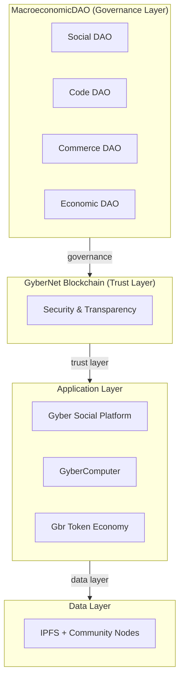

---

### Finding 1.2: Theory-to-Implementation Mapping Table
**Location (RU):** Section 4.1  
**Location (EN):** Section 4.1  
**Line Range:** ~890-920 (RU), ~460-490 (EN)

**Current Content:**
```
Теория                            →  Реализация
─────────────────────────────────────────────────────────────────
CyberSocium (CS)                  →  GyberExperiment (экосистема)
Киберсоциальная корпорация (CSC)  →  Gybernaty Community
Аксиома A1 (децентрализация)      →  GyberNet (блокчейн сообщества)
Аксиома A2 (прозрачность)         →  Блокчейн-реестр всех операций
[... continues for 15+ mappings]
```

**Description:** Mapping table showing correspondence between theoretical constructs and technical implementations.

**Recommended Replacement:**
- **Diagram Type:** Mermaid Flowchart with bidirectional mappings
- **Priority:** **MEDIUM**
- **Rationale:** Critical for understanding how theory translates to practice

**Suggested Mermaid Code:**
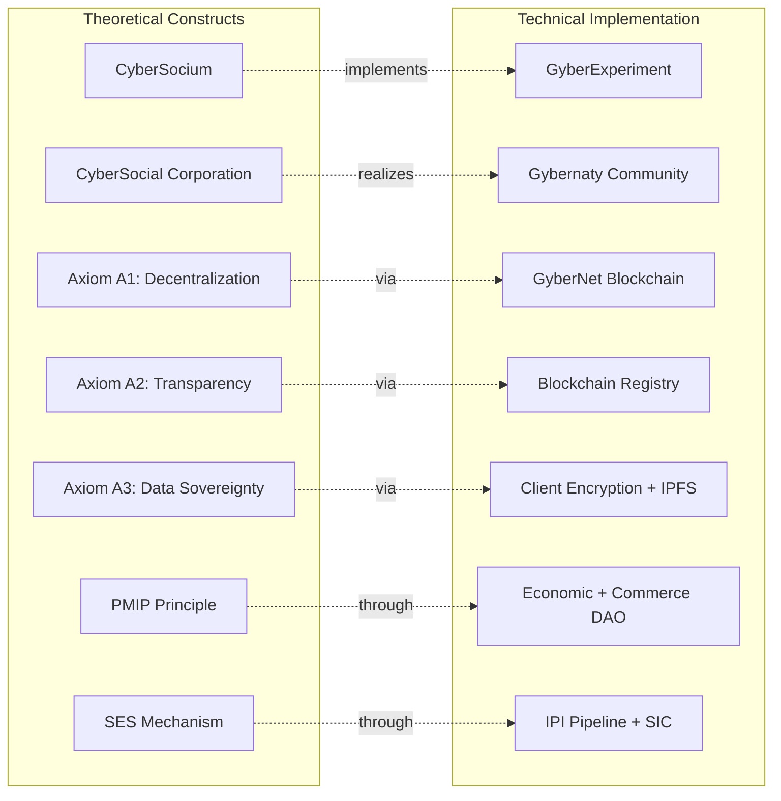

---

## Category 2: Process Flowcharts (DAO Voting, Governance, Lifecycle)

### Finding 2.1: UnitManager Reward Algorithm
**Location (RU):** Section 4.2.3 "Механизм вознаграждения: UnitManager"  
**Location (EN):** Section 4.2.3 "Reward Mechanism: UnitManager"  
**Line Range:** Not in current excerpt, but referenced

**Current Content:**
Text-based numbered algorithm:
```
1. Фиксированное вознаграждение за Unit Type
2. Премия за завершение проекта (×5 множитель)
3. Подтверждение активности через G-Plan
4. Выплата
5. Запись в блокчейн
```

**Description:** Step-by-step process for calculating and distributing rewards to participants.

**Recommended Replacement:**
- **Diagram Type:** Mermaid Sequence Diagram or Flowchart
- **Priority:** **HIGH**
- **Rationale:** Critical governance mechanism, needs clear visual representation

**Suggested Mermaid Code:**
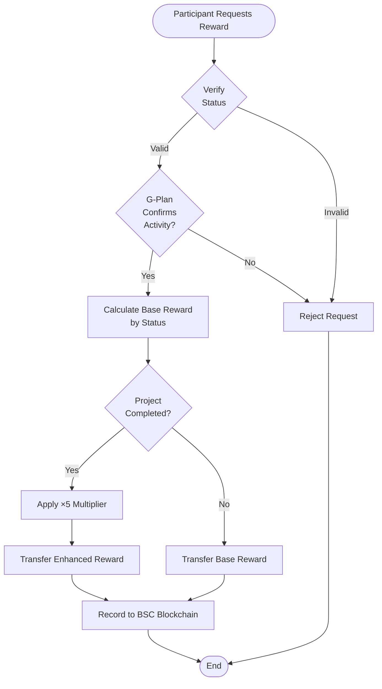

---

### Finding 2.2: IPI (Idea-Project-Implementation) Lifecycle Model
**Location (RU):** Section 3.4.2 (referenced multiple times)  
**Location (EN):** Section 3.4.2 (referenced)  
**Line Range:** Not in current excerpts

**Current Content:**
Text description of phases:
```
Idea → Discussion → Formation → Accumulation → 
Implementation → Operation → Completion
```

**Description:** Seven-stage project lifecycle from initial idea to completion.

**Recommended Replacement:**
- **Diagram Type:** Mermaid State Diagram
- **Priority:** **HIGH**
- **Rationale:** Core process model used throughout ecosystem

**Suggested Mermaid Code:**
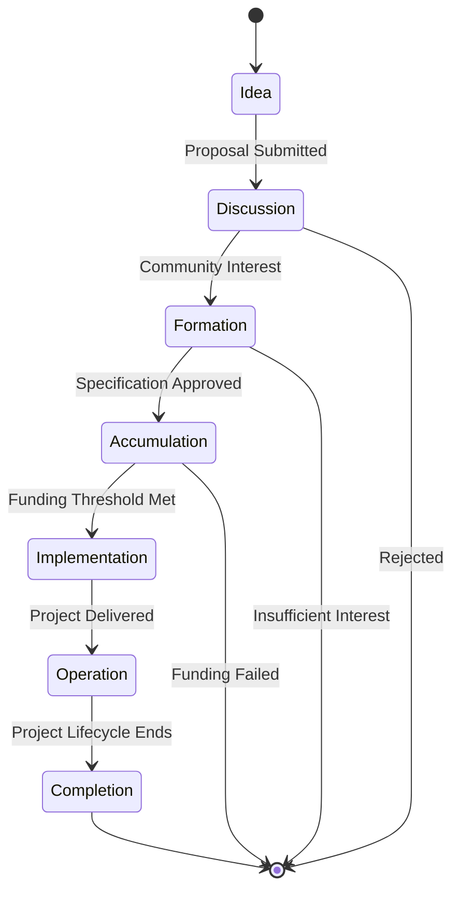

---

### Finding 2.3: Fork Resolution Protocol (FRP) Process
**Location (RU):** Section 3.4.5 "Механизм разрешения внутренних противоречий"  
**Location (EN):** Section 3.4.5 "Mechanism for Resolving Internal Contradictions"  
**Line Range:** ~585+ (RU), not yet visible in EN excerpt

**Current Content:**
Text description of conflict resolution stages (Deliberation, Synthesis, Fork).

**Description:** Process for resolving irreconcilable conflicts within projects through formalized forking mechanism.

**Recommended Replacement:**
- **Diagram Type:** Mermaid Flowchart with decision points
- **Priority:** **HIGH**
- **Rationale:** Critical governance mechanism for maintaining decentralization

**Suggested Mermaid Code:**
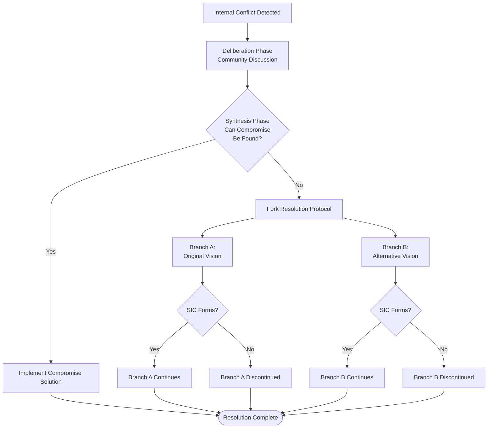

---

## Category 3: Conceptual Diagrams (Evolution, Taxonomy, Theory)

### Finding 3.1: Evolution of Organizational Forms (Ω Vector Space)
**Location (RU):** Section 3.3 "Эволюция форм управления экономическими процессами"  
**Location (EN):** Section 3.3 "Evolution of Forms of Economic Process Management"  
**Line Range:** ~250-450 (RU), ~165-365 (EN)

**Current Content:**
Long text-based table showing historical phases:
```
Фаза 0 — Монархическая централизация (до XVIII века):
  Ω₀ ≈ ⟨0.05, 0.05, 0.02, 0.10, 0.01⟩
  Характеристика: Управление экономическими процессами...

Фаза 1 — Парламентский капитализм (XVIII–XIX века):
  Ω₁ ≈ ⟨0.15, 0.15, 0.10, 0.20, 0.05⟩
  [... continues through Phases 2, 3, 4, 5]
```

**Description:** Historical evolution of economic organizational forms through 6 phases, each characterized by a 5-dimensional vector Ω = ⟨D, T, A, S, C⟩.

**Recommended Replacement:**
- **Diagram Type:** Mermaid Timeline + Radar Chart combination
- **Priority:** **MEDIUM-HIGH**
- **Rationale:** Complex historical progression with multi-dimensional metrics

**Suggested Mermaid Code:**
```mermaid
timeline
    title Evolution of Economic Organizational Forms
    section Phase 0: Monarchical (pre-18th century)
        Ω₀ = ⟨0.05, 0.05, 0.02, 0.10, 0.01⟩ : Centralized sovereign control
    section Phase 1: Parliamentary Capitalism (18-19th century)
        Ω₁ = ⟨0.15, 0.15, 0.10, 0.20, 0.05⟩ : Joint-stock companies emerge
    section Phase 2: Corporate Capitalism (late 19th - mid 20th)
        Ω₂ = ⟨0.15, 0.20, 0.15, 0.15, 0.10⟩ : Managerial revolution
    section Phase 3: Financial Capitalism (1970s-2008)
        Ω₃ = ⟨0.12, 0.18, 0.20, 0.12, 0.15⟩ : Financial hegemony
    section Phase 4: Platform Capitalism (2000s-present)
        Ω₄ = ⟨0.10, 0.15, 0.35, 0.08, 0.30⟩ : Digital platforms
    section Phase 5: CyberSocial Economics (forming)
        Ω₅ = ⟨0.85, 0.90, 0.90, 0.95, 0.85⟩ : CSC dominance
```

**Additional Recommendation:** Create separate radar charts showing the 5-dimensional vector for each phase to visualize the trade-offs between D (Decentralization), T (Transparency), A (Accessibility), S (Sovereignty), and C (Coordination).

---

### Finding 3.2: Comparative Organizational Forms Table
**Location (RU):** Section 3.2 "Киберсоциальная корпорация: определение и свойства"  
**Location (EN):** Section 3.2 "CyberSocial Corporation: Definition and Properties"  
**Line Range:** ~210-240 (RU), ~135-165 (EN)

**Current Content:**
```
Характеристика      | Традиционная    | DAO             | CSC
                     | корпорация      | (существующие)  | (CyberSocium)
─────────────────────┼─────────────────┼─────────────────┼──────────────────
Владение             | Акционеры       | Токенхолдеры    | Все участники
                     |                 |                 | (равные доли)
─────────────────────┼─────────────────┼─────────────────┼──────────────────
Управление           | Совет           | Токен-взвешенное | Верифицированная
                     | директоров      | голосование     | активность + DAO
[... continues for 7 characteristics]
```

**Description:** Comparison of three organizational forms across 7 dimensions: ownership, governance, success criteria, code openness, entry barrier, scalability, crisis resilience.

**Recommended Replacement:**
- **Diagram Type:** Mermaid table (for formatting) + Feature comparison matrix visualization
- **Priority:** **MEDIUM**
- **Rationale:** Critical for understanding CSC's unique value proposition

**Note:** Mermaid doesn't have native comparison table support. Recommend:
1. Keep as enhanced markdown table with better formatting
2. Add supplementary bar chart visualization showing qualitative scores

---

### Finding 3.3: Industrial Revolution vs. Cybersocialization Analogy
**Location (RU):** Section 3.5.3 "Историческая аналогия"  
**Location (EN):** Section 3.5.3 "Historical Analogy"  
**Line Range:** ~585-640 (RU), ~320-375 (EN)

**Current Content:**
```
Индустриальная революция создала:
  — Фабрику как новую организационную форму
  — Акционерное общество как новую экономическую единицу
  — Биржу как новый механизм координации капитала
  [...]

Киберсоциализация создаёт:
  — CSC как новую организационную форму
  — Киберсоциальную корпорацию как новую экономическую единицу
  — MacroeconomicDAO как новый механизм координации
  [...]
```

**Description:** Parallel structure comparing Industrial Revolution's innovations to Cybersocialization's innovations.

**Recommended Replacement:**
- **Diagram Type:** Mermaid Flowchart with parallel paths
- **Priority:** **LOW-MEDIUM**
- **Rationale:** Conceptual clarity, educational value

**Suggested Mermaid Code:**
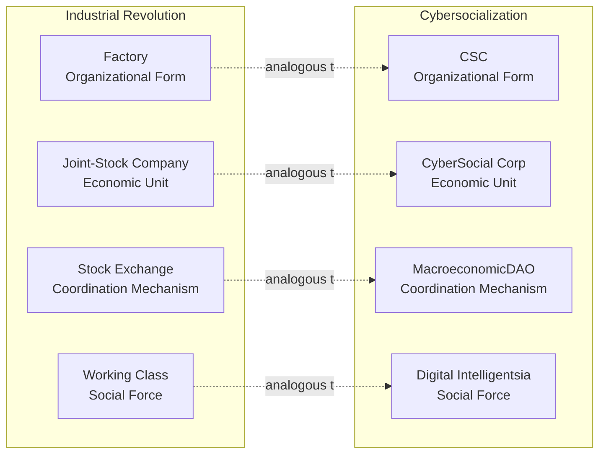

---

### Finding 3.4: Biological Evolution vs. SES Comparison
**Location (RU):** Section 3.6.2 "Эмерджентные свойства" (Property E4)  
**Location (EN):** Section 3.6.2 "Emergent Properties" (Property E4)  
**Line Range:** Not in current excerpts

**Current Content:**
```
Биологическая эволюция          CyberSocium
────────────────────────────────────────────────────────────
Мутации                    →    Новые идеи, предлагаемые агентами
Генетическое разнообразие  →    Разнообразие проектов и их версий (FRP)
Естественный отбор         →    Социально-экономический отбор (SES)
[... continues for 10 mappings]
```

**Description:** Detailed analogy between biological evolutionary mechanisms and CyberSocium's economic evolution.

**Recommended Replacement:**
- **Diagram Type:** Mermaid Flowchart with parallel processes
- **Priority:** **MEDIUM**
- **Rationale:** Complex conceptual framework, benefits from visual clarity

---

## Category 4: Data Structures and Formal Models

### Finding 4.1: System Component Formalization (CS Definition)
**Location (RU):** Section 3.6.1 "Компоненты системы"  
**Location (EN):** Section 3.6.1 "System Components"  
**Line Range:** ~640-800 (RU), ~375-535 (EN)

**Current Content:**
Code-block formatted mathematical notation:
```
CyberSocium CS = ⟨A, P, R, T, G, Φ⟩

где:
  A = {a₁, ..., aₙ} — множество агентов (участников NFC)
    Каждый агент aᵢ характеризуется вектором:
        aᵢ = ⟨walletᵢ, reputationᵢ, statusᵢ, skillsᵢ, capacityᵢ⟩
  [... continues with P, R, T, G, Φ definitions]
```

**Description:** Formal mathematical definition of CyberSocium system with 6 main components and their sub-structures.

**Recommended Replacement:**
- **Diagram Type:** Mermaid Class Diagram or ER Diagram
- **Priority:** **HIGH**
- **Rationale:** Core system definition; class diagram better represents structured data

**Suggested Mermaid Code:**
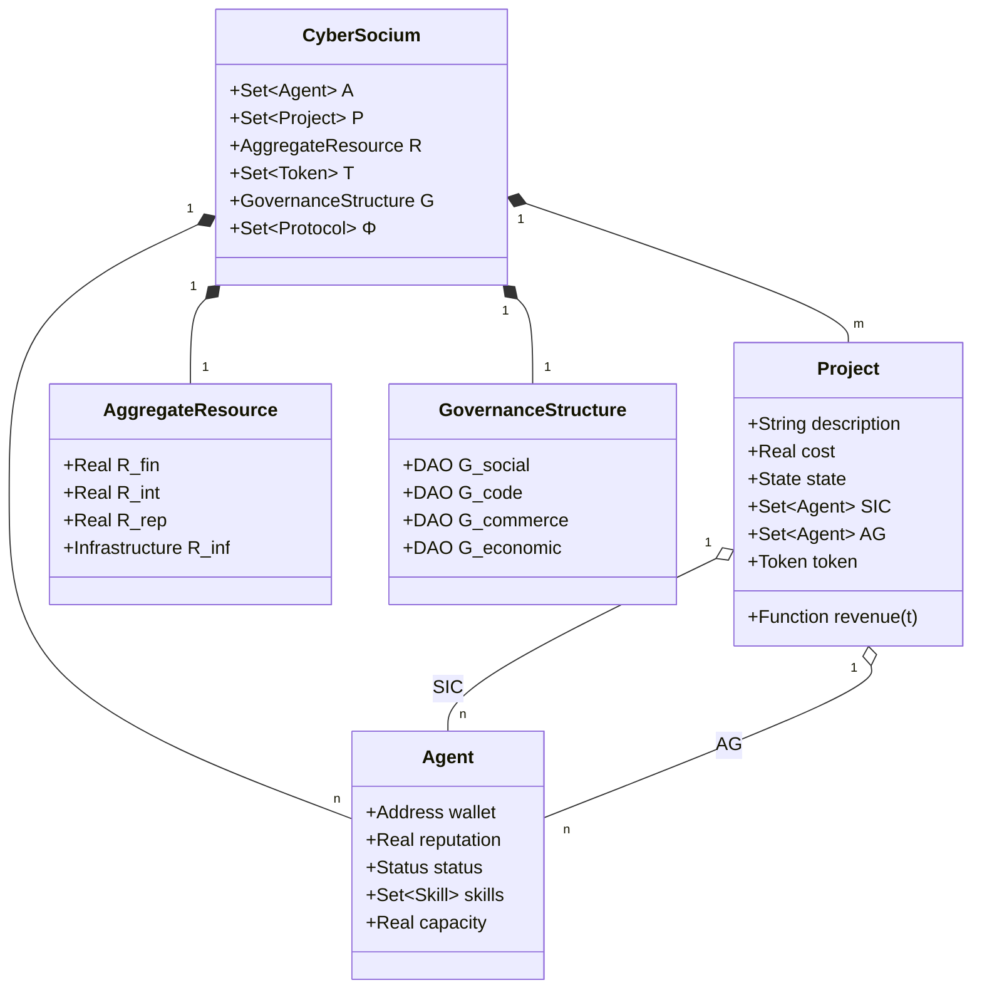

---

### Finding 4.2: Feedback Loop Descriptions
**Location (RU):** Section 3.6.3 "Динамика системы — формализация обратных связей"  
**Location (EN):** Section 3.6.3 "System Dynamics — Formalization of Feedback Loops"  
**Line Range:** Not in current excerpts

**Current Content:**
Text-based descriptions of 6 feedback loops:
```
Петля 1 — Петля роста (Growth Loop):
  Больше участников (↑A)
    → больше идей предлагается
    → больше проектов проходят через IPI
    [...]

Петля 2 — Петля ликвидности (Liquidity Loop):
  [...]

[Continues through Loop 6]
```

**Description:** Six feedback loops (3 positive, 3 negative) governing system dynamics.

**Recommended Replacement:**
- **Diagram Type:** Multiple Mermaid Flowcharts (one per loop) showing causal relationships
- **Priority:** **HIGH**
- **Rationale:** Critical for understanding system behavior; circular causation needs visual representation

**Suggested Mermaid Code (Example for Loop 1):**
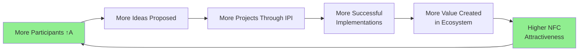

---

## Category 5: Tables That Need Visualization

### Finding 5.1: Token Distribution and Functions
**Location (RU):** Section 4.2.1-4.2.2  
**Location (EN):** Section 4.2.1-4.2.2  
**Line Range:** ~920+ (RU), ~490+ (EN)

**Current Content:**
Text-based lists:
```
Функции токена в экосистеме:
1. Управление (Governance)
2. Оценка работы
3. Взаимодействие с инфраструктурой
4. Стейкинг
5. Средство обмена

Распределение (фиксированный supply):
  Governance Pool (~80%+)
  Торговый Float (~20% или менее)
```

**Description:** Token functions and distribution breakdown.

**Recommended Replacement:**
- **Diagram Type:** Mermaid Pie Chart + Mind Map
- **Priority:** **MEDIUM**
- **Rationale:** Financial/economic information benefits from visual breakdown

**Suggested Mermaid Code:**
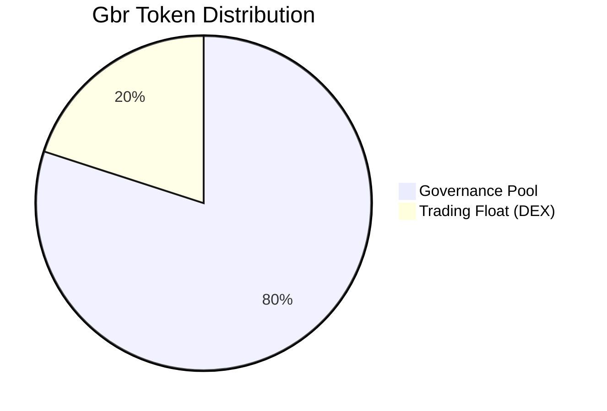

---

### Finding 5.2: UnitManager Reward Levels by Status
**Location (RU):** Section 3.6.1 (within Φ protocols)  
**Location (EN):** Section 3.6.1  
**Line Range:** ~795-810 (RU), ~530-545 (EN)

**Current Content:**
```
Размеры по статусам:
  Unit:    10,000,000 Gbr
  Dev:     100,000,000 Gbr
  LeadDev: 1,000,000,000 Gbr
  ArchDev: 10,000,000,000 Gbr
  Core:    определяется сообществом
```

**Description:** Reward tiers with exponential scaling (10x per level).

**Recommended Replacement:**
- **Diagram Type:** Mermaid Bar Chart (logarithmic visualization recommended)
- **Priority:** **MEDIUM**
- **Rationale:** Exponential relationships hard to grasp from numbers alone

**Suggested Mermaid Code:**
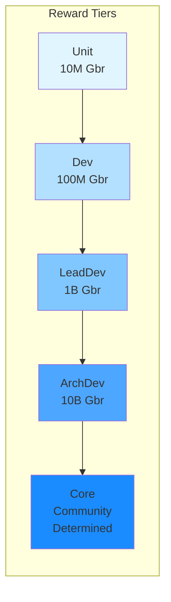

---

### Finding 5.3: PMIP Scenarios ("Millions are Billions")
**Location (RU):** Section 3.4.1 (Утверждение 4)  
**Location (EN):** Section 3.4.1 (Claim 4)  
**Line Range:** Not in current excerpts

**Current Content:**
```
Сценарий A:
  N = 10⁶ (один миллион участников)
  min_capacity = $10/месяц
  CC = $10⁷/месяц = $120M/год

Сценарий B:
  N = 10⁷ (десять миллионов участников)
  min_capacity = $5/месяц
  CC = $5 × 10⁷/месяц = $600M/год
[... continues through Scenario D]

Для сравнения:
  — Годовой бюджет CERN: ~$1.2B
  — Годовой бюджет NASA: ~$25B
  [...]
```

**Description:** Four scaling scenarios demonstrating collective capital accumulation, with comparisons to major institutional budgets.

**Recommended Replacement:**
- **Diagram Type:** Mermaid Bar Chart with comparison benchmarks
- **Priority:** **MEDIUM-HIGH**
- **Rationale:** Key economic argument of PMIP; visual comparison crucial for impact

**Suggested Mermaid Code:**
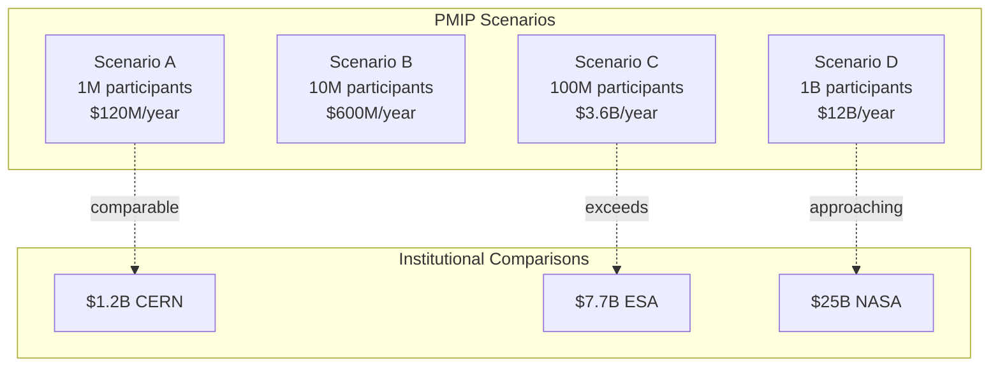

---

## Category 6: Icons/Decorative Elements

### Finding 6.1: NO EMOJIS DETECTED

**Status:** ✅ COMPLIANT

Both documents maintain strict academic/professional tone with **zero emoji usage**. All section markers, emphasis, and visual cues use:
- Markdown headers (#, ##, ###)
- Bold and italic text
- Code blocks and inline code
- ASCII box characters (─, │, ┌, ┐, etc.)
- Mathematical notation (→, ∈, ⊆, etc.)

**Recommendation:** No action needed. Documents already follow professional standards.

---

## Priority Summary

### High Priority (Critical for Understanding)
1. **System Architecture Diagram** (Finding 1.1) - Core infrastructure
2. **UnitManager Reward Flow** (Finding 2.1) - Key governance mechanism
3. **IPI Lifecycle** (Finding 2.2) - Core process model
4. **Fork Resolution Protocol** (Finding 2.3) - Conflict resolution
5. **System Components (CS)** (Finding 4.1) - Formal system definition
6. **Feedback Loops** (Finding 4.2) - System dynamics

### Medium Priority (Enhanced Comprehension)
7. **Theory-to-Implementation Mapping** (Finding 1.2)
8. **Organizational Forms Evolution** (Finding 3.1)
9. **Comparative Org Forms** (Finding 3.2)
10. **PMIP Scaling Scenarios** (Finding 5.3)
11. **Token Distribution** (Finding 5.1)
12. **Reward Tiers** (Finding 5.2)

### Low Priority (Conceptual/Educational)
13. **Industrial Revolution Analogy** (Finding 3.3)
14. **Evolution vs. SES** (Finding 3.4)

---

## Implementation Recommendations

### Phase 1: Core Diagrams (Week 1-2)
- Convert Findings 1.1, 2.1, 2.2, 2.3, 4.1
- Focus on Mermaid flowcharts and class diagrams
- Ensure bilingual consistency (RU + EN)

### Phase 2: Conceptual Visualizations (Week 3-4)
- Convert Findings 3.1, 3.2, 4.2, 5.3
- Use timelines, radar charts, bar charts
- Add color coding for clarity

### Phase 3: Enhancement & Polish (Week 5)
- Convert remaining medium/low priority items
- Standardize color schemes across all diagrams
- Add legend/key elements where needed
- Cross-check all mathematical notations

---

## Technical Notes

### Mermaid Limitations
1. **No native support for:**
   - Mathematical notation (ℝ, ∈, ⊆) - use Unicode in labels
   - Radar/spider charts - use external tool or plugin
   - Logarithmic scales - simulate with spacing/sizing

2. **Workarounds:**
   - Complex tables: Keep as enhanced markdown, supplement with chart
   - Multi-dimensional data: Use multiple complementary diagrams
   - Mathematical formulas: Embed as LaTeX images via plugin

### Consistency Guidelines
- **Color Palette:** Use consistent colors across all diagrams
  - Governance/DAO: Blue tones
  - Economic/Financial: Green tones
  - Technical Infrastructure: Gray tones
  - Processes: Orange/Yellow tones
- **Font Sizes:** Maintain hierarchy (titles > labels > annotations)
- **Notation:** Preserve mathematical symbols in Unicode where possible

---

## Appendix: Full Diagram Inventory

| ID | Type | Section | Priority | Status |
|----|------|---------|----------|--------|
| 1.1 | Architecture | 4.1 | HIGH | Pending |
| 1.2 | Mapping | 4.1 | MEDIUM | Pending |
| 2.1 | Flowchart | 4.2.3 | HIGH | Pending |
| 2.2 | State Diagram | 3.4.2 | HIGH | Pending |
| 2.3 | Flowchart | 3.4.5 | HIGH | Pending |
| 3.1 | Timeline | 3.3 | MEDIUM | Pending |
| 3.2 | Table/Matrix | 3.2 | MEDIUM | Pending |
| 3.3 | Parallel Flow | 3.5.3 | LOW | Pending |
| 3.4 | Parallel Flow | 3.6.2 | MEDIUM | Pending |
| 4.1 | Class Diagram | 3.6.1 | HIGH | Pending |
| 4.2 | Loop Diagrams | 3.6.3 | HIGH | Pending |
| 5.1 | Pie Chart | 4.2.2 | MEDIUM | Pending |
| 5.2 | Bar Chart | 3.6.1 | MEDIUM | Pending |
| 5.3 | Comparison Chart | 3.4.1 | MEDIUM | Pending |

---

## Conclusion

Both CyberSocium documents are **diagram-dense academic texts** that would benefit significantly from professional visualization. The current ASCII-based representations are functional but not optimal for:
- Comprehension by non-technical audiences
- Presentation in academic/professional contexts
- Publication in journals or formal documentation
- Accessibility for screen readers

**Estimated Effort:** ~40-60 hours to convert all identified visualizations to professional Mermaid diagrams with proper styling, bilingual labels, and cross-referencing.

**Next Steps:**
1. Prioritize High Priority diagrams (Findings 1.1, 2.1-2.3, 4.1-4.2)
2. Create Mermaid source files in separate directory (e.g., `/diagrams/`)
3. Test rendering in target platforms (GitHub, GitBook, PDF export)
4. Update source documents with diagram references
5. Create bilingual diagram variants where text-heavy

---

**End of Audit Report**
