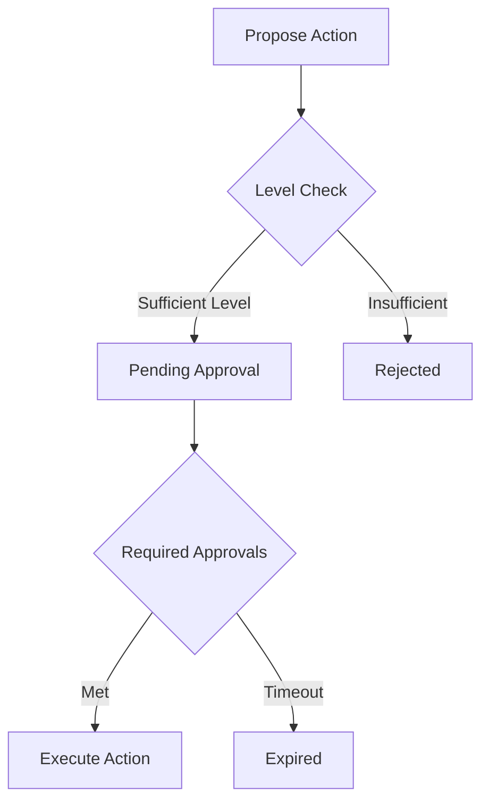

# GybernatyUnitManager

## Overview

GybernatyUnitManager is the core smart contract implementing hierarchical user management with different access levels and capabilities. The contract provides secure token management and user level governance with an approval system.

## Roles & Levels

### User Levels
- **Level 1** — Basic participant
- **Level 2** — Active contributor
- **Level 3** — Senior member
- **Level 4** — Core team

### Gybernaty Role
Special role with maximum privileges:
- Can manage all users
- Can assign/revoke levels
- Controls system parameters

## Core Functions

### User Management

```solidity
function proposeCreateUser(
    address userAddress,
    uint32 level,
    string calldata name,
    string calldata link
) external;
```

Creates a new user proposal requiring approval. Validates:
- Address validity
- Level range (MIN_LEVEL to MAX_LEVEL)
- Name length (max 100 characters)
- Link length (max 200 characters)

### Token Operations

```solidity
function proposeWithdraw(
    uint256 amount
) external;
```

Withdrawal limits are enforced per-level with monthly restrictions.

### Approval Flow



## Deployment

- **Network:** Binance Smart Chain (BSC)
- **Standard:** Upgradeable (UUPS Proxy Pattern)
- **Dependencies:** OpenZeppelin Contracts Upgradeable

## Testing

```bash
cd contracts
npm install
npx hardhat test
```

Test coverage includes unit tests for all managers (UserManager, TokenManager, ApprovalManager) and integration tests for the complete workflow.
